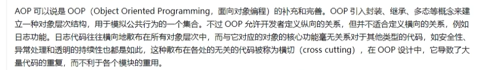
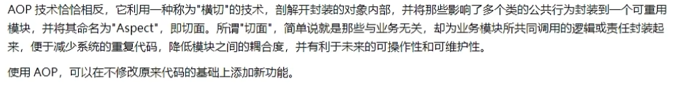
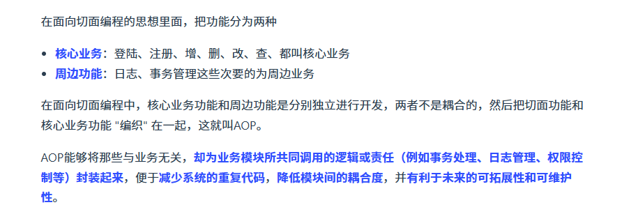
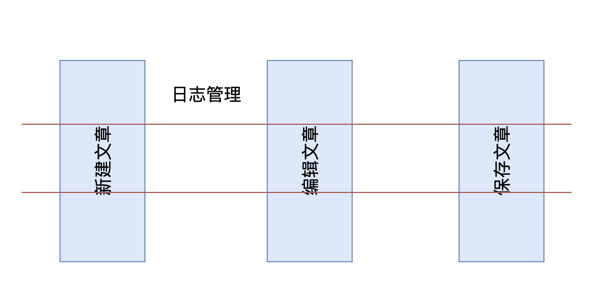
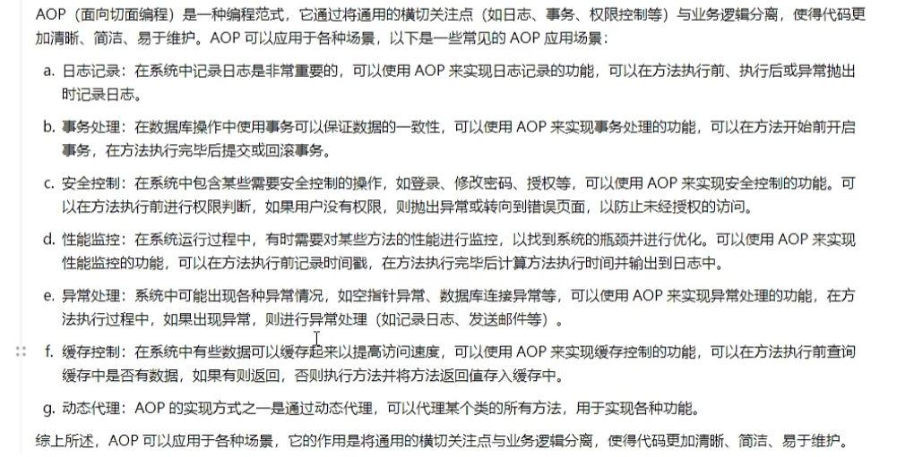
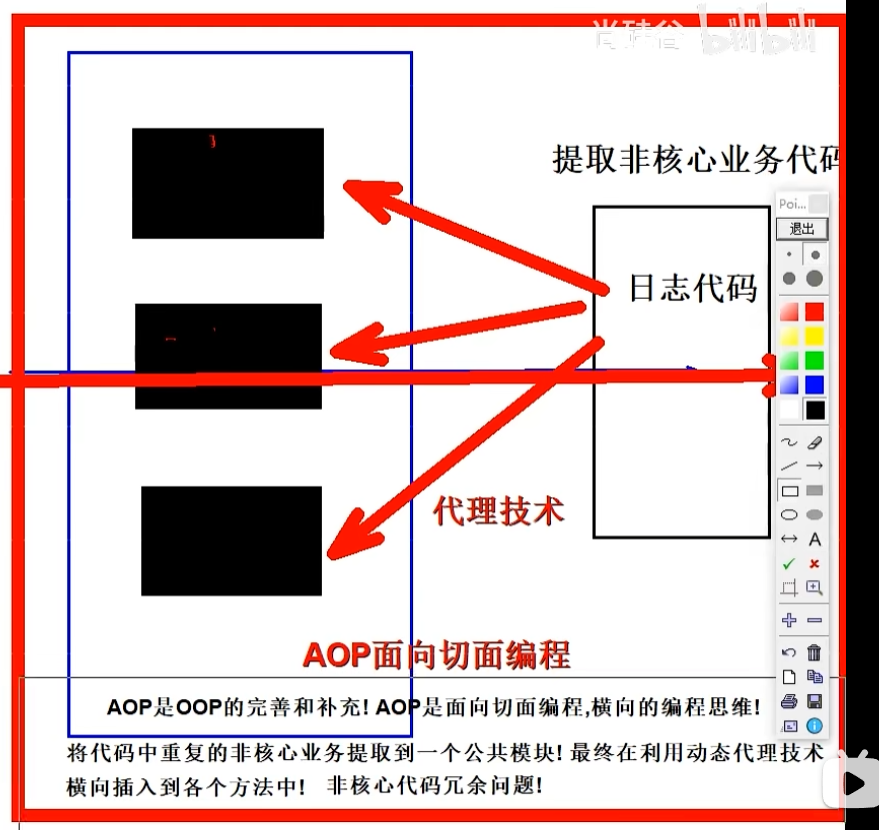
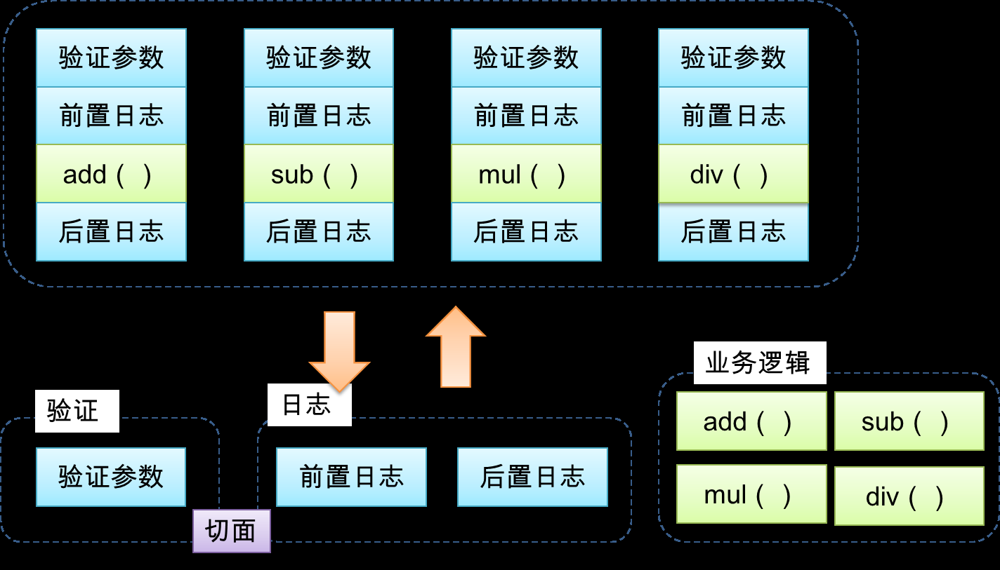
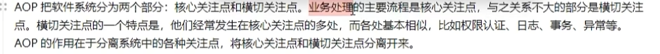
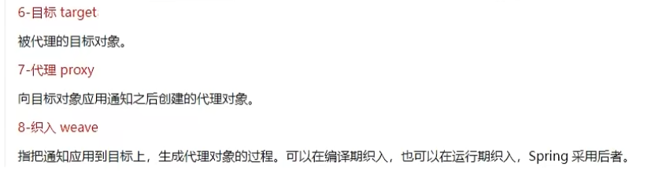
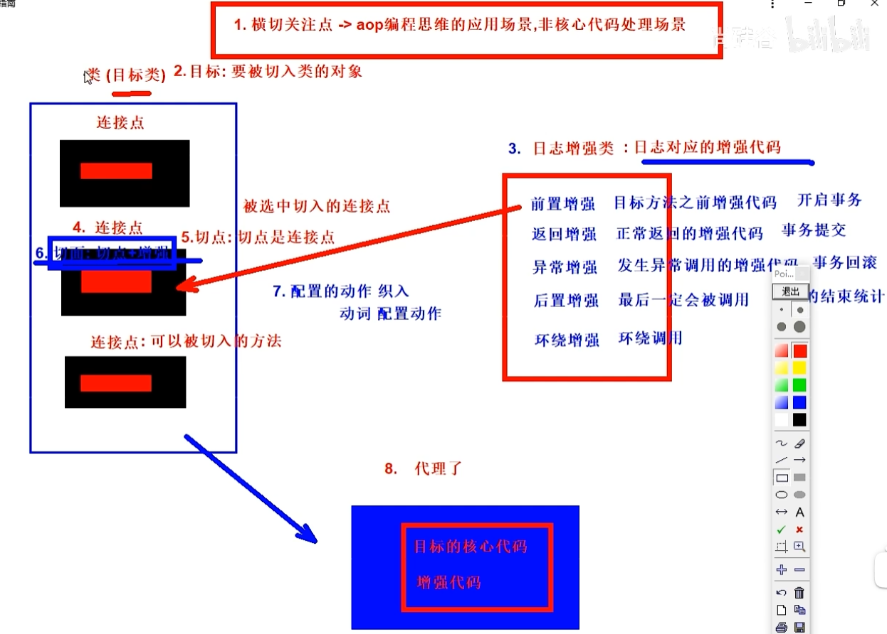

# 一、关于 AOP

AOP，也就是 Aspect-oriented Programming，译为面向切面编程，是计算机科学中的一个设计思想，旨在通过切面技术为业务主体增加额外的通知（Advice），从而对声明为“切点”（Pointcut）的代码块进行统一管理和装饰。

这种思想非常适用于，**将那些与核心业务不那么密切关联的功能添加到程序中**，就好比我们今天的主题——日志功能，就是一个典型的案例。

AOP 是对面向对象编程（Object-oriented Programming，俗称 OOP）的一种补充，OOP 的核心单元是类（class），而 AOP 的核心单元是切面（Aspect）。利用 AOP 可以对业务逻辑的各个部分进行隔离，从而降低耦合度，提高程序的可重用性，同时也提高了开发效率。

我们可以简单的把 AOP 理解为**贯穿于方法之中**，在**方法执行前、执行时、执行后、返回值后、异常后**要执行的操作。

# 二、AOP 的相关术语

来看下面这幅图，这是一个 AOP 的模型图，就是在某些方法执行前后执行一些通用的操作，并且这些操作不会影响程序本身的运行。

我们了解下 AOP 涉及到的关键术语：

**1）横切关注点**，从每个方法中抽取出来的同一类非核心业务（比如：日志业务）

**2）切面（Aspect）**，对横切关注点进行封装的类，每个关注点体现为一个通知方法；通常使用 @Aspect 注解来定义切面。

**3）通知（Advice）**，切面必须要完成的各个具体工作，比如我们的日志切面需要记录接口调用前后的时长，就需要在调用接口前后记录时间，再取差值。通知的方式有五种：

- @Before：前置通知，通知方法会在目标方法调用之前执行
- @After：返回通知，通知方法会在目标方法调用后执行
- @AfterReturning：后置通知，通知方法会在目标方法正常返回后执行
- @AfterThrowing：异常通知，通知方法会在目标方法抛出异常后执行
- @Around：环绕通知，把整个目标方法包裹起来，在被调用前和调用之后分别执行通知方法

> 在Spring AOP（面向切面编程）中，`@After` 和 `@AfterReturning` 是两种不同的通知类型（Advice），它们用于在方法执行的不同阶段插入额外的逻辑。下面是这两种通知类型的详细区别：
>
> ## @After
> - **定义**：`@After` 注解用于定义一个“最终”通知，无论被拦截的方法是否正常返回或抛出了异常，它都会被执行。
> - **作用时机**：
>   - 方法执行完成后，无论是正常返回还是抛出异常，都会执行这个通知。
> - **使用场景**：
>   - 适用于需要在方法执行后执行一些必要的清理操作，比如关闭资源、释放锁等。
>   - 因为它会在任何情况下都执行，所以也被称为“最终”通知。
>
> ### @AfterReturning
> - **定义**：`@AfterReturning` 注解用于定义一个“返回后”通知，只有当被拦截的方法成功执行并返回结果时，该通知才会被执行。
> - **作用时机**：
>   - 只有在目标方法正常返回之后才会执行，如果目标方法抛出异常，则不会执行此通知。
> - **使用场景**：
>   - 当你需要处理方法的返回值或者基于方法的成功执行做一些后续处理时非常有用。
>   - 可以通过指定 `returning` 属性来访问目标方法的返回值，这允许你在通知方法内部对返回值进行操作或检查。
>
> ### 总结
> - 主要区别在于它们触发的条件不同：`@After` 无论方法是正常完成还是抛出异常都会执行；而 `@AfterReturning` 只有在方法正常返回时才会执行，并且可以访问到方法的返回值。
> - 使用上，如果你的操作不依赖于方法的返回值，并且需要在任何情况下都要执行（如资源清理），则应使用 `@After`。如果你的操作需要基于方法的成功执行和/或其返回值，则应使用 `@AfterReturning`。

**4）连接点（JoinPoint）**，连接点指的是程序执行过程中能够插入增强处理（Advice）的明确点。这些点可以是方法调用、异常抛出或其他事件。简单来说，它就是你可以在程序运行时进行拦截的地方。在Spring AOP中，连接点主要指方法的执行。与某些其他AOP框架不同，Spring AOP目前不支持对字段访问或类初始化等作为连接点。连接点为开发者提供了一个位置，在这里可以将横切关注点（如日志、事务等）织入到应用程序的主要业务逻辑中。

**5）切点（Pointcut）**，切点用于精确定义哪些连接点会应用增强处理。换句话说，切点是对连接点的筛选条件，它决定了增强处理应该应用于哪些方法上。切点通常通过特定的语言或表达式来指定，比如使用AspectJ的切点表达式语言。在Spring AOP中，也支持使用AspectJ风格的切点表达式来定义切点，通常使用 @Pointcut 注解来定义切点表达式。切点使得你可以精确地控制增强逻辑的应用范围。例如，你可以定义一个切点，仅当某个包下的所有服务层方法被调用时才触发日志记录。

AOP首先在一个Aspect（切面）里定义了一些Advice（增强），其中包含具体实现的代码，同时整理了切入点，切入点的粒度是方法。最后，我们将这些Advice织入到对象的方法上，形成了最后执行方法时面对的完整方法。

# 三、AOP 的实现机制

