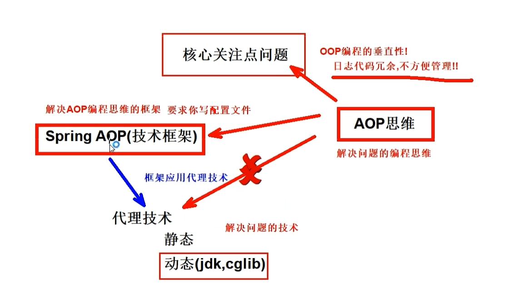

# 一、关于 AOP

AOP，也就是 Aspect-oriented Programming，译为面向切面编程，是计算机科学中的一个设计思想，旨在通过切面技术为业务主体增加额外的通知（Advice），从而对声明为“切点”（Pointcut）的代码块进行统一管理和装饰。

这种思想非常适用于，**将那些与核心业务不那么密切关联的功能添加到程序中**，就好比我们今天的主题——日志功能，就是一个典型的案例。

AOP 是对面向对象编程（Object-oriented Programming，俗称 OOP）的一种补充，OOP 的核心单元是类（class），而 AOP 的核心单元是切面（Aspect）。利用 AOP 可以对业务逻辑的各个部分进行隔离，从而降低耦合度，提高程序的可重用性，同时也提高了开发效率。

我们可以简单的把 AOP 理解为**贯穿于方法之中**，在**方法执行前、执行时、执行后、返回值后、异常后**要执行的操作。

# 二、AOP 的相关术语

来看下面这幅图，这是一个 AOP 的模型图，就是在某些方法执行前后执行一些通用的操作，并且这些操作不会影响程序本身的运行。

我们了解下 AOP 涉及到的 5 个关键术语：

**1）横切关注点**，从每个方法中抽取出来的同一类非核心业务（比如：日志业务）

**2）切面（Aspect）**，对横切关注点进行封装的类，每个关注点体现为一个通知方法；通常使用 @Aspect 注解来定义切面。

**3）通知（Advice）**，切面必须要完成的各个具体工作，比如我们的日志切面需要记录接口调用前后的时长，就需要在调用接口前后记录时间，再取差值。通知的方式有五种：

- @Before：前置通知，通知方法会在目标方法调用之前执行
- @After：返回通知，通知方法会在目标方法调用后执行
- @AfterReturning：后置通知，通知方法会在目标方法正常返回后执行
- @AfterThrowing：异常通知，通知方法会在目标方法抛出异常后执行
- @Around：环绕通知，把整个目标方法包裹起来，在被调用前和调用之后分别执行通知方法

**4）连接点（JoinPoint）**，通知应用的时机，比如接口方法被调用时就是日志切面的连接点。

**5）切点（Pointcut）**，通知功能被应用的范围，比如本篇日志切面的应用范围是所有 controller 的接口。通常使用 @Pointcut 注解来定义切点表达式。

# 三、AOP 思维总结

