# 一、AOP 底层技术实现

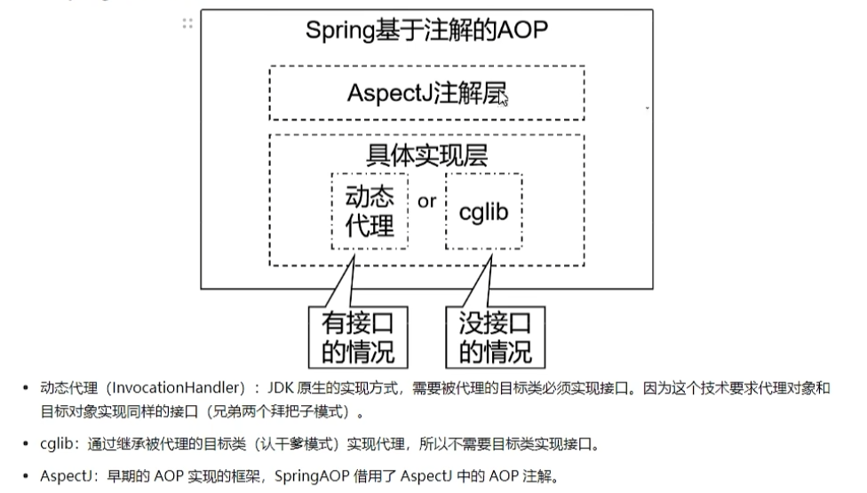

# 二、初步实现

## 2.1 所需要导入的依赖

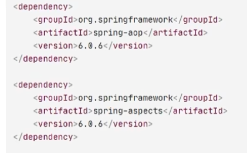

## 2.2 简要步骤

1. 正常编写核心业务，加入到 ioc 容器
2. 编写 ioc 配置类或 xml 配置文件
3. 设置测试环境（**如果是动态代理模式，需要从 ioc 容器中获取核心业务接口而不是核心业务类，因为动态代理模式获取到的是代理类，而非之前的核心业务类**；如果是 cglib 的话，因为生成的是核心业务类的子类，用**父类对象可以接受子类对象**）
4. 编写增强类，定义增强方法
5. 增强类的注解配置（插入切点的位置，切点指定，切面配置等等）
6. 开启 AOP 的注解配置

## 2.3 增强类实现

1. 增强类也需要加入到 `ioc` 容器中（`@Component`）
2. 使用 `@Aspect` 配置切面类

## 2.3 开启增强类的注解配置

1.  `xml` 文件配置

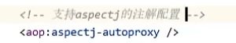

2. 配置类配置

# 三、进阶设置

## 3.1 获取连接点信息

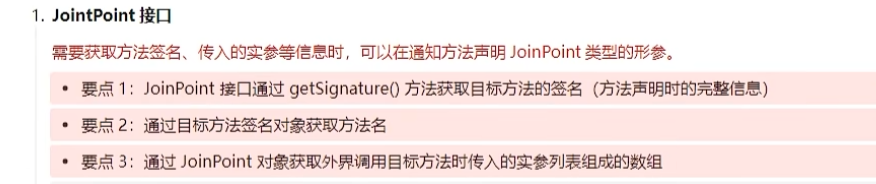

在增强类的方法中增加形参 `JoinPoint` 接口即可：

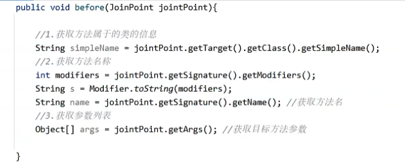

**返回值获取**（只能在 `@AfterReturning` 注解的方法获取）：

`returning=` 用于设置获取返回值的形参的名称

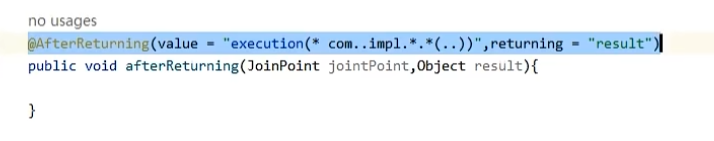

异常值获取（只能在 `@AfterThrowing` 注解的方法获取）

`throwing=` 用于设置获取异常值的形参的名称

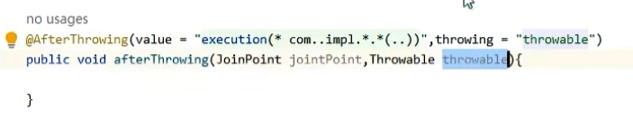

## 3.2 切点表达式语法

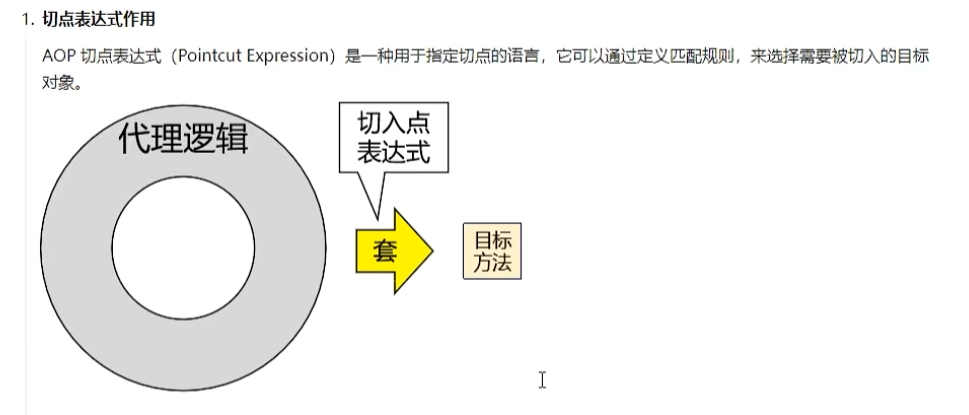

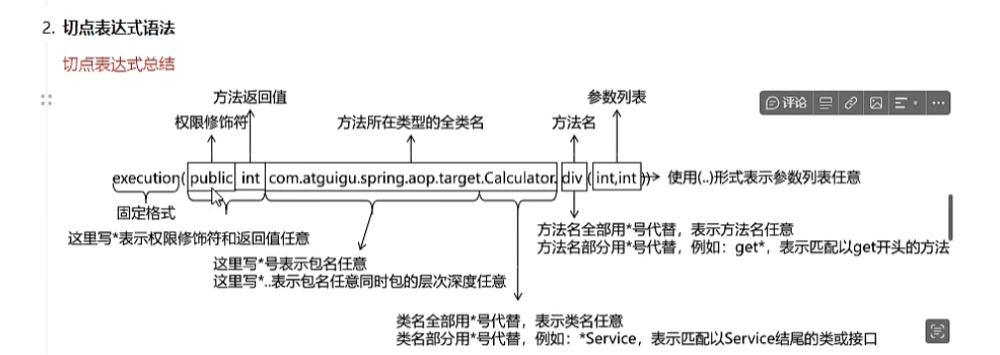

## 3.3 切点表达式的提取和复用

每个方法都用完整的切点表达式，一旦切点路径需要更改，就会比较复杂，可以用下面的方式实现切点表达式的提取和复用：

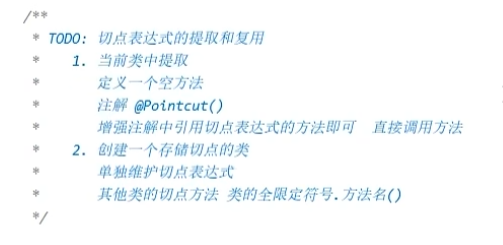

1. 当前类中

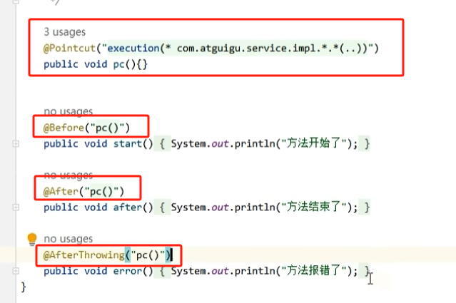

2. 创建一个存储切点的类

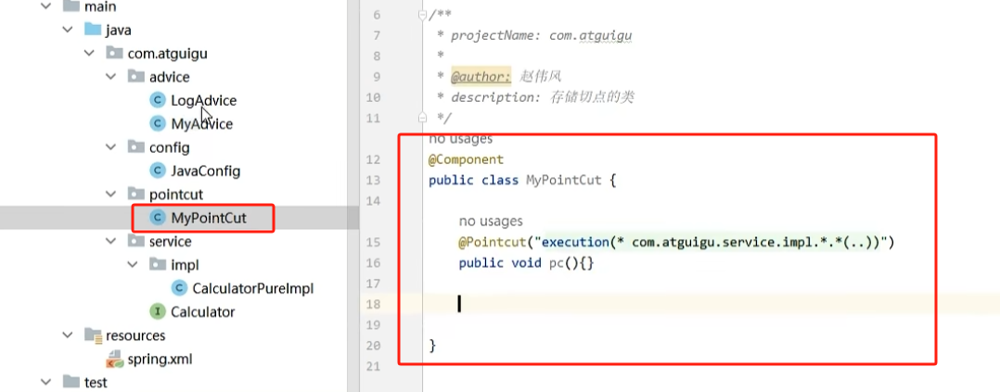

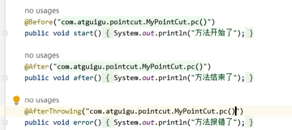

## 3.4 环绕通知的使用

环绕通知的使用就是完全原始的代理模式，它需要在方法内部完成对方法的执行，因此可以同时完成多种其他通知的目的：

1. 环绕通知方法，必须有形参 `ProceedingJoinPoint`（包含切点信息），必须有返回值类型 `Object`（返回切点方法的返回值）

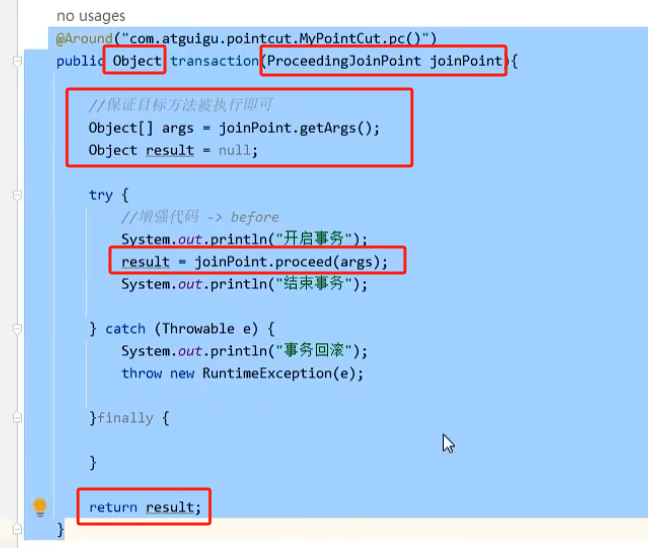

## 3.5 切面优先级设置

如果一个方法上同时存在多个切面，如何设置切面的执行顺序？

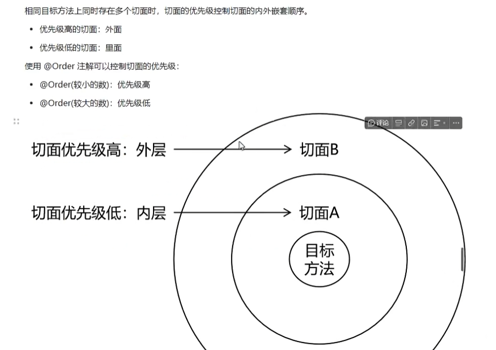

> 因为呈现的是“包裹”的形式，因此：优先级高的，前置先执行，后置后执行；优先级低的，前置后执行，后置先执行

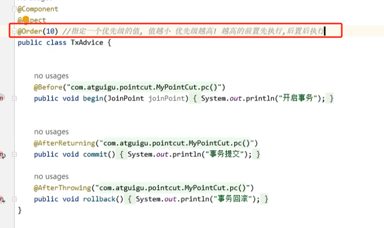