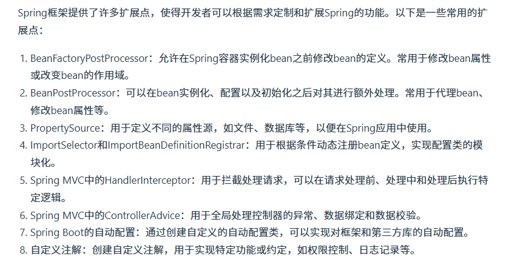

## spring是如何解决循环依赖的？


**构造器循环依赖**：当Bean通过构造函数注入的方式互相依赖时发生的循环依赖。这种情况是致命的，Spring无法解决此类循环依赖问题。

例子：
```java
class A {
    private final B b;
    public A(B b) { this.b = b; }
}

class B {
    private final A a;
    public B(A a) { this.a = a; }
}
```
在这个例子中，A的创建需要B的实例，而B的创建又需要A的实例，这导致了构造器循环依赖，Spring无法解决这种类型的循环依赖。

> 尽量避免使用构造器注入方式来构建可能存在循环依赖的Bean。如果必须使用构造器注入，考虑重构代码以打破循环依赖关系。

**字段/设值方法（Setter）循环依赖**：当Bean通过设值方法（setter方法）注入的方式互相依赖时发生的循环依赖。对于**单例Bean**，Spring可以通过提前暴露Bean的引用（使用三级缓存机制）来解决此类循环依赖问题。

例子：
```java
class A {
    private B b;
    public void setB(B b) { this.b = b; }
}

class B {
    private A a;
    public void setA(A a) { this.a = a; }
}
```
在这个例子中，虽然A和B相互依赖，但由于它们都是通过设值方法进行依赖注入的，并且默认为单例模式，因此Spring可以解决这种循环依赖问题。

> 由于Spring能够自动解决单例Bean间的设值方法循环依赖，通常不需要额外的操作。但为了提高代码质量，还是建议尽量减少设计上的循环依赖。


## spring三级缓存的数据结构是什么


## spring框架中都用到了哪些设计模式


## Bean注入和xml注入最终得到了相同的效果，它们在底层是怎样做的


## Spring给我们提供了很多扩展点，这些有了解吗？

