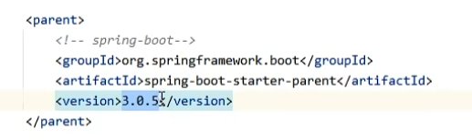
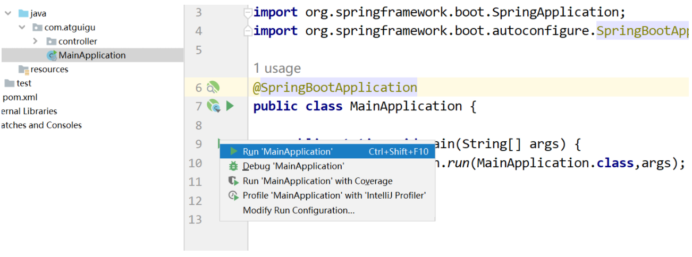
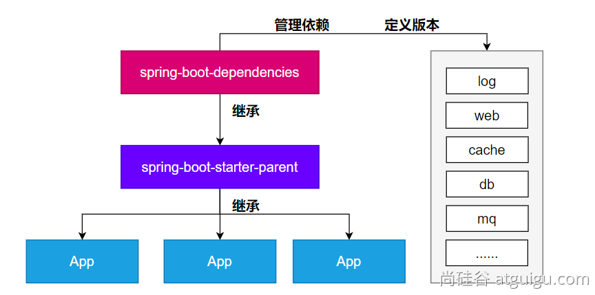

# 一、`SpringBoot3` 简介

## 1.1 简介

到目前为止，你已经学习了多种配置Spring程序的方式。但是无论使用XML、注解、Java配置类还是他们的混合用法，你都会觉得配置文件过于复杂和繁琐，让人头疼！

尤其是在当前 微服务 场景下，一个单体项目被拆分为多个 微服务 项目，本来要配置一次的项目现在每个微服务都要进行配置，极大降低了系统开发的效率。

**为了解决 SSM 框架的这个问题，Spring 提出了 SpringBoot 来提升开发效率：**

SpringBoot 帮我们简单、快速地创建一个独立的、生产级别的 **Spring 应用（说明：SpringBoot底层是Spring）**，大多数 SpringBoot 应用只需要编写少量配置即可快速整合 Spring 平台以及第三方技术！

SpringBoot的主要目标是：

-   为所有 Spring 开发提供更快速、可广泛访问的入门体验。
-   开箱即用，设置合理的默认值，但是也可以根据需求进行适当的调整。
-   提供一系列大型项目通用的非功能性程序（如嵌入式服务器、安全性、指标、运行检查等）。
-   约定大于配置，基本不需要主动编写配置类、也不需要 XML 配置文件。

**总结：简化开发，简化配置，简化整合，简化部署，简化监控，简化运维。**

## 1.2 系统要求

`SpringBoot3` 的环境要求如下：

| 技术&工具 | 版本（or later）                |
| --------- | ------------------------------- |
| maven     | 3.6.3 or later 3.6.3 或更高版本 |
| Tomcat    | 10.0+                           |
| Servlet   | 9.0+                            |
| JDK       | 17+                             |

## 1.3 快速入门

### 1.3.1 场景

场景：浏览器发送 **/hello**请求，返回"**Hello,Spring Boot 3!**"

### 1.3.2 开发步骤

1.  **创建Maven工程**
2.  **添加依赖(springboot父工程依赖 , web启动器依赖)**
3.  **编写启动引导类(springboot项目运行的入口)**
4.  **编写处理器Controller**
5.  **启动项目**

### 1.3.3 依赖添加

#### 1.3.3.1 添加父工程坐标

SpringBoot可以帮我们方便的管理项目依赖 , 在Spring Boot提供了一个名为**spring-boot-starter-parent**的工程，**里面已经对各种常用依赖的版本进行了管理**，**我们的项目需要以这个项目为父工程**，这样我们就不用操心依赖的版本问题了，需要什么依赖，直接引入坐标(不需要添加版本)即可！



#### 1.3.3.2 添加web启动器

为了让Spring Boot帮我们完成各种自动配置，我们必须引入Spring Boot提供的**自动配置依赖**，我们称为**启动器**。因为我们是web项目，这里我们引入web启动器，在 pom.xml 文件中加入如下依赖：

```xml
<dependencies>
<!--web开发的场景启动器-->
    <dependency>
        <groupId>org.springframework.boot</groupId>
        <artifactId>spring-boot-starter-web</artifactId>
    </dependency>
</dependencies>
```

### 1.3.4 创建启动类

创建package：com.atguigu

创建启动类：MainApplication

关键点有两个：

1. `@SpringBootApplication` 注解

2. ```java
   public static void main(String[] args) {
       SpringApplication.run(MainApplication.class,args);
   }
   ```

```java
package com.atguigu;

import org.springframework.boot.SpringApplication;
import org.springframework.boot.autoconfigure.SpringBootApplication;

/**
 * @SpringBootApplication是一个特殊的注解，用于标识一个Spring Boot应用程序的入口类。它的主要作用是将三个常用注解组合在一起，简化了配置的过程。
 *
 * 具体而言，@SpringBootApplication注解包含以下三个注解的功能：
 *     @Configuration：将该类标识为应用程序的配置类。它允许使用Java代码定义和配置Bean。
 *     @EnableAutoConfiguration：启用Spring Boot的自动配置机制。它根据项目的依赖项自动配置Spring应用程序的行为。自动配置根据类路径、注解和配置属性等条件来决定要使用的功能和配置。
 *     @ComponentScan：自动扫描并加载应用程序中的组件，如控制器、服务、存储库等。它默认扫描@SpringBootApplication注解所在类的包及其子包中的组件。
 *
 * 使用@SpringBootApplication注解，可以将上述三个注解的功能集中在一个注解上，简化了配置文件的编写和组件的加载和扫描过程。它是Spring Boot应用程序的入口点，标识了应用程序的主类，
 * 并告诉Spring Boot在启动时应如何配置和加载应用程序。
 */
@SpringBootApplication
public class MainApplication {

    //SpringApplication.run() 方法是启动 Spring Boot 应用程序的关键步骤。它创建应用程序上下文、
    // 自动配置应用程序、启动应用程序，并处理命令行参数，使应用程序能够运行和提供所需的功能
    public static void main(String[] args) {
        SpringApplication.run(MainApplication.class,args);
    }
}
```

### 1.3.5 编写处理器Controller

创建 `package：com.atguigu.controller`

创建类：`HelloController`

注意： `IoC` 和 `DI` 注解需要在**启动类**的**同包或者子包下**方可生效！无需指定，约束俗称。

```java
package com.atguigu.controller;

import org.springframework.web.bind.annotation.GetMapping;
import org.springframework.web.bind.annotation.RestController;

@RestController
public class HelloController {

    @GetMapping("/hello")
    public String hello(){
        return "Hello,Spring Boot 3!";
    }

}
```

### 1.3.6 启动测试



# 二、关键点总结

## 2.1 为什么依赖不需要写版本？

-   每个boot项目都有一个父项目`spring-boot-starter-parent`
-   parent的父项目是`spring-boot-dependencies`
-   父项目 **版本仲裁中心**，把所有常见的jar的依赖版本都声明好了。
-   比如：`mysql-connector-j`



## 2.2 启动器(Starter)是何方神圣？

Spring Boot提供了一种叫做Starter的概念，它是一组预定义的依赖项集合，旨在简化Spring应用程序的配置和构建过程。**Starter包含了一组相关的依赖项，以便在启动应用程序时自动引入所需的库、配置和功能**。

主要作用如下：

1.  简化依赖管理：Spring Boot Starter通过捆绑和管理一组相关的依赖项，减少了手动解析和配置依赖项的工作。**只需引入一个相关的Starter依赖，即可获取应用程序所需的全部依赖。**
2.  自动配置：Spring Boot Starter在**应用程序启动时自动配置所需的组件和功能**。通过根据类路径和其他设置的自动检测，Starter可以**自动配置Spring Bean、数据源、消息传递等常见组件**，从而使应用程序的配置变得简单和维护成本降低。
3.  提供约定优于配置：Spring Boot Starter**遵循“约定优于配置”的原则**，通过**提供一组默认设置和约定，减少了手动配置的需要**。它**定义了标准的配置文件命名约定、默认属性值、日志配置等**，使得开发者可以更专注于业务逻辑而不是繁琐的配置细节。
4.  快速启动和开发应用程序：Spring Boot Starter使得从零开始构建一个完整的Spring Boot应用程序变得容易。它提供了主要领域（如Web开发、数据访问、安全性、消息传递等）的Starter，帮助开发者快速搭建一个具备特定功能的应用程序原型。
5.  模块化和可扩展性：Spring Boot Starter的组织结构使得应用程序的不同模块可以进行分离和解耦。每个模块可以有自己的Starter和依赖项，使得应用程序的不同部分可以按需进行开发和扩展。

spring boot提供的全部启动器地址：

[https://docs.spring.io/spring-boot/docs/current/reference/html/using.html#using.build-systems.starters](https://docs.spring.io/spring-boot/docs/current/reference/html/using.html#using.build-systems.starters "https://docs.spring.io/spring-boot/docs/current/reference/html/using.html#using.build-systems.starters")

命名规范：

-   官方提供的场景：命名为：`spring-boot-starter-*`
-   第三方提供场景：命名为：`*-spring-boot-starter`

## 2.3 `@SpringBootApplication` 注解的功效？

`@SpringBootApplication` 添加到启动类上，是一个**组合注解**，他的功效有具体的子注解实现！

具体而言，`@SpringBootApplication` 注解起到以下几个主要作用：

1. 自动配置：`@SpringBootApplication` 注解包含了`@EnableAutoConfiguration` 注解，用于启用Spring Boot的**自动配置机制**。自动配置会**根据应用程序的依赖项和类路径，自动配置各种常见的Spring配置和功能**，减少开发者的手动配置工作。它通过智能地分析类路径、加载配置和条件判断，为应用程序提供适当的默认配置。

2. 组件扫描：`@SpringBootApplication` 注解**包含了 `@ComponentScan` 注解，用于自动扫描并加载应用程序中的组件**，例如控制器（Controllers）、服务（Services）、存储库（Repositories）等。它默认会扫描 `@SpringBootApplication` **注解所在类的包及其子包中的组件**，并将它们纳入Spring Boot应用程序的上下文中，使它们可被自动注入和使用。

3. 声明配置类：`@SpringBootApplication` 注解本身就是一个组合注解，它**包含了@Configuration注解，将被标注的类声明为配置类**。配置类可以包含Spring框架相关的配置、Bean定义，以及其他的自定义配置。通过 `@SpringBootApplication` 注解，开发者**可以将配置类与启动类合并在一起，使得配置和启动可以同时发生**。

总的来说，`@SpringBootApplication` 注解的主要作用是简化Spring Boot应用程序的配置和启动过程。它**自动配置应用程序、扫描并加载组件**，并**将配置和启动类合二为一**，简化了开发者的工作量，提高了开发效率。