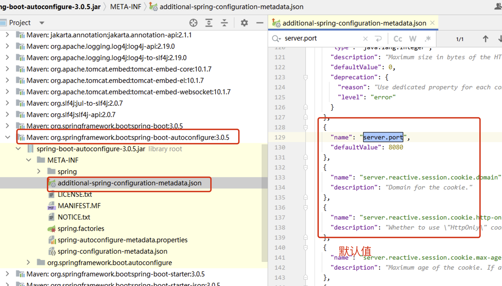

# 一、统一配置管理

`SpringBoot` 工程下，进行**统一的配置管理**，你想设置的任何参数（端口号、项目根路径、数据库连接信息等等)都**集中到一个固定位置和命名的配置文件（`application.properties`或`application.yml`）中**！

**配置文件应该放置在Spring Boot工程的 `src/main/resources` 目录下**。这是因为`src/main/resources`目录是Spring Boot默认的类路径（`classpath`），**配置文件会被自动加载并可供应用程序访问。**


总结：

-   集中式管理配置。统一在一个文件完成程序功能参数设置和自定义参数声明 。
-   位置：resources文件夹下，必须命名application  后缀 `.properties` / `.yaml` /  `.yml `。
-   如果**同时存在 `application.properties` | `application.yml(.yaml)`**  , **properties的优先级更高。**
-   配置基本**都有默认值**。



# 二、`.properties` 配置文件的使用

在 resource 文件夹下面新建 `application.properties` 配置文件

## 2.1 配置项设置

该配置文件中的配置项分为两种：一种是 `springBoot` 自身提供的一些常见的配置项（如：数据库地址、用户名、密码 以及 服务器地址、端口等）；另一种是用户自定义的配置项：

```
# application.properties 为统一配置文件
# 内部包含: 固定功能的key,自定义的key
# 此处的配置信息,我们都可以在程序中@Value等注解读取

# 固定的key
# 启动端口号
server.port=80 

# 自定义
spring.jdbc.datasource.driverClassName=com.mysql.cj.jdbc.driver
spring.jdbc.datasource.url=jdbc:mysql:///springboot_01
spring.jdbc.datasource.username=root
spring.jdbc.datasource.password=root
```

## 2.2 配置项读取

不管是 `springBoot` 自带的还是用户自定义的，都可以使用 `@Value()` 注解进行读取。

```java
package com.atguigu.properties;

import org.springframework.beans.factory.annotation.Value;
import org.springframework.stereotype.Component;

@Component
public class DataSourceProperties {

    @Value("${spring.jdbc.datasource.driverClassName}")
    private String driverClassName;

    @Value("${spring.jdbc.datasource.url}")
    private String url;

    @Value("${spring.jdbc.datasource.username}")
    private String username;

    @Value("${spring.jdbc.datasource.password}")
    private String password;

    // 生成get set 和 toString方法
    public String getDriverClassName() {
        return driverClassName;
    }

    public void setDriverClassName(String driverClassName) {
        this.driverClassName = driverClassName;
    }

    public String getUrl() {
        return url;
    }

    public void setUrl(String url) {
        this.url = url;
    }

    public String getUsername() {
        return username;
    }

    public void setUsername(String username) {
        this.username = username;
    }

    public String getPassword() {
        return password;
    }

    public void setPassword(String password) {
        this.password = password;
    }

    @Override
    public String toString() {
        return "DataSourceProperties{" +
                "driverClassName='" + driverClassName + '\'' +
                ", url='" + url + '\'' +
                ", username='" + username + '\'' +
                ", password='" + password + '\'' +
                '}';
    }
}
```

## 2.3 测试效果

在controller注入，输出进行测试

```java
@Autowired
private DataSourceProperties dataSourceProperties ;

@RequestMapping(path = "/hello")
public String sayHello() {
  System.out.println(dataSourceProperties);
  return "Hello Spring Boot ! " ;
}
```

浏览器访问路径，控制台查看效果：


# 三、`.yaml` 配置文件的使用

## 3.1 `.yaml` 语法说明

1.  数据结构用树形结构呈现，**通过缩进（Tab）来表示层级**，
2.  连续的项目（**集合）通过减号 ” - ” 来表示**
3.  键值结构里面的**key/value对用冒号 ” :空格 ” 来分隔**。
4.  YAML 配置文件的扩展名是yaml 或 yml

例如：

```yaml
# YAML配置文件示例
app_name: 我的应用程序
version: 1.0.0
author: 张三

database:
  host: localhost
  port: 5432
  username: admin
  password: password123

# 这里表示的是一个字符串集合
features:
  - 登录
  - 注册
  - 仪表盘

settings:
  analytics: true
  theme: dark
```

## 3.2 配置文件读取

假设我们的 `.yaml` 文件如下：

```yaml
spring:
  jdbc:
    datasource:
      driverClassName: com.mysql.jdbc.Driver
      url: jdbc:mysql:///springboot_02
      username: root
      password: root
      
server:
  port: 80
```

读取的方式有两种：

### 3.2.1 通过 `@Value()` 注解读取

一个问题：通过该方式只能读取单个值，如果配置项 key 对应的是一个集合，则无法进行读取。

```java
@Component
public class DataSourceProperties {

    @Value("${spring.jdbc.datasource.driverClassName}")
    private String driverClassName;

    @Value("${spring.jdbc.datasource.url}")
    private String url;

    @Value("${spring.jdbc.datasource.username}")
    private String username;

    @Value("${spring.jdbc.datasource.password}")
    private String password;

}
```

### 3.2.2 批量配置文件注入

在类上通过添加 `@ConfigurationProperties(prefix = "xxx")` 注解声明该类要读取属性配置

`prefix="spring.jdbc.datasource"` 表示**读取属性文件中前缀为 `spring.jdbc.datasource` 的所有配置项的值**。**前缀和属性名称和配置文件中的key**必须要**保持一致**才可以注入成功。

通过该方式，**可以读取集合 key。**

```java
@Component
@ConfigurationProperties(prefix = "spring.jdbc.datasource")
public class DataSourceConfigurationProperties {

    // 对应读取 spring.jdbc.datasource.driverClassName
    private String driverClassName;
    // 对应读取 spring.jdbc.datasource.url
    private String url;
    // 对应读取 spring.jdbc.datasource.username
    private String username;
    // 对应读取 spring.jdbc.datasource.password
    private String password;

}
```

## 3.3 多环境下多配置文件的使用

在Spring Boot中，可以使用**多环境配置来根据不同的运行环境（如开发、测试、生产）加载不同的配置**。又或者是，SpringBoot 支持多环境配置让应用程序在不同的环境中使用不同的配置参数，**将配置参数分离到不同的YAML文件中，每个环境对应一个文件，例如数据库连接信息、日志级别、缓存配置等。**

> 创建开发、测试、生产三个环境的配置文件
>
> application-dev.yml（开发）
>
> application-test.yml（测试）
>
> application-prod.yml（生产）

1. 生产配置文件

```yaml
spring:
  jdbc:
    datasource:
      driverClassName: com.mysql.cj.jdbc.Driver
      url: jdbc:mysql:///dev
      username: root
      password: root
```

2. 测试配置文件

```yaml
spring:
  jdbc:
    datasource:
      driverClassName: com.mysql.cj.jdbc.Driver
      url: jdbc:mysql:///test
      username: root
      password: root
```

3. 生产配置文件

```yaml
spring:
  jdbc:
    datasource:
      driverClassName: com.mysql.cj.jdbc.Driver
      url: jdbc:mysql:///prod
      username: root
      password: root
```

最后，我们在主配置文件 `application.yaml` 中选择性激活对应环境使用的配置文件：

> 通过`spring.profiles.active`属性指定当前的环境

```yaml
spring:
  profiles:
    active: dev  # 环境可以指定多个，即多个配置文件同时生效
```

