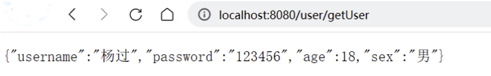
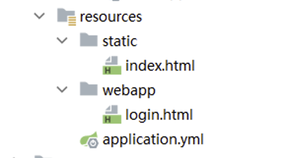

# 一、实现过程

## 1.1 导入依赖

```xml
1.父项目
    <parent>
        <groupId>org.springframework.boot</groupId>
        <artifactId>spring-boot-starter-parent</artifactId>
        <version>3.0.5</version>
    </parent>

2.web启动器
    <dependency>
        <groupId>org.springframework.boot</groupId>
        <artifactId>spring-boot-starter-web</artifactId>
    </dependency>
```

## 1.2 创建启动类

```java
@SpringBootApplication
public class MainApplication {

    public static void main(String[] args) {
        SpringApplication.run(MainApplication.class,args);
    }
}
```

## 1.3 创建实体类

```java
@Data
public class User {
    private String username ;
    private String password ;
    private Integer age ;
    private String sex ;
}
```

## 1.4 编写 `controller` 

```java
@Controller
@RequestMapping("/user")
public class UserController {

    @GetMapping("/getUser")
    @ResponseBody
    public User getUser(){
        
        User user = new User();
        user.setUsername("杨过");
        user.setPassword("123456");
        user.setAge(18);
        user.setSex("男");
        return user;
    }
}
```

## 1.5 访问测试



# 二、`web` 相关配置项

位置：`application.yml`

```yaml
# web相关的配置
# https://docs.spring.io/spring-boot/docs/current/reference/html/application-properties.html#appendix.application-properties.server
server:
  # 端口号设置
  port: 80
  # 项目根路径
  servlet:
    context-path: /boot
```

当涉及Spring Boot的Web应用程序配置时，以下是**五个重要的配置参数**：

1.  `server.port`: 指定**应用程序的HTTP服务器端口号**。默认情况下，Spring Boot使用8080作为默认端口。您可以通过在配置文件中设置`server.port`来更改端口号。
2.  `server.servlet.context-path`: 设置**应用程序的上下文路径**。这是应用程序在URL中的基本路径。默认情况下，上下文路径为空。您可以通过在配置文件中设置`server.servlet.context-path`属性来指定自定义的上下文路径。
3.  `spring.mvc.view.prefix`和`spring.mvc.view.suffix`: 这两个属性用于**配置视图解析器的前缀和后缀**。视图解析器用于解析控制器返回的视图名称，并将其映射到实际的视图页面。`spring.mvc.view.prefix`定义视图的前缀，`spring.mvc.view.suffix`定义视图的后缀。
4.  `spring.resources.static-locations`: 配置**静态资源的位置**。静态资源可以是CSS、JavaScript、图像等。**默认情况下，Spring Boot会将静态资源放在`classpath:/static`目录下**。您**可以通过在配置文件中设置`spring.resources.static-locations`属性来自定义静态资源的位置。**
5.  `spring.http.encoding.charset`和`spring.http.encoding.enabled`: 这两个属性用于配置**HTTP请求和响应的字符编码**。`spring.http.encoding.charset`定义字符编码的名称（例如UTF-8），`spring.http.encoding.enabled`用于启用或禁用字符编码的自动配置。

这些是在Spring Boot的配置文件中与Web应用程序相关的一些重要配置参数。根据您的需求，您可以在配置文件中设置这些参数来定制和配置您的Web应用程序

# 三、静态资源处理

> 在WEB开发中我们需要引入一些静态资源 , 例如 : `HTML` , `CSS` , `JS` , 图片等 , 如果是普通的项目静态资源可以放在项目的 `webapp` 目录下。现在使用Spring Boot做开发 , 项目中没有 `webapp` 目录 , 我们的项目是一个jar工程，那么就没有 `webapp` ，我们的静态资源该放哪里呢？

## 3.1 默认路径

在springboot中就定义了静态资源的默认查找路径：

`classpath` 就是当前项目的 `resources` 目录

**· classpath:/META-INF/resources/**

**· classpath:/resources/**

**· classpath:/static/**

**· classpath:/public/**

我们只要**静态资源放在这些目录中任何一个，`SpringMVC` 都会帮我们处理**。 我们**习惯会把静态资源放在 ·`classpath:/static/` 目录下**。在 `resources` 目录下创建 `index.html` 文件


打开浏览器输入 : `http://localhost:8080/index.html` 即可（注意：**路径中不需要包含 `static`**）

## 3.2 覆盖路径

如果想要自定义静态文件的存储路径，可以使用 `spring.resources.static-locations` 进行手动设置：

```yaml
# web相关的配置
# https://docs.spring.io/spring-boot/docs/current/reference/html/application-properties.html#appendix.application-properties.server
server:
  # 端口号设置
  port: 80
  # 项目根路径
  servlet:
    context-path: /boot
spring:
  web:
    resources:
      # 配置静态资源地址,如果设置,会覆盖默认值
      static-locations: classpath:/webapp
```



此时的访问地址：`http://localhost/boot/login.html` （**路径中也不需要包含 `webapp`**）

# 四、自定义拦截器

拦截器只需要按照 `spring-mvc` 中正常的配置流程即可，**只要保证拦截器的配置类所在的包位于启动类包或者子包下即可**。

```java
// 拦截类
@Component
public class MyInterceptor implements HandlerInterceptor {
    @Override
    public boolean preHandle(HttpServletRequest request, HttpServletResponse response, Object handler) throws Exception {
        System.out.println("MyInterceptor拦截器的preHandle方法执行....");
        return true;
    }

    @Override
    public void postHandle(HttpServletRequest request, HttpServletResponse response, Object handler, ModelAndView modelAndView) throws Exception {
        System.out.println("MyInterceptor拦截器的postHandle方法执行....");
    }

    @Override
    public void afterCompletion(HttpServletRequest request, HttpServletResponse response, Object handler, Exception ex) throws Exception {
        System.out.println("MyInterceptor拦截器的afterCompletion方法执行....");
    }
}

```

```java
// 配置类
@Configuration
public class MvcConfig implements WebMvcConfigurer {

    @Autowired
    private MyInterceptor myInterceptor ;

    /**
     * /**  拦截当前目录及子目录下的所有路径 /user/**   /user/findAll  /user/order/findAll
     * /*   拦截当前目录下的以及子路径   /user/*     /user/findAll
     * @param registry
     */
    @Override
    public void addInterceptors(InterceptorRegistry registry) {
        registry.addInterceptor(myInterceptor).addPathPatterns("/**");
    }
}
```

