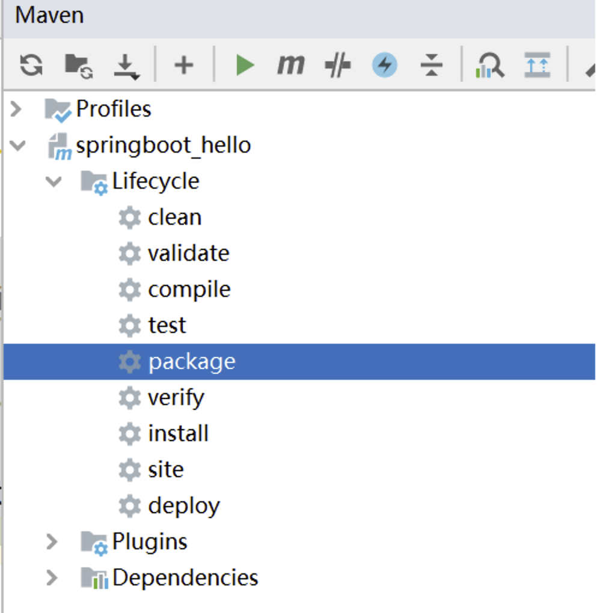
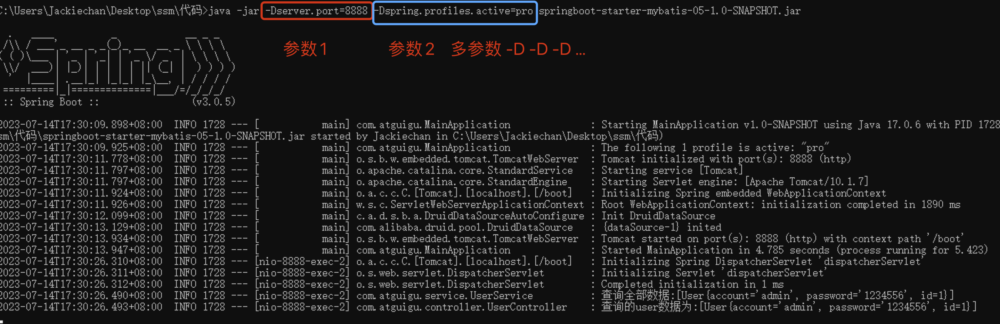

# 一、添加打包插件

在 `Spring Boot` 项目中**添加 `spring-boot-maven-plugin` 插件**是为了支持将项目打包成可执行的可运行 `jar` 包。**如果不添加 `spring-boot-maven-plugin` 插件配置**，使用常规的`java -jar` 命令来**运行打包后的 Spring Boot 项目是无法找到应用程序的入口点，因此导致无法运行。**

```xml
<!--    SpringBoot应用打包插件-->
<build>
    <plugins>
        <plugin>
            <groupId>org.springframework.boot</groupId>
            <artifactId>spring-boot-maven-plugin</artifactId>
        </plugin>
    </plugins>
</build>
```

# 二、执行打包指令

在 idea 点击 package 进行打包

执行成功后，可以**在编译的 target 文件中查看 jar 包**



# 三、命令启动和参数说明

**`java -jar  `命令用于在 Java 环境中执行可执行的 jar 文件**。下面是关于`java -jar`命令的说明：

```xml
命令格式：java -jar  [选项] [参数] <jar文件名>
```

1.  `-D<name>=<value>`：设置系统属性，可以通过`System.getProperty()`方法在应用程序中获取该属性值。例如：`java -jar -Dserver.port=8080 myapp.jar`。
2.  `-X`：设置JVM参数，例如内存大小、垃圾回收策略等。常用的选项包括：
    -   `-Xmx<size>`：设置JVM的最大堆内存大小，例如 `-Xmx512m` 表示设置最大堆内存为512MB。
    -   `-Xms<size>`：设置JVM的初始堆内存大小，例如 `-Xms256m` 表示设置初始堆内存为256MB。
3.  `-Dspring.profiles.active=<profile>`：指定Spring Boot的激活配置文件，可以通过`application-<profile>.properties`或`application-<profile>.yml`文件来加载相应的配置。例如：`java -jar -Dspring.profiles.active=dev myapp.jar`。

启动和测试：



注意： **-D 参数必须要在jar之前！否者不生效！**