# 一、SSM 整合

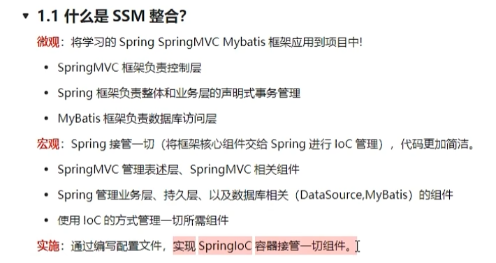

# 二、SSM 整合的核心问题

## 2.1 SSM 整合需要几个 `Ioc` 容器

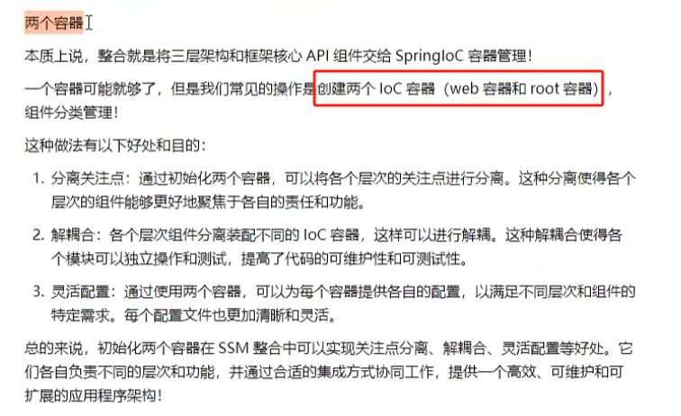

## 2.2 每个 Ioc 容器对应哪些类型组件

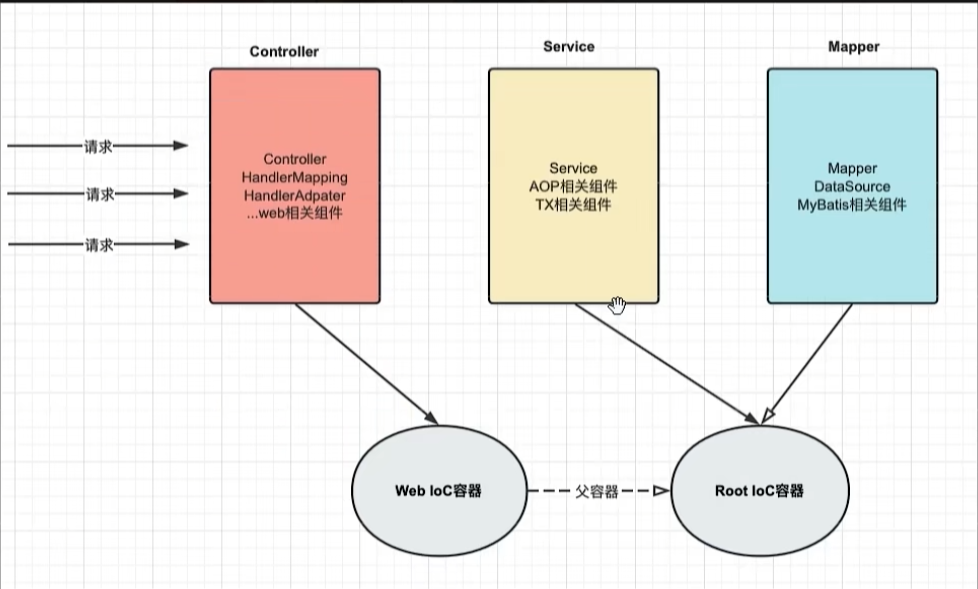

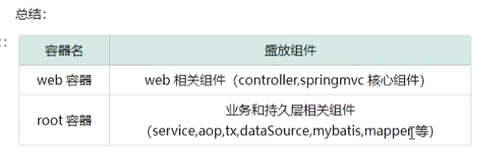

## 2.3 Ioc 容器之间的关系和调用方向

情况1：两个无关联的 Ioc 容器之间的组件无法相互调用

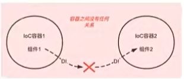

情况2：子 Ioc 容器可以单向调用父 Ioc 容器的组件

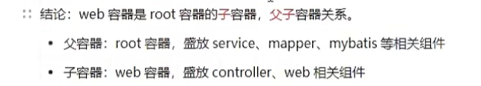

层次关系图如下：

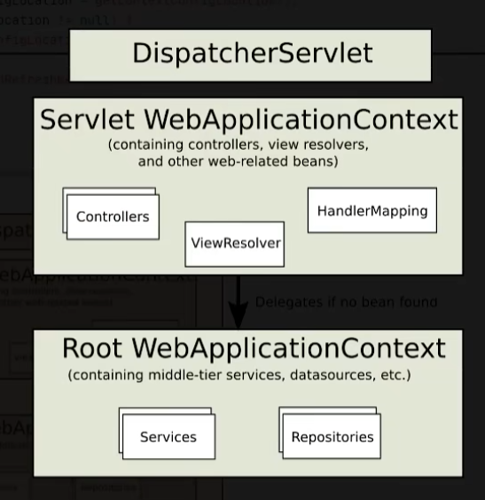

## 2.4 具体需要多少配置类以及对应容器关系？

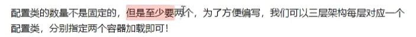

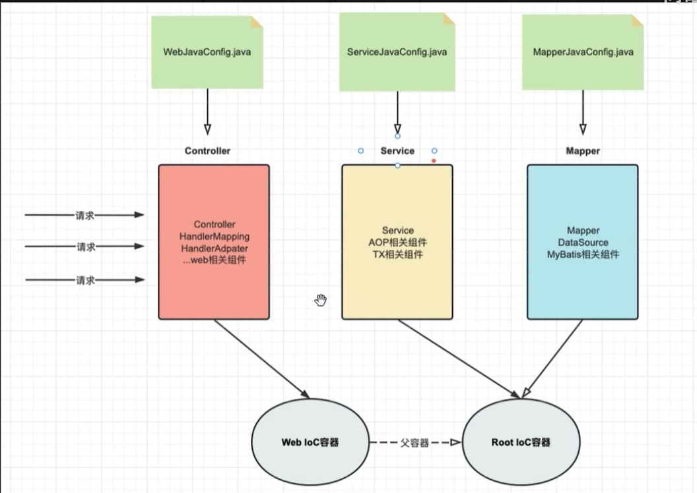

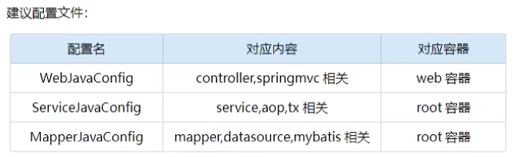

## 2.5 Ioc 初始化方式和配置位置？

使用 `spring-mvc` 中初始化容器的方式：

在初始化类中完成两个 Ioc 容器的创建初始化

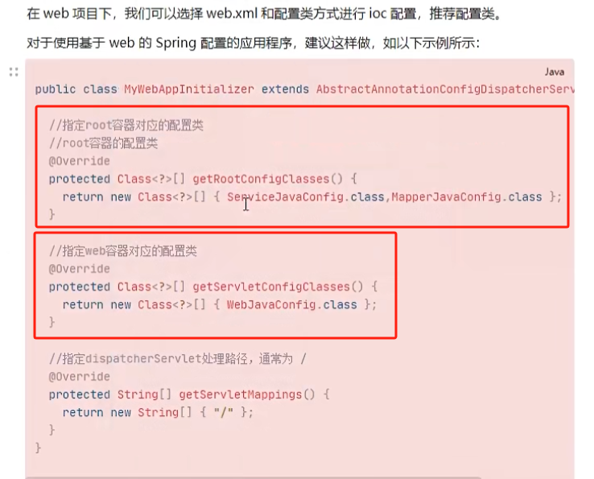

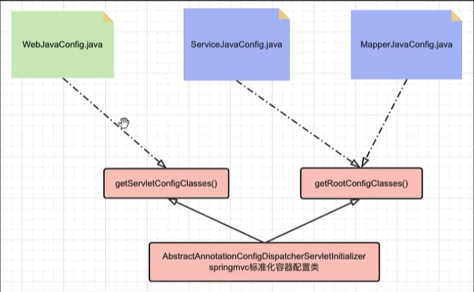