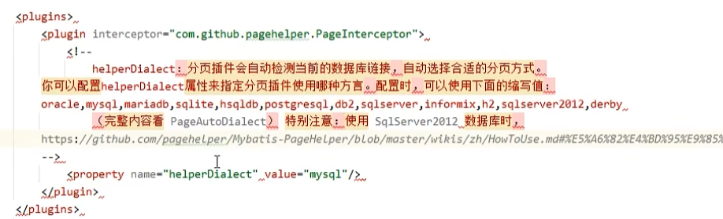

# 一、依赖添加

实体类添加：

`logback` 配置：

# 二、`spring-mvc` 层配置

配置类中需要配置以下功能：

# 三、service 层配置

# 四、`mybatis` 层配置

## 4.1 `mybatis` 整合思路

如何将 `sqlSessionFactory` 加入到 `ioc` 容器？

有两种思路：

思路一：

思路二：

总结：

## 4.2 准备外部配置文件

## 4.3 整合实现

### 4.3.1 方法一：保留 `mybatis-config.xml`

数据库的连接由  Druid 连接池完成配置，mapper 接口和 mapper.xml 文件所在包的扫描由 Java 配置类处理，其余功能依旧在 `mybatis-config.xml` 中进行配置：

配置类：

Druid 连接池（`dataSource`）加入到 `ioc` 容器：

`sqlSessionFactory` 加入到 `ioc` 容器：

`mapper` 代理对象加入到 `ioc` 容器：

### 4.3.2  存在的一个问题

问题：

解决方案：

`Durid` 连接池专门用一个配置类 `DataSourceJavaConfig` 进行配置：

### 4.3.3 方法二：全部在配置类中手动设置

#### 4.3.3.1  `settings` 项配置

配置文件：

配置类：

#### 4.3.3.2 别名设置

配置文件：

配置类：

#### 4.3.3.3 插件设置

配置文件：

配置类：

# 五、初始化配置类

# 六、访问测试

## 6.1 完善 mapper 层

1. `mapper` 接口

2. `mapper.xml` 实现 SQL 查询

## 6.2 业务层完善

1. 业务层接口

2. 业务层实现类

## 6.3 controller 层完善

controller 层调用业务层接口，通过 DI 注入业务层实现类（通过接口接值）

