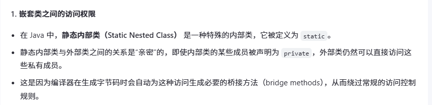
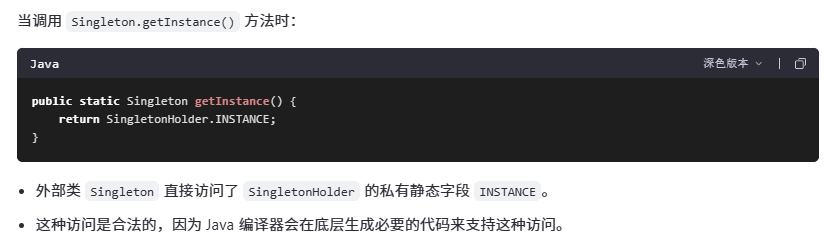
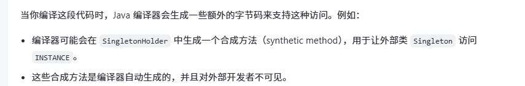

# 一、单例模式介绍

单例模式（Singleton Pattern）是一种**创建型**设计模式，它确保**一个类只有一个实例**，并**提供一个全局访问点来访问这个实例**。这种模式在需要**控制资源访问、配置管理或日志记录等场景**中非常有用。

# 二、单例模式的主要组成部分

1. **唯一实例**：保证在整个应用程序生命周期中，**某个类仅有一个实例存在**。
2. **全局访问点**：提供一个**静态方法（通常是 getInstance()）**，让客户端代码可以**获取该类的唯一实例**。
3. **私有构造函数**：**防止外部通过构造函数创建新的实例**，从而确保单一性。

# 三、单例模式实现方式

根据线程安全性和懒加载的需求，单例模式有不同的实现方式：

## 3.1 饿汉式（Eager Initialization）

这是最简单的单例模式实现，实例在**类加载时**就创建好了。这种方式是**线程安全**的，但不支持懒加载（Lazy Loading）。

```java
public class Singleton {
    private static final Singleton instance = new Singleton();

    // 私有构造函数
    private Singleton() {}

    public static Singleton getInstance() {
        return instance;
    }
}
```

## 3.2 懒汉式（Lazy Initialization）

### 3.2.1 原始懒汉式

实例在**第一次使用时才创建**，这支持了懒加载。但是，**原始的懒汉式**实现**不是线程安全的**。

```java
public class Singleton {
    private static Singleton instance;

    // 私有构造函数
    private Singleton() {}

    public static Singleton getInstance() {
        if (instance == null) {
            instance = new Singleton();
        }
        return instance;
    }
}
```

### 3.2.2 一次加锁

为了使懒汉式实现线程安全，可以在 **getInstance() 方法上加锁**（Synchronized Method），但这**会影响性能**。

```java
public class Singleton {
    private static Singleton instance;

    // 私有构造函数
    private Singleton() {}

    public static synchronized Singleton getInstance() {
        if (instance == null) {
            instance = new Singleton();
        }
        return instance;
    }
}
```

### 3.2.3 双重检查锁定（Double-Checked Locking）

这是一种优化的懒加载和线程安全的方法，它只在第一次创建实例时进行同步操作。

```java
public class Singleton {
    private static volatile Singleton instance;

    // 私有构造函数
    private Singleton() {}

    public static Singleton getInstance() {
        if (instance == null) {
            synchronized (Singleton.class) {
                if (instance == null) {
                    instance = new Singleton();
                }
            }
        }
        return instance;
    }
}
```

## 3.3 静态内部类（Static Inner Class）

利用Java的类加载机制来实现延迟加载和线程安全。

```java
public class Singleton {
    // 私有构造函数
    private Singleton() {}

    private static class SingletonHolder {
        private static final Singleton INSTANCE = new Singleton();
    }

    public static Singleton getInstance() {
        return SingletonHolder.INSTANCE;
    }
}
```







## 3.4 枚举（Enum）

单元素的枚举天生就是线程安全的，并且防止反序列化创建新的实例，这是最简洁的实现方式。

```java
public enum Singleton {
    INSTANCE;

    // 可以定义一些属性和方法
    private String name;

    public String getName() {
        return name;
    }

    public void setName(String name) {
        this.name = name;
    }

    public void showMessage() {
        System.out.println("Hello from the singleton instance!");
    }
}

// 客户端代码
class Client {
    public static void main(String[] args) {
        // 获取单例对象
        Singleton singleton = Singleton.INSTANCE;

        // 调用方法
        singleton.setName("Singleton Enum");
        singleton.showMessage();
        System.out.println("Name: " + singleton.getName());
    }
}
```

# 四、单例模式优缺点

优点

- 唯一性：确保了系统中某类对象只有一个实例。
- 受控访问点：提供了一个全局访问点来访问该实例。
- 资源利用率高：因为单例对象是在需要的时候才被创建，所以可以节省资源。

缺点

- 难以并行化：如果单例对象需要持有状态并且是可变的，那么可能会成为并发编程中的瓶颈。
- 隐藏依赖关系：单例模式可能会隐藏类之间的依赖关系，使得代码更难理解。
- 测试困难：由于单例通常包含全局状态，这可能使单元测试变得复杂。
- 不易扩展：一旦确定为单例，后续如果想要改变为多实例，会比较麻烦。

# 五、应用场景

单例模式适用于以下几种情况：

- 系统只需要一个实例的对象，如数据库连接池、线程池、缓存、日志记录器等。
- 控制资源的访问，比如配置文件读取器。
- 中央注册表或服务定位器，用于查找其他的服务。

选择适当的实现方式取决于具体的应用需求，包括是否需要懒加载、线程安全以及对性能的要求等因素。

