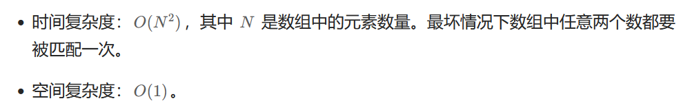
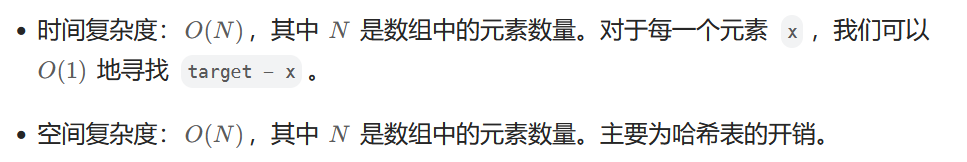

给定一个整数数组 `nums` 和一个整数目标值 `target`，请你在该数组中找出 **和为目标值** *`target`* 的那 **两个** 整数，并返回它们的数组下标。

你可以假设每种输入只会对应一个答案。但是，数组中同一个元素在答案里不能重复出现。

你可以按任意顺序返回答案。

**示例 1：**

```
输入：nums = [2,7,11,15], target = 9
输出：[0,1]
解释：因为 nums[0] + nums[1] == 9 ，返回 [0, 1] 。
```

**示例 2：**

```
输入：nums = [3,2,4], target = 6
输出：[1,2]
```

**示例 3：**

```
输入：nums = [3,3], target = 6
输出：[0,1]
```


**方法一：暴力枚举**

```go
func twoSum(nums []int, target int) []int {
	for i := 0; i < len(nums)-1; i++ {
		for j := i + 1; j < len(nums); j++ {
			if nums[i]+nums[j] == target {
				res := make([]int, 0)
				res = append(res, i)
				res = append(res, j)
				return res
			}
		}
	}
	return nil
}
```

复杂度分析




**方法二：哈希表**

​	注意到方法一的时间复杂度较高的原因是寻找 target - x 的时间复杂度过高。因此，我们需要一种更优秀的方法，能够快速寻找数组中是否存在目标元素。如果存在，我们需要找出它的索引。

```go
func twoSum(nums []int, target int) []int {
    hashTable := map[int]int{}
    for i, x := range nums {
        if p, ok := hashTable[target-x]; ok {
            return []int{p, i}
        }
        hashTable[x] = i
    }
    return nil
}
```

**复杂度分析**

