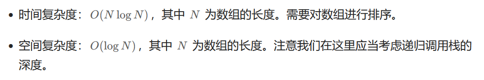
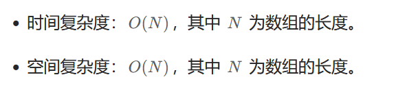

给你一个整数数组 `nums` 。如果任一值在数组中出现 **至少两次** ，返回 `true` ；如果数组中每个元素互不相同，返回 `false` 。


**示例 1：**

```
输入：nums = [1,2,3,1]
输出：true
```

**示例 2：**

```
输入：nums = [1,2,3,4]
输出：false
```

**示例 3：**

```
输入：nums = [1,1,1,3,3,4,3,2,4,2]
输出：true
```


**方法一：排序**

```go
func containsDuplicate(nums []int) bool {
    sort.Ints(nums)
    for i := 1; i < len(nums); i++ {
        if nums[i] == nums[i-1] {
            return true
        }
    }
    return false
}
```

**复杂度分析**




**方法二：哈希表**

```go
func containsDuplicate(nums []int) bool {
    set := map[int]struct{}{}
    for _, v := range nums {
        if _, has := set[v]; has {
            return true
        }
        set[v] = struct{}{}
    }
    return false
}
```

**复杂度分析**

