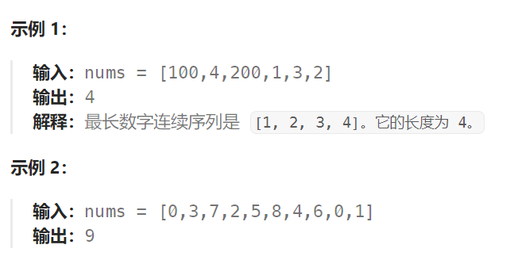

## 题目

给定一个未排序的整数数组 `nums` ，找出数字连续的最长序列（不要求序列元素在原数组中连续）的长度。

请你设计并实现时间复杂度为 `O(n)` 的算法解决此问题。



## 题解

使用**哈希表**

**每种数值只会被访问一次**(**一旦检测到 val - 1 存在就不会进入循环中**)，因此时间复杂度为 O(N)

```go
func longestConsecutive(nums []int) int {
    if len(nums) == 0 {
        return 0
    }
    valMap := make(map[int]bool)  // 记录出现在 nums 中的数值(同时去除掉了重复值)
    for _,v := range nums {
        valMap[v] = true
    }
    maxLen := 1
    for val, _ := range valMap {  // 遍历哈希表而不是原始 nums，可以跳过许多重复值(否则会超时)
        if !valMap[val-1] {   // 当且仅当 val-1 不存在时，从 val 开始往后遍历连续序列
            curNum := val
            curLen := 1
            for valMap[curNum+1] {  // 直到连续序列断开，结束循环
                curLen++
                curNum++
            }
            maxLen = getMax(maxLen, curLen)
        }
    }
    return maxLen
}
func getMax(a, b int) int {
    if a > b {
        return a
    } else {
        return b
    }
}
```

