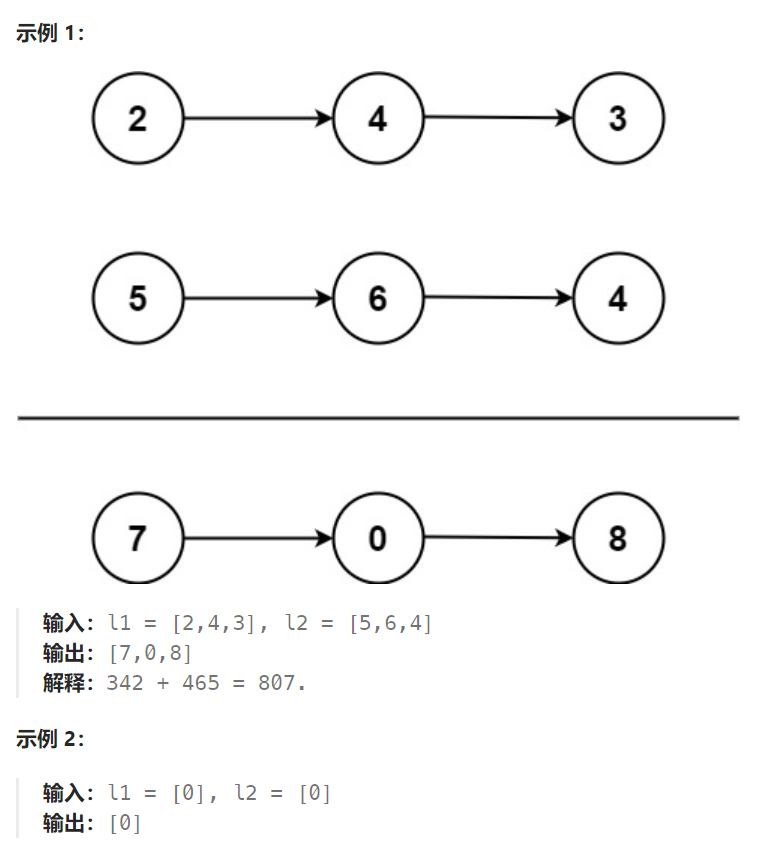

## 题目

给你两个 **非空** 的链表，表示两个非负的整数。它们每位数字都是按照 **逆序** 的方式存储的，并且每个节点只能存储 **一位** 数字。

请你将两个数相加，并以相同形式返回一个表示和的链表。

你可以假设除了数字 0 之外，这两个数都不会以 0 开头。



## 题解

不要忘记：当两个链表都结束时，可能还有最后一个进位需要作为一个新的链表节点

```go
func addTwoNumbers(l1 *ListNode, l2 *ListNode) *ListNode {
    dummy := &ListNode{}   // 新链表的哑结点
    newCur := dummy

    add := 0    // 是否进位(0 或者 1)
    for l1 != nil && l2 != nil {
        newVal := l1.Val + l2.Val + add   // 两个链表节点相加 + 进位
        if newVal >= 10 {  // 向上进位
            add = 1
            newCur.Next = &ListNode{Val: newVal - 10}
        } else {
            add = 0
            newCur.Next = &ListNode{Val: newVal}
        }
        newCur = newCur.Next
        l1 = l1.Next
        l2 = l2.Next
    }
    for l1 != nil {
        newVal := l1.Val + add
        if newVal >= 10 {  // 向上进位
            add = 1
            newCur.Next = &ListNode{Val: newVal - 10}
        } else {
            add = 0
            newCur.Next = &ListNode{Val: newVal}
        }       
        newCur = newCur.Next
        l1 = l1.Next
    }
    for l2 != nil {
        newVal := l2.Val + add
        if newVal >= 10 {  // 向上进位
            add = 1
            newCur.Next = &ListNode{Val: newVal - 10}
        } else {
            add = 0
            newCur.Next = &ListNode{Val: newVal}
        }       
        newCur = newCur.Next
        l2 = l2.Next
    }
    if add == 1 {   // 两个链表都结束了, 最后还有一个进位
       newCur.Next = &ListNode{Val: 1} 
    }

    return dummy.Next
}
```

