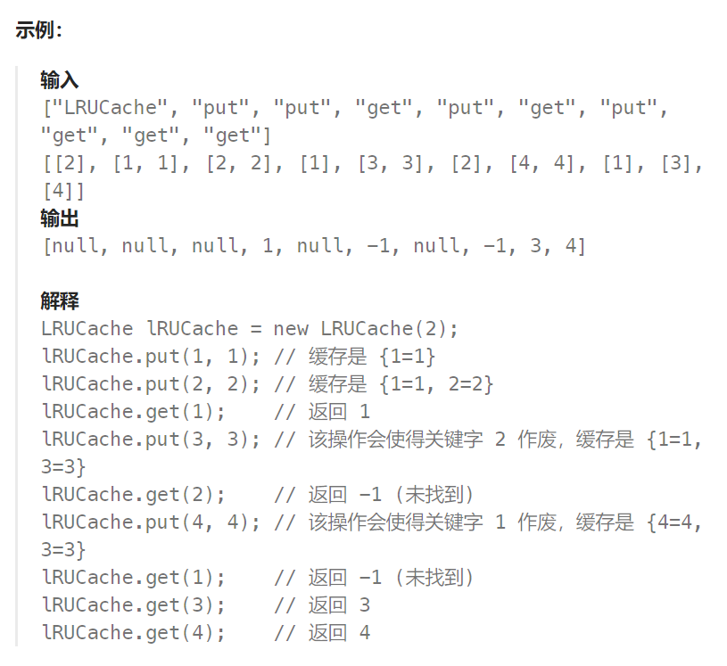
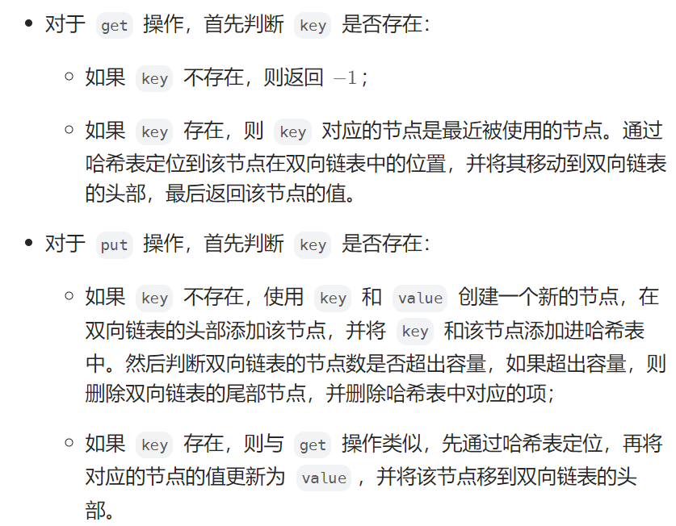

## 题目

请你设计并实现一个满足 [LRU (最近最少使用) 缓存](https://baike.baidu.com/item/LRU) 约束的数据结构。

实现 `LRUCache` 类：

- `LRUCache(int capacity)` 以 **正整数** 作为容量 `capacity` 初始化 LRU 缓存
- `int get(int key)` 如果关键字 `key` 存在于缓存中，则返回关键字的值，否则返回 `-1` 。
- `void put(int key, int value)` 如果关键字 `key` 已经存在，则变更其数据值 `value` ；如果不存在，则向缓存中插入该组 `key-value` 。如果插入操作导致关键字数量超过 `capacity` ，则应该 **逐出** 最久未使用的关键字。

函数 `get` 和 `put` 必须以 `O(1)` 的平均时间复杂度运行。



## 题解

LRU 缓存机制可以通过哈希表辅以双向链表实现。

- 双向链表按照**被使用的顺序**存储了这些键值对，**靠近头部的键值对是最近使用（读取和插入都算使用）的**，而**靠近尾部的键值对是最久未使用的**。

- 哈希表即为普通的哈希映射（HashMap），通过缓存**数据的键**映射到其**在双向链表中的位置（即对应节点的地址）**。


这样以来，我们首先使用哈希表进行定位，找出**缓存项在双向链表中的位置**，随后将其**移动到双向链表的头部**，即可在 O(1) 的时间内完成 get 或者 put 操作。具体的方法如下：



上述各项操作中，**通过访问哈希表定位到链表节点时间复杂度为 O(1)** ，在双向链表的头部添加节点、在双向链表的尾部删除节点的复杂度也为 O(1) 。而**将一个节点移到双向链表的头部**，可以分成「**删除该节点**」和「**在双向链表的头部添加节点**」两步操作，都可以在 O(1) 间内完成。

注意：

在双向链表的实现中，使用一个伪头部（dummy head）和伪尾部（dummy tail）标记界限，这样在添加节点和删除节点的时候就不需要检查相邻的节点是否存在。

```go
type LRUCache struct {
    capacity int   // 最大容量
    curCount int   // 当前缓存的 k-v 数量
    NodeMap map[int]*DLinkedNode  // 存储所有 key 所在的节点地址
    LL *DLinkedList   // 构成 LRU 的底层双向链表
}
func Constructor(capacity int) LRUCache {
    ll := NewDLinkedList()
    return LRUCache{
        capacity: capacity,
        curCount: 0,
        NodeMap: make(map[int]*DLinkedNode),
        LL:ll,
    }
}
func (this *LRUCache) Get(key int) int {
    if node, ok := this.NodeMap[key]; !ok {   // 对应key不存在
        return -1
    } else {
        val := node.val   // 节点存储的 val
        // 将最近使用的节点移动到链表头部，分为两步: 1.将该节点从链表中删除  2.将节点重新从链表头部插入
        this.LL.RemoveNode(node)
        newHead := this.LL.AddToHead(key, val)
        this.NodeMap[key] = newHead
        return val
    }
}
func (this *LRUCache) Put(key int, value int)  {
    if node, ok := this.NodeMap[key];!ok {   // 对应 key 原本不存在，直接新建节点插入到链表头部
        newHead := this.LL.AddToHead(key, value)
        this.NodeMap[key] = newHead   // 在 map 中记录节点地址
        if this.curCount + 1 > this.capacity {  // 插入这个新节点后导致容量超了，删除尾部节点
            lastTail := this.LL.RemoveFromTail()
            delete(this.NodeMap, lastTail.key)   // 从 map 中删除节点地址
            // 加一个，删一个，节点总数不变
        } else {
            this.curCount++
        }
    } else {   // 对应 key 原本存在，更新节点的值，将其移动到首部
        this.LL.RemoveNode(node)
        newHead := this.LL.AddToHead(key, value)
        this.NodeMap[key] = newHead   // 在 map 中更新节点的地址
    }
}
```

双向链表的实现：

```go
// 双向链表节点
type DLinkedNode struct {
    key int
    val int
    prev *DLinkedNode
    next *DLinkedNode
}
// 双向链表(需要功能: 1.从头部插入  2.从尾部删除  3.从中间删除)
type DLinkedList struct {
    head *DLinkedNode
    tail *DLinkedNode
}
// 创建一个双向链表，头和尾节点都用哑结点
func NewDLinkedList() *DLinkedList {
    head := &DLinkedNode{}
    tail := &DLinkedNode{}
    head.next = tail
    tail.prev = head
    return &DLinkedList{head: head, tail:tail}
}
// 将一对 k-v 插入到链表头部
func (dl *DLinkedList) AddToHead(key, val int) *DLinkedNode{
    node := &DLinkedNode{key:key, val:val}
    // 新节点的后方节点进行调整
    dl.head.next.prev = node
    node.next = dl.head.next
    // 新节点的前方节点进行调整
    dl.head.next = node
    node.prev = dl.head

    return node
}
// 删除链表尾部元素
func (dl *DLinkedList) RemoveFromTail() *DLinkedNode{
    if dl.tail.prev == dl.head {  // 链表内实际没有节点
        return &DLinkedNode{}
    }
    rnode := dl.tail.prev
    rnode.prev.next = dl.tail
    dl.tail.prev = rnode.prev

    return rnode
}
// 将指定的节点删除掉(传入节点的地址)
func (dl *DLinkedList) RemoveNode(node *DLinkedNode) {
    prev := node.prev
    next := node.next

    prev.next = next
    next.prev = prev
}
```

golang 附带的双向链表（引入包: container/list）

```go
ll := list.New()   // 创建并初始化一个双向链表(头和尾各是一个哑结点)

ll.Front()  // 返回头结点(非哑结点)
ll.Back()  // 返回尾节点(非哑结点)
ll.Len()  // 返回链表长度(不带哑结点)

ll.PushFront(3)   // 将元素插入到链表头部(参数是 any 类型)
ll.PushBack(4)  // 将元素插入到链表尾部

node := &list.Element{}   // 链表中节点的类型
ll.MoveToFront(node)   // 传入节点地址，将其移动到链表头部
ll.MoveToBack(node) // 传入节点地址，将其移动到链表尾部

ll.Remove(node)  // 传入节点地址，将其删除
```

