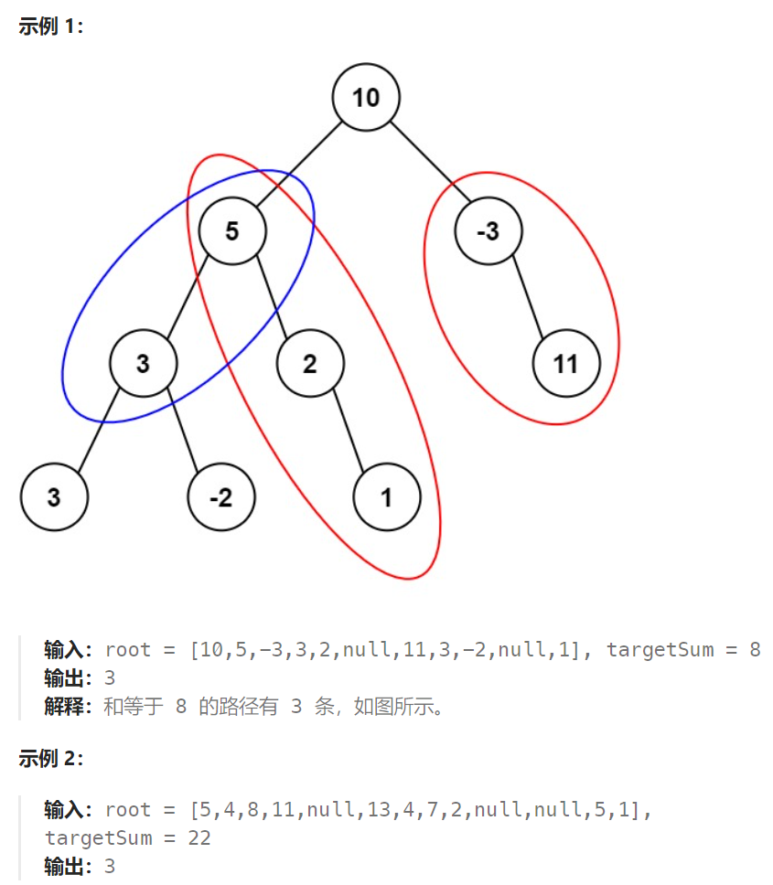

## 题目

给定一个二叉树的根节点 `root` ，和一个整数 `targetSum` ，求该二叉树里节点值之和等于 `targetSum` 的 **路径** 的数目。

**路径** 不需要从根节点开始，也不需要在叶子节点结束，但是路径方向必须是向下的（只能从父节点到子节点）。



## 题解

### 方法一：二叉树递归（双递归）

注意，这里有两个函数在递归，pathSum() 是主递归函数

```go
// 求以 root 为根节点的子树中，路径和为 targetSum 的路径个数(路径的起点不一定是 root )
func pathSum(root *TreeNode, targetSum int) int {
    if root == nil {
        return 0
    }
    res := rootSum(root, targetSum)  // 以当前 root 为起点的, 路径和为 targetSum 的路径个数
    res += pathSum(root.Left, targetSum)  // 左子树中路径和为 targetSum 的路径个数
    res += pathSum(root.Right, targetSum)  // 右子树中路径和为 targetSum 的路径个数
    return res
}
// 获取以 root 作为起点，路径和为 targetSum 的路径个数
func rootSum(root *TreeNode, targetSum int) int {
    if root == nil {
        return 0
    }
    res := 0
    if root.Val == targetSum {  // 根节点的值恰好 == targetSum
        res++
    }
    if root.Left != nil {
        res += rootSum(root.Left, targetSum - root.Val)
    }
    if root.Right != nil {
        res += rootSum(root.Right, targetSum - root.Val)
    }
    return res
}
```

### 方法二：前缀和

该题使用前缀和方法的话，其思路和 `560.和为K的子数组` 完全一致。

`dfs` 在遍历二叉树的同时，统计从根节点出发到每一个节点的路径和，一旦两个前缀和路径之差 == `targetSum` ， 那么说明从 `前缀和路径 1 的结束点` 到 `前缀和路径 2 的结束点` 之间的路径的路径和 == `targetSum`

```go
func pathSum(root *TreeNode, targetSum int) int {
    if root == nil {
        return 0
    }
    res := 0   // 路径和 == targetSum 的路径个数

    pathSumSet := make(map[int]int)  // 存储所有从 root 出发能得到的不同路径和的路径数量，即前缀和集合
    pathSumSet[0] = 1   // 特殊项（某路径自身路径和 == targetSum）

    curPathSum := 0  // 当前路径的路径和

    var dfs func(*TreeNode)   // 
    dfs = func(root *TreeNode) {
        if root == nil {
            return
        }
        curPathSum += root.Val
        // 两条前缀和路径的差 == targetSum
        // 从当前路径的终点到这条路径的终点之间构成的路径，其路径和 == targetSum
        if pathSumSet[curPathSum - targetSum] != 0 {  
            res += pathSumSet[curPathSum - targetSum]
        }
        pathSumSet[curPathSum]++  // 从根节点到当前节点的一条路径
        if root.Left != nil {
            dfs(root.Left)
        }
        if root.Right != nil {
            dfs(root.Right)
        }
        // 因为要返回到自己的父节点，路径上就不会存在当前节点, 因此要回溯
        curPathSum -= root.Val
    }
    dfs(root)
    return res
}
```

