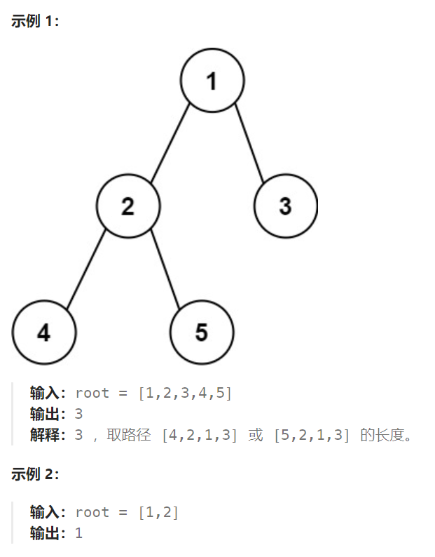

## 题目

给你一棵二叉树的根节点，返回该树的 **直径** 。

二叉树的 **直径** 是指树中任意两个节点之间最长路径的 **长度** 。这条路径可能经过也可能不经过根节点 `root` 。

两节点之间路径的 **长度** 由它们之间边数表示。



## 题解

```go
func diameterOfBinaryTree(root *TreeNode) int {
    maxLen := 0  // 路径的最大长度
    var dfs func(*TreeNode) int
    dfs = func(root *TreeNode) int {
        if root == nil {
            return 0
        }
        if root.Left == nil && root.Right == nil {   // 叶子结点
            return 1
        }
        leftH, rightH := 0,0
        if root.Left != nil {
            leftH = dfs(root.Left)   // 左子树的高度
        }
        if root.Right != nil {
            rightH = dfs(root.Right)  // 右子树的高度
        }
        curH := 1 + getMax(leftH, rightH)   // 当前子树的高度
        curLen := leftH + rightH        // 当前子树内的最长路径
        maxLen = getMax(maxLen, curLen)

        return curH
    }
    dfs(root)
    return maxLen
}
```

