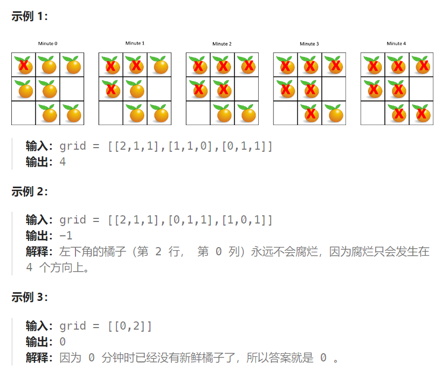

## 题目

在给定的 `m x n` 网格 `grid` 中，每个单元格可以有以下三个值之一：

- 值 `0` 代表空单元格；
- 值 `1` 代表新鲜橘子；
- 值 `2` 代表腐烂的橘子。

每分钟，腐烂的橘子 **周围 4 个方向上相邻** 的新鲜橘子都会腐烂。

返回 *直到单元格中没有新鲜橘子为止所必须经过的最小分钟数。如果不可能，返回 `-1`* 。



## 题解

本体的关键是要将所有的腐烂橘子视为一个整体集合，同时开始 bfs 扩展。

```go
func orangesRotting(grid [][]int) int {
    rowMax := len(grid)
    colMax := len(grid[0])
    var dirs [4][2]int = [4][2]int{ {-1,0},{1,0},{0,-1},{0,1} }
    q := make([][2]int, 0)   // 存储所有腐烂橘子的队列
    // 1. 第一轮遍历，找出所有烂橘子，加入到队列中
    for row := 0; row < rowMax; row++ {
        for col := 0; col < colMax; col++ {
            if grid[row][col] == 2 {  // 找到烂橘子
                grid[row][col] = -1  // 标记为已经访问
                q = append(q, [2]int{row, col})
            }
        }
    }
    // 2.从所有腐烂橘子同时出现，感染新鲜橘子
    needM := 0   // 所需的感染时间
    for len(q) > 0 {
        curCount := len(q)
        infect := false  // 本轮是否发生过感染
        for i := 0; i < curCount; i++ {
            p := q[0]
            q = q[1:]
            x, y := p[0], p[1]

            for j := 0; j < len(dirs); j++ {
                newX := x + dirs[j][0]
                newY := y + dirs[j][1]
                if newX < 0 || newX >= rowMax || newY < 0 || newY >= colMax {
                    continue
                }
                if grid[newX][newY] == 0 {
                    continue
                }
                if grid[newX][newY] == -1 {  // 已经访问过的烂橘子
                    continue
                }
                // 没有访问过的新鲜橘子
                grid[newX][newY] = -1   // 变成被访问的烂橘子
                q = append(q, [2]int{newX, newY})
                infect = true
            }
        }
        if infect {
            needM++  // 耗费一分钟完成感染
        }  
    }
    // 3.第三轮遍历，查看是否有孤立的新鲜橘子
    for row := 0; row < rowMax; row++ {
        for col := 0; col < colMax; col++ {
            if grid[row][col] == 1 {  // 找到新鲜橘子，则必定不可能全部腐烂
                return -1
            }
        }
    } 
    return needM   // 不存在孤立的新鲜橘子
}
```

