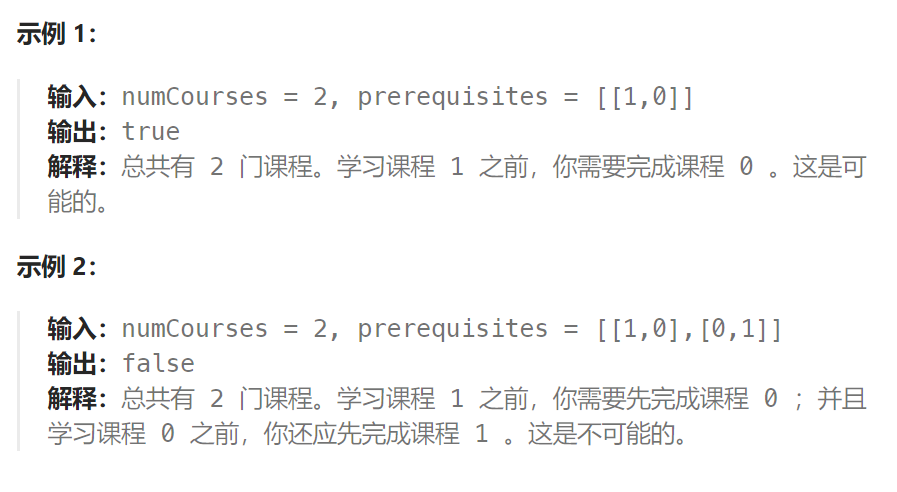
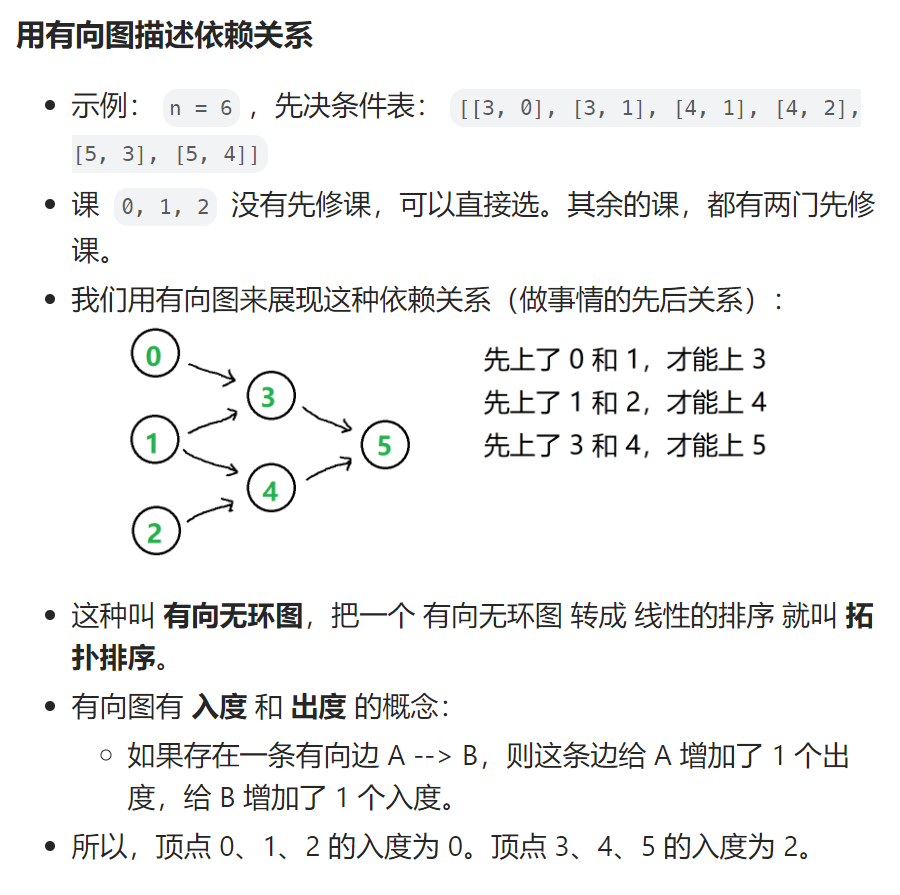
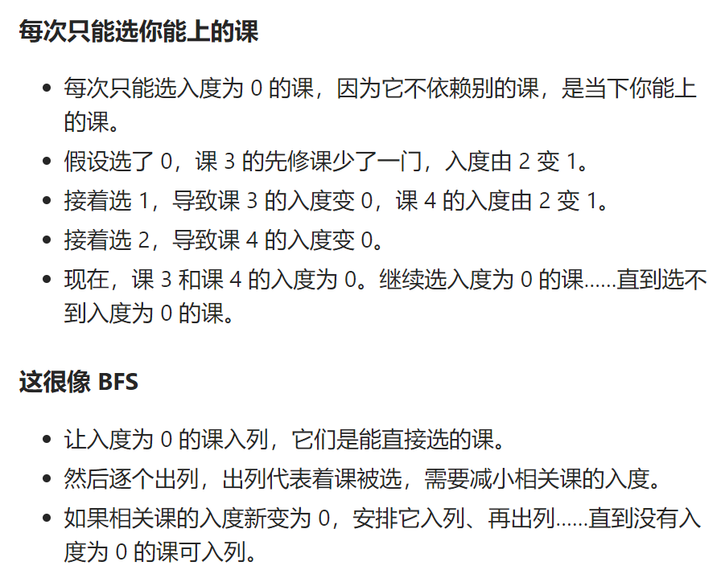
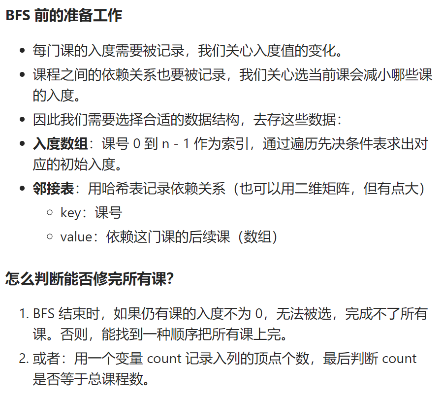

## 题目

你这个学期必须选修 `numCourses` 门课程，记为 `0` 到 `numCourses - 1` 。

在选修某些课程之前需要一些先修课程。 先修课程按数组 `prerequisites` 给出，其中 `prerequisites[i] = [ai, bi]` ，表示如果要学习课程 `ai` 则 **必须** 先学习课程 `bi` 。

- 例如，先修课程对 `[0, 1]` 表示：想要学习课程 `0` ，你需要先完成课程 `1` 。

请你判断是否可能完成所有课程的学习？如果可以，返回 `true` ；否则，返回 `false` 。



## 题解

拓扑排序







```go
func canFinish(numCourses int, prerequisites [][]int) bool {
    // nexts[i]: 记录依赖课程 i 的所有后续课程
    nexts := make([][]int, numCourses)
    // degree[i]: 记录课程 i 的入度（该课程依赖几门课）
    degree := make([]int, numCourses)
    for i := 0; i < len(prerequisites); i++ {
        p := prerequisites[i]
        nexts[p[1]] = append(nexts[p[1]], p[0])
        degree[p[0]]++
    }
    // 存储入度为0的课程(没有尚未学习的前导课程的课程)
    noDepend := make([]int, 0)   
    for i := 0; i < numCourses; i++ {
        if degree[i] == 0 {
            noDepend = append(noDepend, i)
        }
    }
    // 按照依赖关系将所有能学的课程都进行学习
    for len(noDepend) > 0 {
        course := noDepend[0]   // 将这门课程学习
        noDepend = noDepend[1:]
        // 该课程的所有后续课程 入度-1
        for i := 0; i < len(nexts[course]); i++ {
            next := nexts[course][i]
            degree[next]--
            if degree[next] == 0 {   // 如果入度 == 0， 将其加入到学习队列
                noDepend = append(noDepend, next)
            }
        }
    }
    // 检查是否还有入度 > 0 的课程，这些课程无法学习
    for i := 0; i < len(degree); i++ {
        if degree[i] != 0 {
            return false
        }
    }
    return true
}
```

