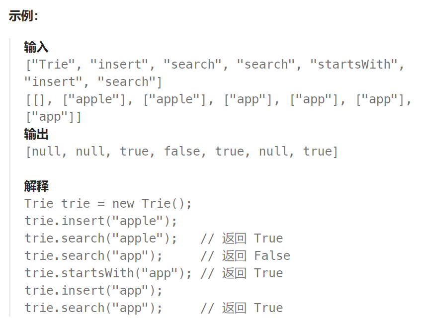
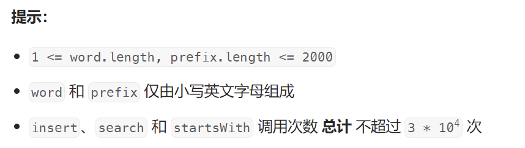

## 题目

**[Trie](https://baike.baidu.com/item/字典树/9825209?fr=aladdin)**（发音类似 "try"）或者说 **前缀树** 是一种树形数据结构，用于高效地存储和检索字符串数据集中的键。这一数据结构有相当多的应用情景，例如自动补完和拼写检查。

请你实现 Trie 类：

- `Trie()` 初始化前缀树对象。
- `void insert(String word)` 向前缀树中插入字符串 `word` 。
- `boolean search(String word)` 如果字符串 `word` 在前缀树中，返回 `true`（即，在检索之前已经插入）；否则，返回 `false` 。
- `boolean startsWith(String prefix)` 如果之前已经插入的字符串 `word` 的前缀之一为 `prefix` ，返回 `true` ；否则，返回 `false` 。





## 题解

```go
意识到 Node.endCount 这个属性是很关键的，如果查询的单词本身是另一个长单词的前缀，如果仅仅从上到下比较字符节点是否存在，会导致误判（单词 apple 中本身就包含了单词 app ）
```

```go
// 前缀树的一个节点(一个节点存储的值是一个字符)
type Node struct {
    endCount int   // 节点成为单词结尾的次数
    nexts [26]*Node   // 下一个也是小写字母，因此最多就只有 26 种可能
}
func NewNode() *Node {
    return &Node{
        endCount: 0,
        nexts: [26]*Node{},
    }
}
type Trie struct {
    head *Node   // 根节点是一个哑结点，不存储实际字符
}
func Constructor() Trie {
    return Trie{
        head: NewNode(),
    }
}
func (this *Trie) Insert(word string)  {
    cur := this.head
    for i := 0; i < len(word); i++ {
        index := word[i] - 'a'
        if cur.nexts[index] == nil {  // 节点不存在，才会进行新建插入
            node := NewNode()
            cur.nexts[index] = node
        }
        cur = cur.nexts[word[i] - 'a']

        if i == len(word) - 1 {   // 当前是单词末尾字符
            cur.endCount++   // 该处节点是某个单词的末尾节点
        }
    }
}
func (this *Trie) Search(word string) bool {
    cur := this.head
    for i := 0; i < len(word); i++ {
        index := word[i] - 'a'
        if cur.nexts[index] != nil {
            cur = cur.nexts[index]
        } else {
            return false
        }
        if i == len(word) - 1 {   // 到达单词的末尾
            if cur.endCount == 0 {  // 前缀树显示以此节点为末尾的单词不存在
                return false
            }
        }
    }
    return true
}
func (this *Trie) StartsWith(prefix string) bool {
    cur := this.head
    for i := 0; i < len(prefix); i++ {
        index := prefix[i] - 'a'
        if cur.nexts[index] != nil {
            cur = cur.nexts[index]
        } else {
            return false
        }
    }
    return true
}
```

