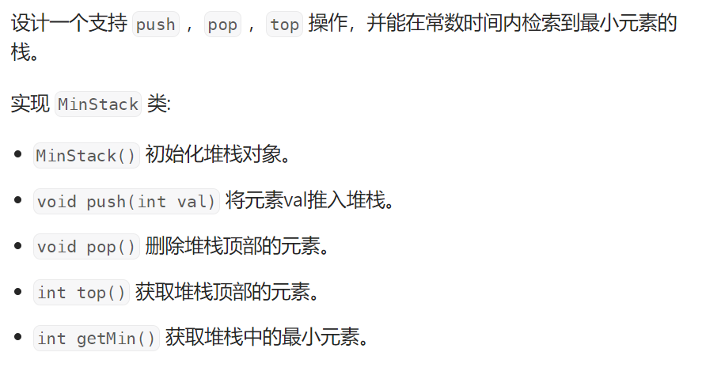
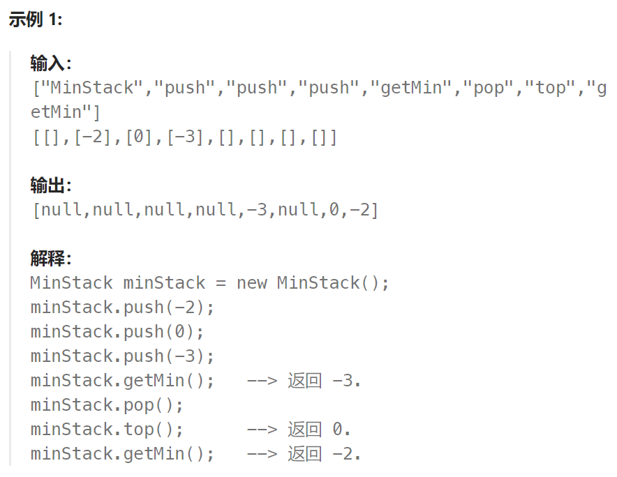

## 题目





## 题解

```
1.准备一个栈用来存数据，完成pop和push操作，这样时间复杂度是O(1)
2.再准备一个栈用来存当前栈中的最小值，方式是：每当数据栈push进一个元素时，最小值栈也要push进一个元素，这个元素需要是 min(当前push到数据栈的元素，最小值栈栈顶元素) ; 每当数据栈pop出一个元素时，最小值栈也要pop出一个元素。这样以来，利用最小值栈可以实现getMin的时间复杂度为O(1)
```

```go
type MinStack struct {
    normal *Stack   // 普通的栈
    min *Stack  // 存放最小元素的栈(普通栈的一段递减区域内最小值只有一个，因此在最小栈中体现为相同长度的连续最小值)
    size int  
}
func Constructor() MinStack {
    return MinStack{
        normal: &Stack{},
        min: &Stack{},
        size:0,
    }
}
func (this *MinStack) Push(val int)  {
    if this.size == 0 {
        this.normal.Push(val)
        this.min.Push(val)
    } else {
        this.normal.Push(val)
        _, top := this.min.Top()
        this.min.Push(getMin(top, val))  // 最小栈Push: 新元素和最小栈栈顶两者中的最小值
    }
    this.size++
}
func (this *MinStack) Pop()  {
    if this.size == 0 {
        return
    }
    this.normal.Pop()
    this.min.Pop()   // 最小栈也要对应出栈一个元素

    this.size--
}
func (this *MinStack) Top() int {
    _, top := this.normal.Top()
    return top
}
func (this *MinStack) GetMin() int {
    _, top := this.min.Top()
    return top  
}
```

