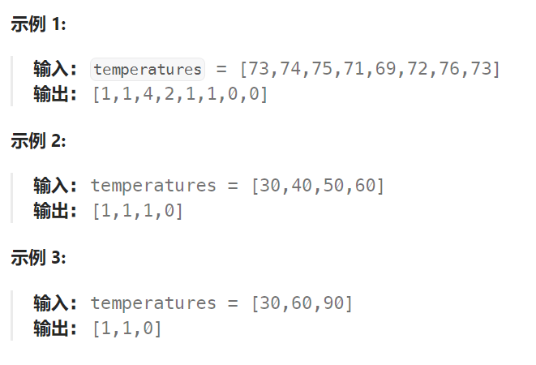

## 题目

给定一个整数数组 `temperatures` ，表示每天的温度，返回一个数组 `answer` ，其中 `answer[i]` 是指对于第 `i` 天，下一个更高温度出现在几天后。如果气温在这之后都不会升高，请在该位置用 `0` 来代替。



## 题解

该题需要使用单调栈解决。

对于每一个元素，要找到比他高的且距离最近的后面的元素

使用单调栈，且要选择单调递增的单调栈(如果要找比当前元素小且距离最近的用单调递减)。每个元素遇到第一个比他大的元素时就直接出栈。

单调递增栈（栈顶最小，栈低最大）中通常都是存储元素的下标。

```go
func dailyTemperatures(temperatures []int) []int {
    s := &Stack{}   // 单调递增栈，存储元素的下标
    answer := make([]int, len(temperatures))
    for i := 0; i < len(temperatures); i++ {
        t := temperatures[i]
        // 如果栈不为空，则可能需要不断弹出，使得栈顶的元素大于当前待入栈的元素
        for {
            flag, top := s.Top()
            if !flag {   // 栈为空，不能再弹出
                s.Push(i)
                break
            }
            if temperatures[top] >= t {  // 栈顶元素温度已经 >= 当前元素温度
                s.Push(i)
                break
            } else {   // 当前栈顶元素温度 < 待入栈的元素温度，需要弹出
                if flag, oldTop := s.Pop(); flag {   // 栈不为空
                    answer[oldTop] = i - oldTop   // temperatures[oldTop] 右侧比它大的第一个元素就是当前的t
                } 
            }
        }
    }
    // 栈中还有剩余的元素，每一个元素右侧都找不到比他大的元素
    for s.size > 0 {
        _, oldTop := s.Pop()
        answer[oldTop] = 0
    }
    return answer
}
```

