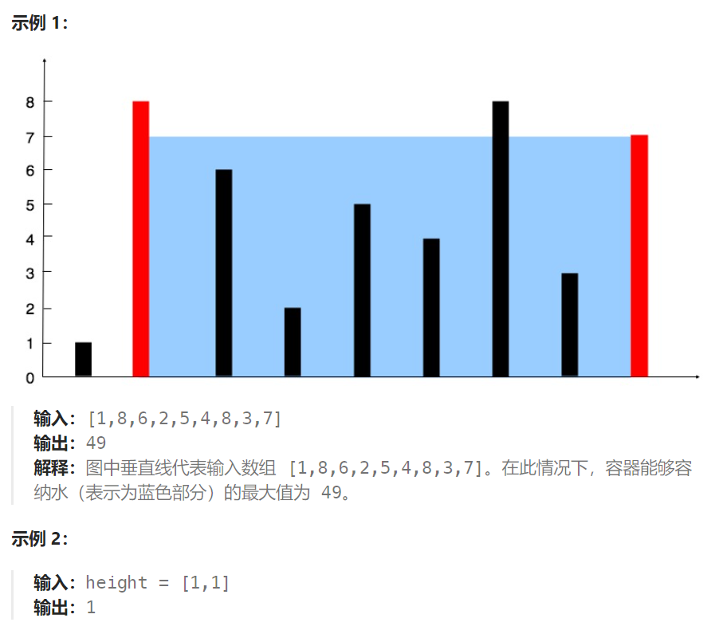
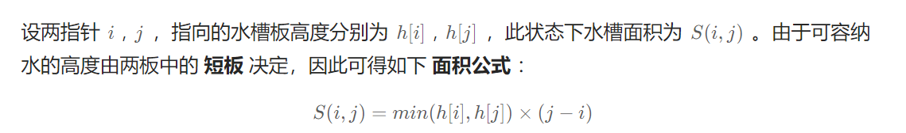
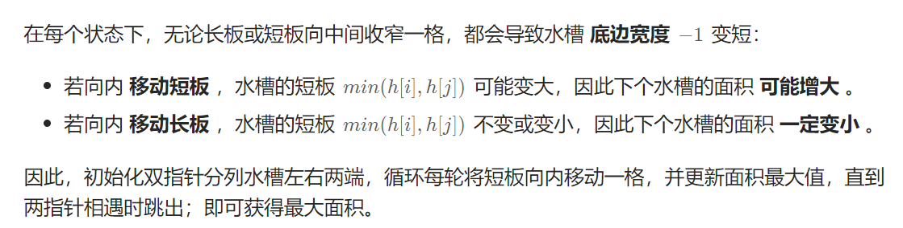

## 题目

给定一个长度为 `n` 的整数数组 `height` 。有 `n` 条垂线，第 `i` 条线的两个端点是 `(i, 0)` 和 `(i, height[i])` 。

找出其中的两条线，使得它们与 `x` 轴共同构成的容器可以容纳最多的水。

返回容器可以储存的最大水量。

**说明：**你不能倾斜容器。



## 题解

左右双指针解决：





意识到移动长板一定会导致水槽面积缩小，因此每次只能移动短板。

```go
func maxArea(height []int) int {
    n := len(height)

    left, right := 0, n-1
    maxV := (right - left) * getMin(height[left], height[right])   // 最大容量
    for left < right {
        if height[left] <= height[right] {  
            left++
        } else {
            right--
        }
        v := (right - left) * getMin(height[left], height[right])
        if v > maxV {
            maxV = v
        }
    }    
    return maxV
}
func getMin(a, b int) int {
    if a < b {
        return a
    } else {
        return b
    }
}
```

