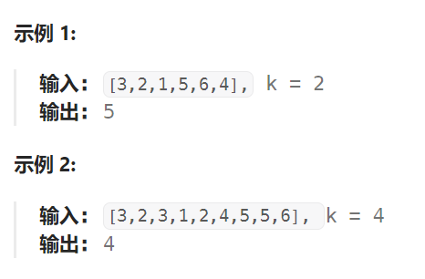
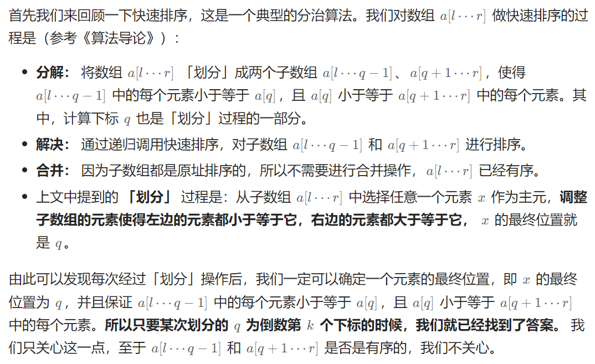

## 题目

给定整数数组 `nums` 和整数 `k`，请返回数组中第 `**k**` 个最大的元素。

请注意，你需要找的是数组排序后的第 `k` 个最大的元素，而不是第 `k` 个不同的元素。

你必须设计并实现时间复杂度为 `O(n)` 的算法解决此问题。



## 题解

### 方法一：基于快速排序原理



```go
func findKthLargest(nums []int, k int) int {
    n := len(nums)
    left, right := 0, len(nums)-1

    res := quickSort(&nums, left, right, n-k)
    return res
}

func quickSort(nums *[]int, left, right int, k int) int {
    if left >= right {
        return (*nums)[left]
    }
    target := (*nums)[right]  // 取区间最后一个数，作为分区的标准

    leftIndex := left
    rightIndex := right-1
    i := left
    for {
        if i > rightIndex {
            break
        }
        if (*nums)[i] < target {  // 移动到小于(左半)区域
            (*nums)[i], (*nums)[leftIndex] = (*nums)[leftIndex], (*nums)[i]
            leftIndex++
            i++
        } else if (*nums)[i] == target {  // 停留在等于区域
            i++
        } else {   // 移动到大于(右半)区域 
            (*nums)[i], (*nums)[rightIndex] = (*nums)[rightIndex], (*nums)[i]
            rightIndex--
        }
    }
    (*nums)[rightIndex+1], (*nums)[right] = (*nums)[right], (*nums)[rightIndex+1]// 将比较对象移动到等于区域
    
    if rightIndex+1 == k {   // 是倒数第 k 个元素
        return (*nums)[k]
    } else if rightIndex+1 < k {  // 当前在倒数第 k 个元素的左侧，需要到右侧找
        return quickSort(nums, rightIndex+2, right, k)
    } else {  // 当前在倒数第 k 个元素的右侧，需要到左侧找
        return quickSort(nums, left, rightIndex, k)
    }
}
```

### 方法二：基于堆排序原理

基于倒序 `heapify` 实现的堆构建，时间复杂度是 O(N)，而基于正序 `heapInsert` 实现的堆构建，时间复杂度是O(N*logN)

```go
func findKthLargest(nums []int, k int) int {
    heapSize := len(nums)
    // 将数组变成一个大根堆，从后往前堆化
    for i := heapSize-1; i >= 0; i-- {
        heapify(nums, i, heapSize)
    }
    // 弹出前 k-1 个元素
    for i := 0; i < k-1; i++ {
        nums[0] = nums[heapSize-1]
        heapSize--
        heapify(nums, 0, heapSize)   
    }

    return nums[0]
}
// 对 nums[left:right] 区域进行堆化,  right 一般都是len(nums)
func heapify(nums []int, left, right int) {
    root := left  // 对以 left 为根节点的子树进行堆化
    leftChild := left*2+1
    rightChild := left*2+2

    // 获取 root, leftChild, rightChild 中的最大值的下标
    if leftChild < right && nums[leftChild] > nums[root] {
        root = leftChild
    }
    if rightChild < right && nums[rightChild] > nums[root] {
        root = rightChild
    }
    if root != left {   // 原本的根节点比自己的孩子节点要小, 需要进行交换，并继续向下堆化
        nums[left], nums[root] = nums[root], nums[left]
        heapify(nums, root, right)
    }
}
```

