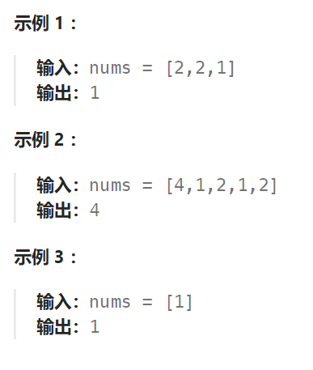
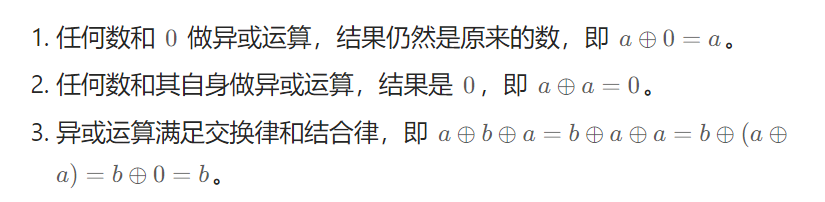

## 题目

给你一个 **非空** 整数数组 `nums` ，除了某个元素只出现一次以外，其余每个元素均出现两次。找出那个只出现了一次的元素。

你必须设计并实现线性时间复杂度的算法来解决此问题，且该算法只使用常量额外空间。



## 题解

时间复杂度为 O(N) ，空间复杂度为 O(1)。

该题只能用位运算解决，基于以下位运算三个公式：



```go
func singleNumber(nums []int) int {
    res := 0   // 起始值是0, 不妨碍运算,因为所有数字和 0 的异或运算,其结果还是该数本身

    for i := 0; i < len(nums); i++ {
        res = res ^ nums[i]
    }
    return res
}
```

