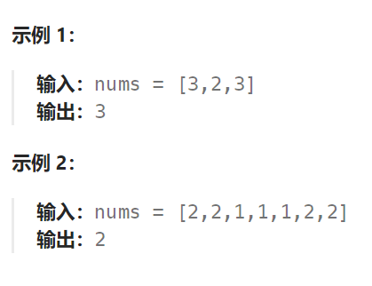
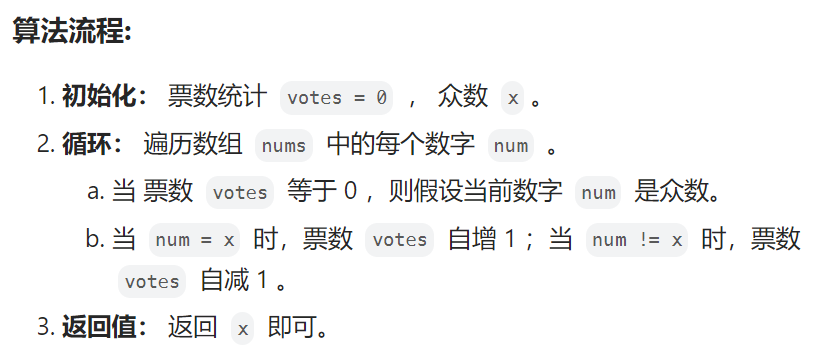

## 题目

给定一个大小为 `n` 的数组 `nums` ，返回其中的多数元素。多数元素是指在数组中出现次数 **大于** `⌊ n/2 ⌋` 的元素。

你可以假设数组是非空的，并且给定的数组总是存在多数元素。

**进阶：**尝试设计时间复杂度为 O(n)、空间复杂度为 O(1) 的算法解决此问题。



## 题解

要实现时间复杂度为 O(n)、空间复杂度为 O(1) 的要求，需要使用下面这种称为"摩尔投票"的算法：



```go
func majorityElement(nums []int) int {
    votes := 0  // 投票数，一旦投票数 == 0, 就是假设当前数字为众数
    mockX := 0
    for _, v := range nums {
        if votes == 0 {
            mockX = v   // 投票数 == 0, 重新假设当前数是众数
            votes++
        } else {   // 当前投票数 > 0
            if v == mockX {   // 碰到当前假设的众数, 票数+1
                votes++
            } else {   // 碰到非当前假设的众数, 票数-1
                votes--
            }
        }
    }
    return mockX  // 返回最后一个模拟的众数, 它就是真实的众数
}
```

摩尔投票算法的原理：

设输入数组 `nums` 的众数为 x  ，数组长度为 n  。

- 推论一： 若记 众数 的票数为 +1  ，非众数 的票数为 −1 ，则一定有所有数字的 票数和 >0  。

- 推论二： 若数组的前 a 个数字的 票数和 =0 ，则 数组剩余 (n−a) 个数字的 票数和一定仍 >0 ，也就是说后 (n−a) 个数字的 众数仍为 x 。


在票数和 == 0 的区域内，众数的出现次数一定和非众数出现的次数一样，都刚好是 len/2，而不会超过这个数，也就是说整个数组的众数在票数和 == 0 的区域内不是众数（因为出现次数不满足 > len/2 ）。

根据上面的结论，结合下面的分治结论：

```
如果数 a 是数组 nums 的众数，如果我们将 nums 分成两部分，那么 a 必定是至少一部分的众数。

我们可以使用反证法来证明这个结论。假设 a 既不是左半部分的众数，也不是右半部分的众数，那么 a 出现的次数少于 l / 2 + r / 2 次，其中 l 和 r 分别是左半部分和右半部分的长度。由于 l / 2 + r / 2 <= (l + r) / 2，说明 a 也不是数组 nums 的众数，因此出现了矛盾。所以这个结论是正确的。
```

既然众数不是左区域(票数和 == 0) 的众数，那它必然是后面剩余区域的众数。

利用此特性，每轮假设发生 **票数和 =0** 都可以 **缩小剩余数组区间** 。当遍历完成时，最后一轮假设的数字即为众数。

