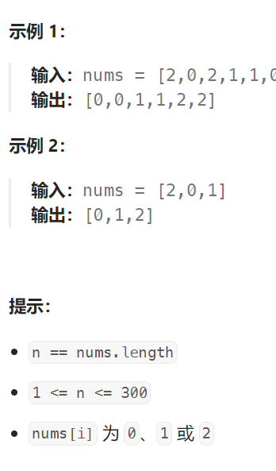

## 题目

给定一个包含红色、白色和蓝色、共 `n` 个元素的数组 `nums` ，**[原地](https://baike.baidu.com/item/原地算法)**对它们进行排序，使得相同颜色的元素相邻，并按照红色、白色、蓝色顺序排列。

我们使用整数 `0`、 `1` 和 `2` 分别表示红色、白色和蓝色。

必须在不使用库内置的 sort 函数的情况下解决这个问题。



## 题解

标准的三色区域划分，因此该题使用快速排序中的荷兰国旗解决方法。

划分成分成：1. <1区域(0)    2. =1区域(1)      3.>1区域(2)

不需要使用完整的快速排序算法，因为 < 1 区域只会有 0 一种值，> 1 区域只会有 2 一种值。

```go
func sortColors(nums []int)  {
    // left: 小于 target 的左半区域的下一个位置(不属于区域)
    // right: 大于 target 的右半区域的下一个位置(不属于区域)
    left, right := 0, len(nums)-1 
    target := 1   // 因为只有三类数, 1就是中间数, 分成 <1区域  =1区域  >1区域

    if left >= right {   // 不需要排序
        return
    }
    i := left  // 扫描的指针
    for {
        if i > right {  // 扫描指针进入了 > target 区域, 结束本次排序
            break
        }
        if nums[i] < target {   // 将其填充到左区域
            swap(&nums, i, left)
            left++
            i++   // 从左区域边缘交换过来的数, 必定是 == target 的
        } else if nums[i] == target {
            i++
        } else {   // 大于 target, 将其交换到右区域
            swap(&nums, i, right)
            right--
            // 没有 i++, 因为右区域过来的数情况未知
        }
    }
}
func swap(nums *[]int, i, j int) {
    tmp := (*nums)[i]
    (*nums)[i] = (*nums)[j]
    (*nums)[j] = tmp
}
```

