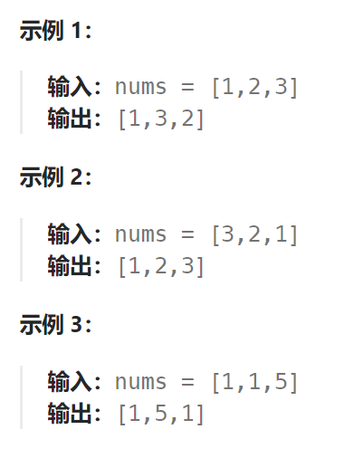
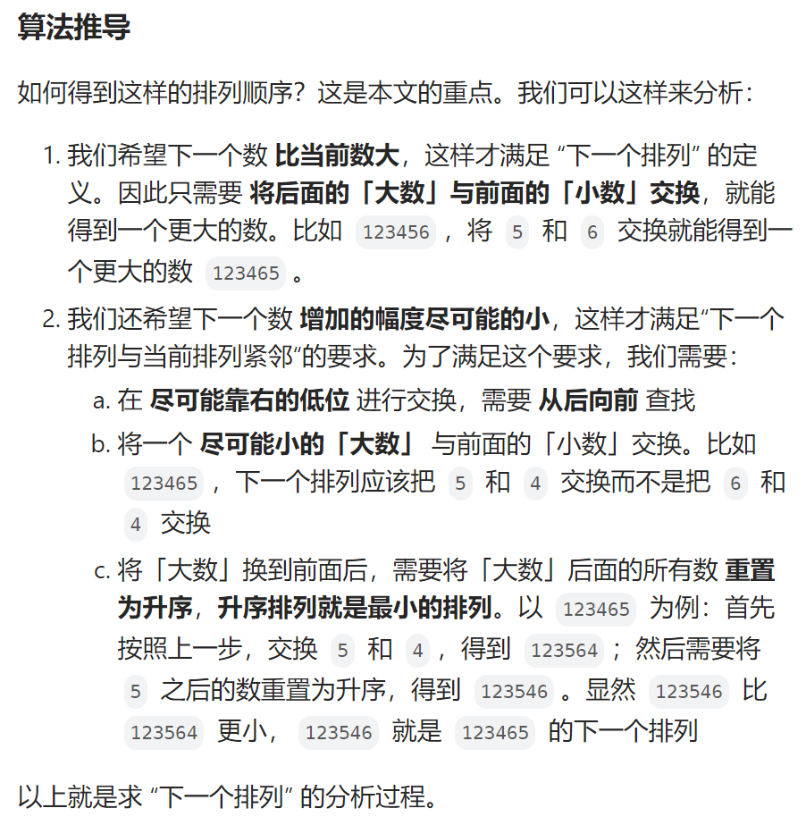
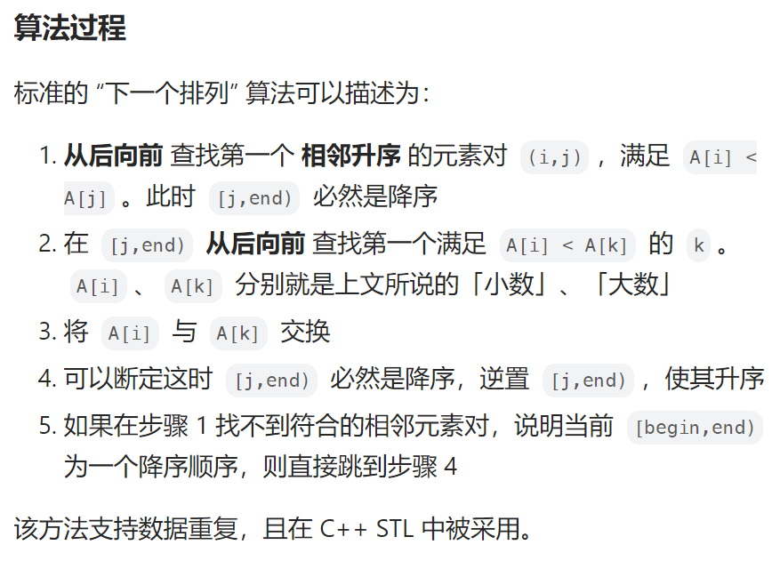

## 题目

整数数组的一个 **排列** 就是将其所有成员以序列或线性顺序排列。

- 例如，`arr = [1,2,3]` ，以下这些都可以视作 `arr` 的排列：`[1,2,3]`、`[1,3,2]`、`[3,1,2]`、`[2,3,1]` 。

整数数组的 **下一个排列** 是指其整数的下一个字典序更大的排列。更正式地，如果数组的所有排列根据其字典顺序从小到大排列在一个容器中，那么数组的 **下一个排列** 就是在这个有序容器中排在它后面的那个排列。如果不存在下一个更大的排列，那么这个数组必须重排为字典序最小的排列（即，其元素按升序排列）。

- 例如，`arr = [1,2,3]` 的下一个排列是 `[1,3,2]` 。
- 类似地，`arr = [2,3,1]` 的下一个排列是 `[3,1,2]` 。
- 而 `arr = [3,2,1]` 的下一个排列是 `[1,2,3]` ，因为 `[3,2,1]` 不存在一个字典序更大的排列。

给你一个整数数组 `nums` ，找出 `nums` 的下一个排列。

必须**[ 原地 ](https://baike.baidu.com/item/原地算法)**修改，只允许使用额外常数空间。



## 题解





```go
func nextPermutation(nums []int)  {
    n := len(nums)
    if n <= 1 {
        return
    }
    i, j, k := n-2, n-1, n-1    // j初始时比i大1
    // 1.找到相邻的 i,j 使得 nums[i] < nums[j]
    for {
        if i < 0 || nums[i] < nums[j] {
            break
        }
        i--
        j--
    }
    // 2. nums[j:end] 是一个递减的序列 ，倒序找到第一个 > nums[i] 的元素,将其与 nums[i] 交换
    if i < 0 {   // 整个序列是完全递减的
        reverse(&nums, 0, n-1)   // 将整个数组完全逆转
    } else {
        for {   // 从后往前(原因是交换到前面的数要尽可能的小), 找到第一个 > nums[i] 的元素
            if nums[i] < nums[k] {
                swap(&nums, i, j)
                break
            }
            k--
        } 
        // 3. 将 nums[j:end] 从降序重置为升序的，目的是让序列尽可能的小
        reverse(&nums, j, n-1)
    }
}
func reverse(nums *[]int, left, right int) {
    for left < right {
        tmp := (*nums)[left]
        (*nums)[left] = (*nums)[right]
        (*nums)[right] = tmp
        left++
        right--
    }
}
func swap(nums *[]int, left, right int) {
    tmp := (*nums)[left]
    (*nums)[left] = (*nums)[right]
    (*nums)[right] = tmp
}
```

