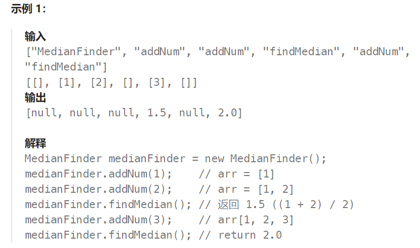
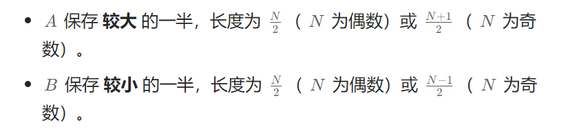
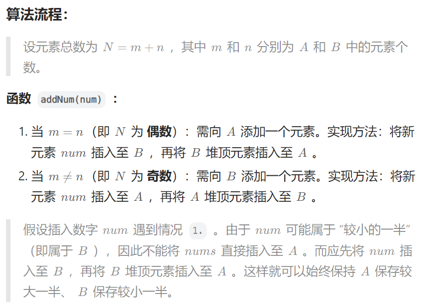
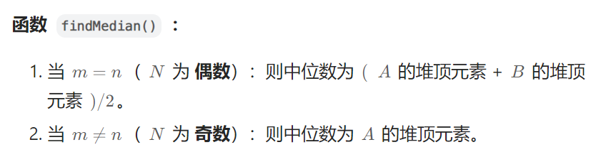

## 题目

**中位数**是有序整数列表中的中间值。如果列表的大小是偶数，则没有中间值，中位数是两个中间值的平均值。

- 例如 `arr = [2,3,4]` 的中位数是 `3` 。
- 例如 `arr = [2,3]` 的中位数是 `(2 + 3) / 2 = 2.5` 。

实现 MedianFinder 类:

- `MedianFinder() `初始化 `MedianFinder` 对象。
- `void addNum(int num)` 将数据流中的整数 `num` 添加到数据结构中。
- `double findMedian()` 返回到目前为止所有元素的中位数。与实际答案相差 `10-5` 以内的答案将被接受。



## 题解

建立一个 **小根堆** A 和 **大根堆** B ，各保存现有数据的一半元素，且规定：



较大的一半就是指数组排序后，数值大的那一半。

随后，中位数可仅根据 A,B 的堆顶元素计算得到。






特别注意：在使用 `golang` 提供的 `heap` 时，除了初始化时要使用 `heap` 包提供的 `Init()` 进行初始化；在进行 `Push` 和 `Pop` 操作的时候，也需要使用 `heap.Push()` 和 `heap.Pop()` ，而不能使用数据结构本身定义的方法进行 `Push` 和 `Pop`

```go
import "container/heap"
type MedianFinder struct {
    bigHeap *Heap  // 存储较小一半的元素
    smallHeap *Heap  // 存储较大一半的元素(长度 >= 大根堆长度)
}
func Constructor() MedianFinder {
    bigHeap := NewHeap(true)
    smallHeap := NewHeap(false)
    heap.Init(bigHeap)
    heap.Init(smallHeap)

    return MedianFinder{
        bigHeap: bigHeap,
        smallHeap: smallHeap,
    }
}
func (this *MedianFinder) AddNum(num int)  {
    if this.smallHeap.Len() == this.bigHeap.Len() {   // 当前存储了偶数个元素，下一个元素存入小根堆
        heap.Push(this.bigHeap, num)  // 先存入大根堆
        top := heap.Pop(this.bigHeap)  // 弹出大根堆堆顶
        heap.Push(this.smallHeap, top) // 再将大根堆堆顶加入小根堆
    } else {   // 当前存储了奇数个元素，下一个元素要存入大根堆
        heap.Push(this.smallHeap, num)  
        top := heap.Pop(this.smallHeap)  
        heap.Push(this.bigHeap, top) 
    }
}
func (this *MedianFinder) FindMedian() float64 {
    if this.smallHeap.Len() == this.bigHeap.Len() {   // 现在有偶数个元素, 中间数为两个堆顶的均值
        top1 := this.bigHeap.Top().(int)
        top2 := this.smallHeap.Top().(int)
        return float64(top1 + top2) / 2.0
    } else {  // 现在有奇数个元素, 中间数就是小根堆堆顶
        top := this.smallHeap.Top().(int)
        return float64(top)
    }
}

type Heap struct {
    arr []int
    kind bool   // true表示大根堆, false 表示小根堆
}
func NewHeap(kind bool) *Heap {
    return &Heap{
        arr: make([]int, 0),
        kind: kind,
    }
}
func (h *Heap) Len() int {
    return len(h.arr)
}
func (h *Heap) Swap(i, j int) {
    h.arr[i], h.arr[j] = h.arr[j], h.arr[i]
}
func (h *Heap) Less(i, j int) bool {
    if h.kind {  // 大根堆
        return h.arr[i] > h.arr[j]
    } else { // 小根堆
        return h.arr[i] < h.arr[j]
    }
}
func (h *Heap) Push(val interface{}) {
    h.arr = append(h.arr, val.(int))
}
func (h *Heap) Pop() interface{} {
    n := len(h.arr)
    val := h.arr[n-1]
    h.arr = h.arr[:n-1]
    return val
}
func (h *Heap) Top() interface{} {
    return h.arr[0]
}
```

