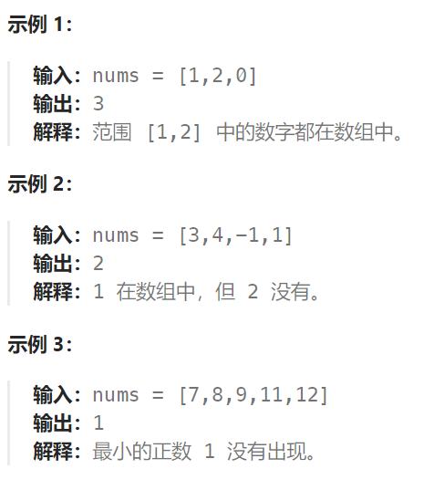

## 题目

给你一个未排序的整数数组 `nums` ，请你找出其中没有出现的最小的正整数。

请你实现时间复杂度为 `O(n)` 并且只使用常数级别额外空间的解决方案。



## 题解

### 方法：将数组视为哈希表

1. 题目要求我们「只能使用常数级别的空间」，而要找的数一定在 [1, N + 1] 左闭右闭（这里 N 是数组的长度）这个区间里。因此，我们可以就把原始的数组当做哈希表来使用。事实上，哈希表其实本身也是一个数组；
2. 我们要找的数就在 `[1, N + 1]` 里，最后 `N + 1` 这个元素我们不用找。因为在前面的 `N` 个元素都找不到的情况下，我们才返回 `N + 1`；
3. 可以采取这样的思路：就把 1 这个数放到下标为 0 的位置， 2 这个数放到下标为 1 的位置，按照这种思路整理一遍数组。然后我们再遍历一次数组，第 1 个遇到的它的值不等于下标的那个数，就是我们要找的缺失的第一个正数。


```go
func firstMissingPositive(nums []int) int {
    n := len(nums)
    // 让 nums[i] 移动到下标为 nums[i]-1 的位置
    // 因此, nums[i] <= n 是需要的，因为 n 是长度为 n 的数组可以出现的最大值(放在 len(nums)-1 位置上)
    // 如果 nums[nums[i]-1] 已经 == nums[i]， 说明当前 nums[i] 已经处于正确的位置
    for i := 0; i < n; i++ {
        // 因为交换过来的值，不一定就应该在这个位置上，还需要将其再移动到应当在的位置
        // 因此使用了 for 循环
        for nums[i] > 0 && nums[i] <= n && nums[nums[i]-1] != nums[i] {
            nums[i], nums[nums[i]-1] = nums[nums[i]-1], nums[i]
        }
    }
    for i := 0; i < n; i++ {
        if nums[i] != i+1 {  // 发现第一个没有正确安放数值的位置
            return i+1   // i+1 是第一个未出现的正整数
        }
    }
    return n+1   // 数组中出现了 1~n 所有元素，因此第一个未出现的元素就是 n+1
}
```


   