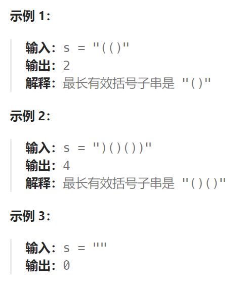

## 题目

给你一个只包含 `'('` 和 `')'` 的字符串，找出最长有效（格式正确且连续）括号子串的长度。



## 题解

1.准备一个和总括号字符串长度一样的辅助数组dp

2.从左到右遍历括号字符串，dp[i]记录截止到当前位时的最长括号子串长度

1）如果当前第i位是"("，那么dp[i] = 0，直接跳过
2）如果当前第i位是")"，那么需要按照以下步骤进行dp[i]的计算
	① 首先要获取其前一位的dp值即dp[i-1]的值，从当前在总括号字符串的位置向前跳转 dp[i-1]+1个位置。然后判断当前位置是否是"("且有没有越界，如果没有越界且正好是"(",那么dp[i]至少应该是 dp[i-1]+2。至于是不是"至少"，还需要进行第②步
	② 完成第一步的跳跃且检查正好是"("，那么接着检查当前"("位置(下标为j)的前一个位置的dp[j-1]是否符合“未越界且大于0”(是一个完整的括号子串)，那么dp[i] 需要在 dp[i-1]+2 的基础上再加上 dp[j-1]

3.完成遍历后，我们返回dp数组中最大的值

```go
func longestValidParentheses(s string) int {
    if s == "" {
        return 0
    }
    // dp[i]表示: 以当前 s[i] 作为结尾的子串, 有效括号子串的长度
    dp := make([]int, len(s))
    dp[0] = 0

    maxLen := 0

    for i := 1; i < len(s); i++ {
        if s[i] == '(' {   // 以 '(' 结尾的字符子串必定不是有效的括号子串
            dp[i] = 0
        } else {
            lastJudge := i-1-dp[i-1]  // 先移动到 i-1 位置上，然后再向前移动 dp[i-1] 步(越过整个dp[i-1]范围内的括号子串)
            if lastJudge >= 0 && s[lastJudge] == '(' {  // 没有越界，而且当前是一个'('
                dp[i] = dp[i-1] + 2   // 至少是 dp[i-1] 再加两个括号
                if lastJudge - 1 >= 0 && dp[lastJudge-1] > 0 {   // 前面还有一个完整的括号子串
                    dp[i] += dp[lastJudge-1]
                }
                maxLen = getMax(dp[i], maxLen)
            }
        }
    }
    return maxLen
}
```

