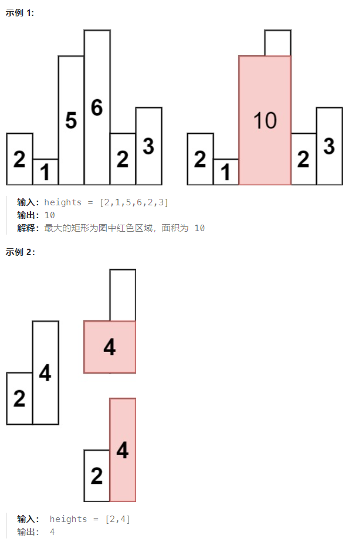

## 题目

给定 *n* 个非负整数，用来表示柱状图中各个柱子的高度。每个柱子彼此相邻，且宽度为 1 。

求在该柱状图中，能够勾勒出来的矩形的最大面积。



## 题解

此题有两种思路：

1. 如果我们枚举「宽」，我们可以使用两重循环枚举矩形的左右边界以固定宽度 w ，此时矩形的高度 h ，就是所有包含在内的柱子的「最小高度」，对应的面积为 w×h 
2. 如果我们枚举「高」，我们可以使用一重循环枚举某一根柱子，将其固定为矩形的高度 h 。随后我们从这跟柱子开始向两侧延伸，直到遇到高度小于 h 的柱子，就确定了矩形的左右边界。如果左右边界之间的宽度为 w ，那么对应的面积为 w×h 

这两种暴力方法的时间复杂度均为 O(N^2)，会超出时间限制，我们必须要进行优化。考虑到枚举「宽」的方法使用了两重循环，本身就已经需要 O(N^2) 的时间复杂度，不容易优化，因此我们可以考虑优化只使用了一重循环的枚举「高」的方法。

也就是说，对于每一根确定高度的柱子，我们都需要找到其左右两侧"最后一个不低于其高度的柱子"，第一时间想到的是二分法，但是二分法必须针对有序的数组，无法使用。

换一种角度，对于每一根柱子，我们只需要找到其左右两侧"第一个比当前柱子要低的柱子"，然后左侧向右移动一位，右侧向左移动一位，这样就分别找到了左右两侧"最后一个不低于其高度的柱子"。

这样的思路就是单调栈方法，而且是"单调递减栈"，为每个元素找到其左右两侧第一个比他小的元素。

之所以分为两次使用单调栈，原因是可能存在高度相等的柱子，一次单调栈不太好确定边界。

```go
type Info struct {
    left int   // 柱子左侧第一个比他低的柱子编号(没有就是-1)
    right int  // 柱子右侧第一个比他低的柱子编号(没有就是 n )
}

func largestRectangleArea(heights []int) int {
    n := len(heights)
    stack := make([]int, 0)   // 单调递减栈
    infos := make([]Info, n)  // 记录每个柱子左右两侧比其低的第一个柱子的编号

    // 1.第一轮遍历，找到每个柱子右侧比起小的第一个柱子的编号
    for i := 0; i < len(heights); i++ {
        h := heights[i]
        for {
            if len(stack) == 0 {   // 栈为空，直接入栈
                stack = append(stack, i)
                break
            }
            top := stack[len(stack)-1]  // 栈顶元素
            if heights[top] > h {   // 当前元素是是栈顶元素右侧第一个比起小的柱子编号
                infos[top].right = i
                stack = stack[:len(stack)-1]  // 弹出栈顶元素(因为不符合单调递减)
            } else {   // 比栈顶元素大，入栈
                stack = append(stack, i)
                break
            }
        }
    }
    // 对于栈中剩余的元素，其右侧的柱子都比它高
    for i := 0; i < len(stack); i++ {
        infos[stack[i]].right = n
    }
    // 2.第二轮遍历，找到每个柱子左侧比起小的第一个柱子的编号
    stack = make([]int, 0)
    for i := len(heights)-1; i >= 0; i-- {  // 倒序遍历 heights，这样就是左侧
        h := heights[i]
        for {
            if len(stack) == 0 {   // 栈为空，直接入栈
                stack = append(stack, i)
                break
            }
            top := stack[len(stack)-1]  // 栈顶元素
            if heights[top] > h {   // 当前元素是是栈顶元素左侧第一个比起小的柱子编号
                infos[top].left = i
                stack = stack[:len(stack)-1]  // 弹出栈顶元素(因为不符合单调递减)
            } else {
                stack = append(stack, i)
                break
            }
        }
    }
    // 对于栈中剩余的元素，其左侧的柱子都比它高
    for i := 0; i < len(stack); i++ {
        infos[stack[i]].left = -1
    } 
    maxS := 0
    for i := 0; i < len(infos); i++ {
        left := infos[i].left + 1   // 柱子左侧最后一个 >= 当前柱子的柱子编号
        right := infos[i].right - 1  // 柱子右侧最后一个 >= 当前柱子的柱子编号
        s := heights[i] * (right - left +1)
        if s > maxS {
            maxS = s
        }
    }
    return maxS
}
```

