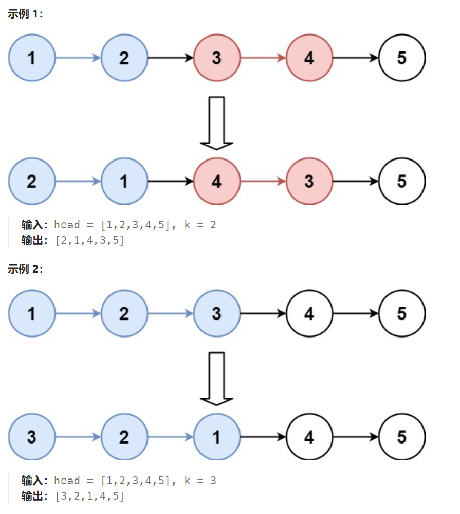

## 题目

给你链表的头节点 `head` ，每 `k` 个节点一组进行翻转，请你返回修改后的链表。

`k` 是一个正整数，它的值小于或等于链表的长度。如果节点总数不是 `k` 的整数倍，那么请将最后剩余的节点保持原有顺序。

你不能只是单纯的改变节点内部的值，而是需要实际进行节点交换。



## 题解

```go
func reverseKGroup(head *ListNode, k int) *ListNode {
    dummy := &ListNode{Next: head}  // 哑结点
    preTail := dummy   // 记录上一组的最后一个节点
    curHead := head   // 记录当前组的第一个节点
    cur := head  // 记录当前移动到的节点
    for cur != nil {
        for i := 0; i < k-1; i++ {   // 向后移动k-1次，到达当前组的最后一个节点
            cur = cur.Next 
            if cur == nil {  // 当前组内不足 k 个节点，不再需要翻转
                return dummy.Next 
            }
        }
        // 循环结束，向后移动了 k-1 次，到达了当前组的最后一个节点
        // 让上一组的最后一个节点指向当前组翻转后的新头结点
        newHead, newTail := reverse(curHead, cur.Next)  
        preTail.Next = newHead
        // 更新循环遍历
        preTail = newTail  
        curHead = newTail.Next
        cur = newTail.Next
    }
    return dummy.Next
}
// 翻转链表. 给定翻转区域(tail不再区域内)，返回翻转后的头和尾(都在区域内)
func reverse(head, tail *ListNode) (*ListNode, *ListNode) {
    if head == tail || head.Next == tail {  // 只有0个或1个节点, 不需要翻转
        return head, head
    }
    fir, sec := head, head.Next  // 循环遍历(fir 不变, 一直固定指向原本的head，使其不断后移)
    for sec != tail {   // sec 必须存在才可以移动到前面
        fir.Next = sec.Next  // 将 sec 从链表中去掉
        sec.Next = head   // sec 采用头插入法，插入链表头部
        head = sec   // sec 变成新的头部
        sec = fir.Next   // sec 指向下一个要启动到链表头部的节点
    }
    return head, fir  // fir指向的就是翻转后的为节点
}
```

