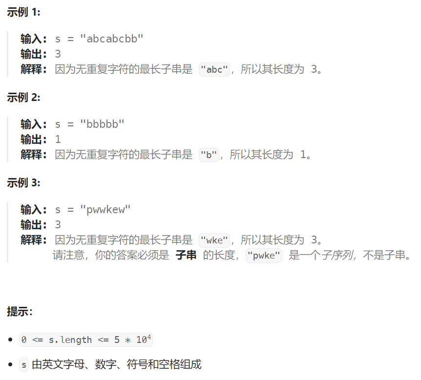

## 题目

给定一个字符串 `s` ，请你找出其中不含有重复字符的 **最长子串** 的长度。



## 题解

使用滑动窗口解决

因为每个字符在窗口内出现次数只能是1，因此map的 value 也可以直接用 bool 类型，如果 true 就表示此字符在窗口内已经出现过，需要移动 start 直到为 false，再将该字符插入到 map 中

```go
func lengthOfLongestSubstring(s string) int {
    n := len(s)
    if n <= 1 {
        return n
    }
    maxLen := 0   // 最长子串的长度
    start, end := 0,0   // 窗口的起点和终点
    charMap := make(map[byte]int)  // 统计窗口内字符的出现个数
    // 任何时候，窗口内所有字符出现次数都 == 1
    for ; end < n; end++ {
        char := s[end]
        charMap[char]++   // 该字符出现次数 + 1
        for charMap[char] > 1 {   // 需要保证新加入的字符不会让其出现次数 > 1, 否则让 start 前进
            charMap[s[start]]--
            if charMap[s[start]] == 0 {
                delete(charMap, s[start])
            }
            start++ 
        }
        if len(charMap) > maxLen {
            maxLen = len(charMap)
        }
    }
    return maxLen
}
```

