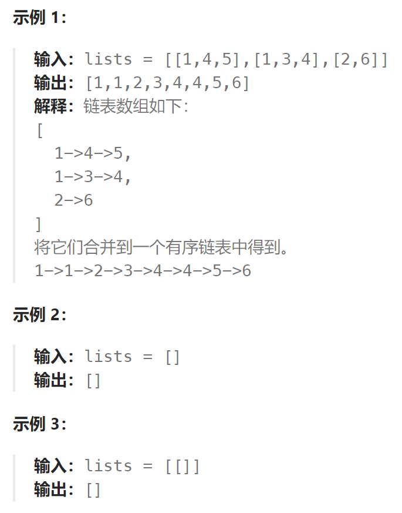

## 题目

给你一个链表数组，每个链表都已经按升序排列。

请你将所有链表合并到一个升序链表中，返回合并后的链表。



## 题解

采用分治法，两两合并链表。

```go
func mergeKLists(lists []*ListNode) *ListNode {
    if len(lists) == 0 {
        return nil
    }
    return merge(lists, 0, len(lists)-1)
}

func merge(lists []*ListNode, left, right int) *ListNode{
    if left == right {   // 只有一条链表，无需合并
        return lists[left]
    }
    mid := left + (right - left) >> 1
    l1 := merge(lists, left, mid)   // 将左侧所有链表两两合并，最终生成一条
    l2 := merge(lists, mid+1, right)  // 将右侧所有链表两两合并，最终生成一条
    return mergeTwo(l1, l2)
}
// 合并两个链表
func mergeTwo(list1, list2 *ListNode) *ListNode {
    if list1 == nil { return list2 }
    if list2 == nil { return list1 }
    dummy := &ListNode{}
    prev := dummy
    for list1 != nil && list2 != nil {
        if list1.Val < list2.Val {
            prev.Next = list1
            prev = list1
            list1 = list1.Next
        } else {
            prev.Next = list2
            prev = list2
            list2 = list2.Next
        }
    }
    if list1 != nil {
        prev.Next = list1
    }
    if list2 != nil {
        prev.Next = list2
    }
    return dummy.Next
}
```

