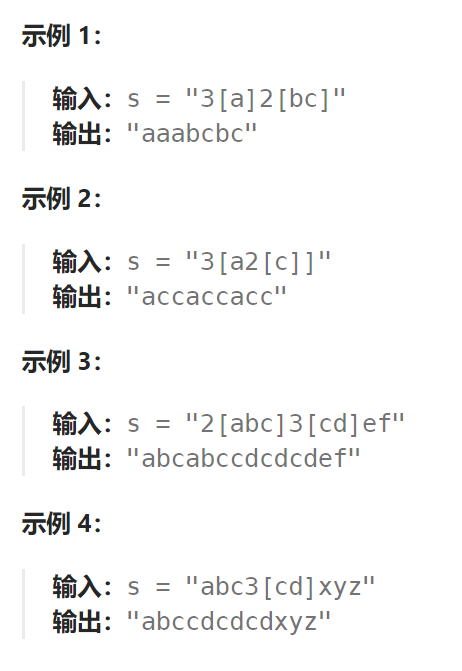
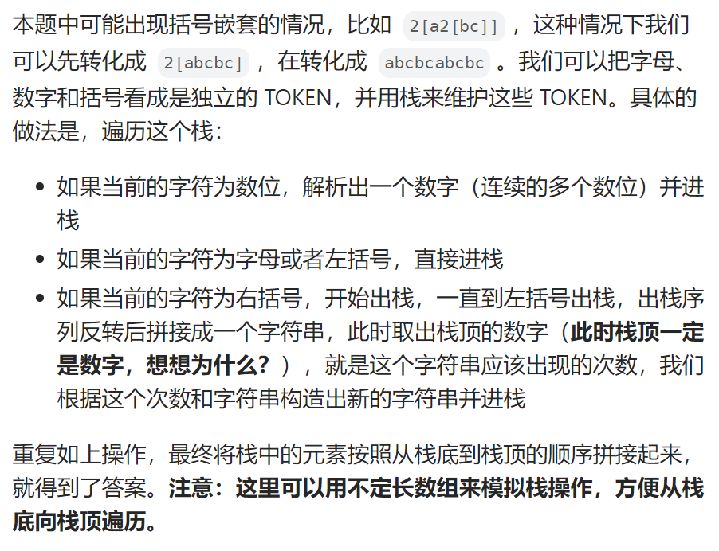

## 题目

给定一个经过编码的字符串，返回它解码后的字符串。

编码规则为: `k[encoded_string]`，表示其中方括号内部的 `encoded_string` 正好重复 `k` 次。注意 `k` 保证为正整数。

你可以认为输入字符串总是有效的；输入字符串中没有额外的空格，且输入的方括号总是符合格式要求的。

此外，你可以认为原始数据不包含数字，所有的数字只表示重复的次数 `k` ，例如不会出现像 `3a` 或 `2[4]` 的输入。



## 题解



```go
func decodeString(s string) string {
    stack := &Stack{}
    for i := 0; i < len(s); i++ {
        if s[i] >= '0' && s[i] <= '9' {   // 是数字,将连续的数字字符变为字符串追加到栈中
            numStr := []byte{s[i]}
            i = i+1
            for ; i < len(s) ; i++ {   
                if s[i] >= '0' && s[i] <= '9' {  // 连续数字还未结束
                    numStr = append(numStr, s[i])
                } else {    // 连续数字结束
                    stack.Push(string(numStr))
                    i--
                    break
                }
            }
        } else if s[i] == '[' || (s[i] >= 'a' && s[i] <= 'z') {  // 是字符或者左括号,直接入栈
            stack.Push(string(s[i]))
        } else {   // 是右括号，需要一直弹出，直到弹出最近的一个左括号，将数据解析后再加入栈中 
            charStr := ""
            for  {
                _, char := stack.Pop()
                if char != "[" {   // 是字符，需要采用头追加法
                    charStr = char + charStr
                } else {
                    break
                }
            }
            _, numStr := stack.Pop()  // 必定弹出一个数字
            num,_ := strconv.Atoi(numStr)
            decode := ""
            for j := 0; j < num; j++ {    // 重复追加 num 次自己
                decode += charStr
            }
            stack.Push(decode)   // 解码后的字符串重新加入栈中
        }
    }
    res := ""
    for stack.size > 0 {
        _, subS := stack.Pop()
        res = subS + res   // 从头部追加字符串
    }
    return res
}
```

