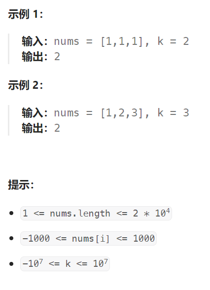

## 题目

给你一个整数数组 `nums` 和一个整数 `k` ，请你统计并返回 *该数组中和为 `k` 的子数组的个数* 。

子数组是数组中元素的连续非空序列。



## 题解

### 错误思路：滑动窗口

本体不能用滑动窗口，因为 nums[i] 可能是负数，在 nums[i] 都为正数的时候，以下解法是正确的.

但是 start  移动的判断条件是：

```go
curSum != k && start < end
```

本意是让 start 移动到最靠近 end 的位置，满足 curSum == k，但是如果 start 的后面会出现负数，该判断条件会失效，比如 start 后面是 100，-100，正确的答案下start还应该继续向后移动两位。

```go
func subarraySum(nums []int, k int) int {
    n := len(nums)
    if n == 0 {
        return 0
    }
    start, end := 0,0   // 窗口的起点和终点
    count := 0   //和为 k 的连续子数组个数
    curSum := 0   // 当前窗口内的数值和
    for ; end < n; end++ {
        num := nums[end]
        curSum += num
        for curSum != k && start < end {  // 窗口内的和不等于 k，移动 start
            curSum -= nums[start]
            start++
        }
        if curSum == k {
            count++
        }
    }
    return count
}
```

### 方法：前缀和 + 哈希表

```go
func subarraySum(nums []int, k int) int {
    n := len(nums)
    if n == 0 {
        return 0
    }
    count := 0   // 子数组的个数
    hashMap := make(map[int]int)  // 记录每一种从起始处(下标为0)开始的连续子数组和的出现次数

    hashMap[0] = 1   // 边界条件: 当 [0,i] 区间内所有数值之和 == k 时，count = count+1
    preSum := 0   // 从起始处开始的前缀子数组和

    for i := 0; i < len(nums); i++ {
        preSum += nums[i]   // preSum 是 [0,i] 区间内所有数值的和 
        if hashMap[preSum - k] > 0 { // 当前前缀和([0,i]) - 某一前缀和([0,j], j < i) == k
            count += hashMap[preSum - k]   // 获得到 [j,i] 数值和为 k 的连续子数组个数
        }
        hashMap[preSum]++
    }
    return count
}
```

