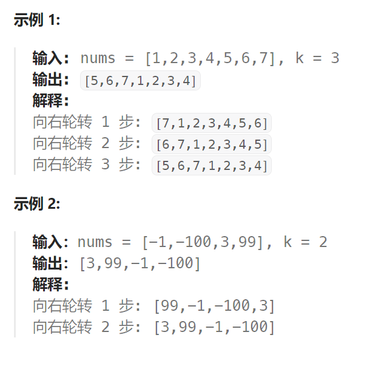

## 题目

给定一个整数数组 `nums`，将数组中的元素向右轮转 `k` 个位置，其中 `k` 是非负数。



## 题解

### 方法一：整体翻转 + 局部翻转

```go
func rotate(nums []int, k int)  {
    if k == 0 {
        return
    }
    if k > len(nums) {
        k = k % len(nums)
    }
    // 1.先整体翻转
    reverse(&nums, 0, len(nums)-1)
    // 2.再局部翻转
    reverse(&nums, 0, k-1)
    reverse(&nums, k, len(nums)-1)
}

func reverse(nums *[]int, left, right int) {
    for left < right {
        tmp := (*nums)[left]
        (*nums)[left] = (*nums)[right]
        (*nums)[right] = tmp
        left++
        right--
    }
}
```

