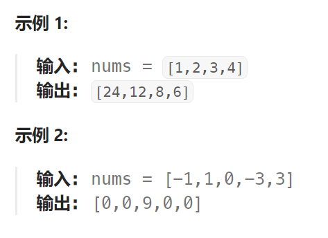

## 题目

给你一个整数数组 `nums`，返回 *数组 `answer` ，其中 `answer[i]` 等于 `nums` 中除 `nums[i]` 之外其余各元素的乘积* 。

题目数据 **保证** 数组 `nums`之中任意元素的全部前缀元素和后缀的乘积都在 **32 位** 整数范围内。

请 **不要使用除法，**且在 `O(*n*)` 时间复杂度内完成此题。



## 题解

### 方法一：前缀积与后缀积数组

```go
func productExceptSelf(nums []int) []int {
    n := len(nums)
    prefix := make([]int, n) // 前缀积数组
    suffix := make([]int, n) // 后缀积数组

    prefix[0] = 1
    for i := 1; i < n; i++ {
        prefix[i] = prefix[i-1] * nums[i-1]
    }
    suffix[n-1] = 1
    for i := n-2; i >= 0; i-- {
        suffix[i] = suffix[i+1] * nums[i+1]
    }
    ans := make([]int, n)
    for i := 0; i < n; i++ {
        ans[i] = prefix[i] * suffix[i]
    }
    return ans
}
```

### 方法二：优化空间复杂度

省略掉 前缀积 和 后缀积 数组。

```go
func productExceptSelf(nums []int) []int {
    n := len(nums)
    ans := make([]int, n)
    // 1.先计算前缀积
    ans[0] = 1
    for i := 1; i < n; i++ {
        ans[i] = ans[i-1] * nums[i-1]
    }
    // 2.再计算 前缀积 * 后缀积
    R := 1   // R 为 nums[i] 右侧所有元素的乘积
    for i := n-1; i >= 0; i-- {
        ans[i] = ans[i] * R
        R *= nums[i]
    }
    return ans
}
```

