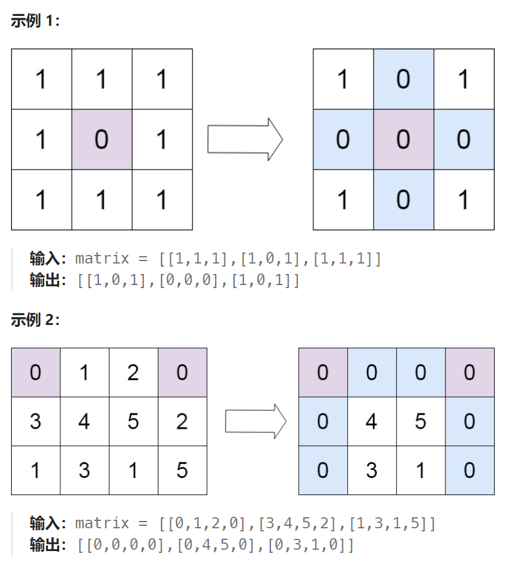

## 题目

给定一个 `*m* x *n*` 的矩阵，如果一个元素为 **0** ，则将其所在行和列的所有元素都设为 **0** 。请使用 **[原地](http://baike.baidu.com/item/原地算法)** 算法**。**



## 题解

### 方法一：使用辅助数组

```go
func setZeroes(matrix [][]int)  {
    rowMax := len(matrix)
    colMax := len(matrix[0])

    visitMap := make(map[[2]int]bool)   // 某一个 0 是否已经访问

    for row := 0 ; row < rowMax; row++ {
        for col := 0; col < colMax; col++ {
            if matrix[row][col] == 0 && !visitMap[[2]int{row, col}] {
                visitMap[[2]int{row, col}] = true
                // 所在行全部变为0
                for curCol := 0; curCol < colMax; curCol++ {
                    if matrix[row][curCol] != 0 {
                        matrix[row][curCol] = 0
                        visitMap[[2]int{row, curCol}] = true
                    }
                    
                }
                // 所在列全部变为0
                for curRow := 0; curRow < rowMax; curRow++ {
                    if matrix[curRow][col] != 0 {
                        matrix[curRow][col] = 0
                        visitMap[[2]int{curRow, col}] = true
                    }
                }
            }
        }
    }
}
```

### 方法二：优化，使用第0行与第0列代替辅助数组功能

```go
func setZeroes(matrix [][]int)  {
    rowMax := len(matrix)
    colMax := len(matrix[0])

    row0, col0 := false, false  // 分别记录第0行与第0列是否存在0
    for col := 0; col < colMax; col++ {
        if matrix[0][col] == 0 {
            row0 = true
            break
        }
    }
    for row := 0; row < rowMax; row++ {
        if matrix[row][0] == 0 {
            col0 = true
            break
        }
    }
    // 查看除了第0行与第0列以外的元素，是否存在0，如果存在，对应的第0行与第0列位置上要被设置为0
    for row := 1; row < rowMax; row++ {
        for col := 1; col < colMax; col++ {
            if matrix[row][col] == 0 {
                // 第0行和第0列 代替行使了方法一中两个辅助数组的作用
                // 分别记录该列和改行是否存在0
                matrix[0][col] = 0   // 第 0 行对应列被设置为0
                matrix[row][0] = 0  // 第 0 列对应行被设置为0
            }
        }
    }
    // 根据重新设置完以后的第0行和第0列，检查任意 [i,j] 位置是否要被设置为 0
    
    for row := 1; row < rowMax; row++ {
        for col := 1; col < colMax; col++ {
            if matrix[0][col] == 0  || matrix[row][0] == 0 {  // 0行或0列对应位置是0时, 同行同列所有的位置都要设置为0
                matrix[row][col] = 0
            }
        }
    }  
    if row0 {  // 第 0 行存在0，那么改行所有的都要设置为 0 
        for col := 0; col < colMax; col++ {
            matrix[0][col] = 0
        }
    }
    if col0 {  // 第 0 列存在0，那么改列所有的都要设置为 0 
        for row := 0; row < rowMax; row++ {
            matrix[row][0] = 0
        }
    }
}
```

