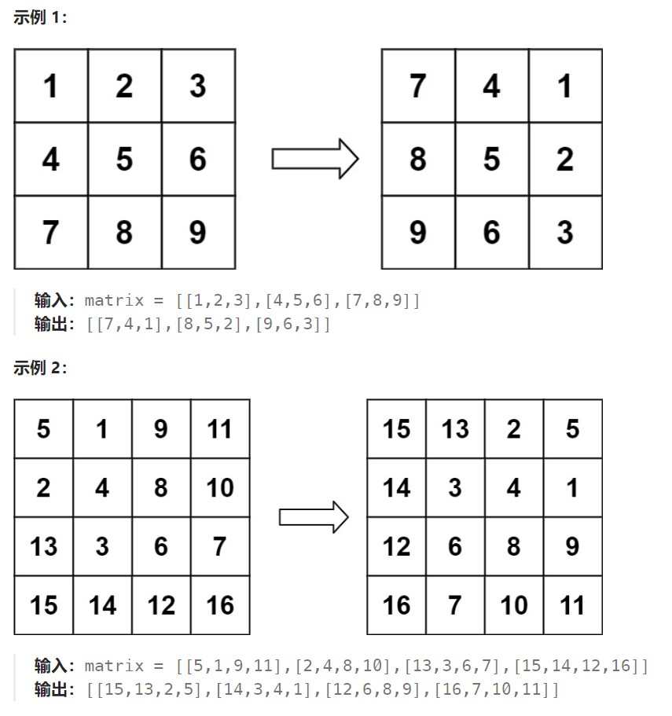

## 题目

给定一个 *n* × *n* 的二维矩阵 `matrix` 表示一个图像。请你将图像顺时针旋转 90 度。

你必须在**[ 原地](https://baike.baidu.com/item/原地算法)** 旋转图像，这意味着你需要直接修改输入的二维矩阵。**请不要** 使用另一个矩阵来旋转图像。



## 题解

```
经过分析此题，可以得出一个结论：任何一圈的矩阵元素在旋转90°之后，仍然在此圈上。我们以最外层为例：
1 3 9 7 为一组，旋转后格子向后移动一个位置
2 6 8 4 为一组，旋转后格子向后移动一个位置

因此，此题的做法为：(依旧假设 左上角为(a,b)  右下角为(c,d)  )
1.最外层循环次数即为圈数，我们依旧通过控制左上角和右下角的坐标作为循环变量：每轮循环 a++ b++ c-- d--,当出现 a>=c 或者 b>=d 时退出
2.对于每一圈的操作如下：
①每一圈要分为 c-a 组，每一组固定有4个矩阵元素
②内部循环即为 c-a 次，假设当前为第i次，那么就将第i组进行旋转，4个元素分别是：m[a][b+i] 、 m[a+i][d] 、 m[c][d-i] 、 m[c-i][d]   (起点的位置都很好想，分别是m[a][b] 、 m[a][b+1] 、 m[a][b+2] ; 余后的每一个位置都是上一个位置顺时针走i步得到的)
```

```go
func rotate(matrix [][]int)  {
    rowMax := len(matrix)
    colMax := len(matrix[0])

    leftUp := [2]int{0,0}   // 外循环的左上角
    rightDown := [2]int{rowMax-1,colMax-1}    // 外循环的右下角

    // 外循环：确保左上角在右下角的左上方
    for leftUp[0] < rightDown[0] && leftUp[1] < rightDown[1] {
        for i := 0; i < rightDown[1] - leftUp[1]; i++ {  // 内循环，次数为 rightDown.col - leftUp.col
            // 每次内循环，对四个元素进行转动
            one := matrix[leftUp[0]][leftUp[1]+i]
            two := matrix[leftUp[0]+i][rightDown[1]]
            three := matrix[rightDown[0]][rightDown[1]-i]
            four := matrix[rightDown[0]-i][leftUp[1]]

            matrix[leftUp[0]+i][rightDown[1]] = one  // 之前的 one 移动到 two上
            matrix[rightDown[0]][rightDown[1]-i] = two  // 之前的two移动到three上
            matrix[rightDown[0]-i][leftUp[1]] = three  // 之前的three移动到four上
            matrix[leftUp[0]][leftUp[1]+i] = four   // 之前的four移动到one上  
        }
        // 外循环变量更新
        leftUp[0]++
        leftUp[1]++
        rightDown[0]--
        rightDown[1]--
    } 
}
```

