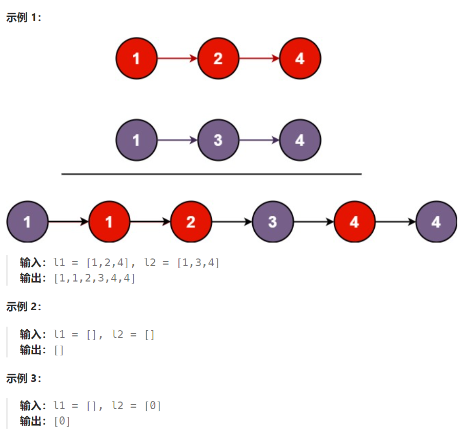

## 题目

将两个升序链表合并为一个新的 **升序** 链表并返回。新链表是通过拼接给定的两个链表的所有节点组成的。 



## 题解

方法：链表双指针，新链表的起始头结点需要用一个哑结点保存

```go
func mergeTwoLists(list1 *ListNode, list2 *ListNode) *ListNode {
    dummy := &ListNode{}   // 新链表的哑结点
    newCur := dummy  // 新链表
    for list1 != nil && list2 != nil {
        if list1.Val < list2.Val {
            newCur.Next = &ListNode{Val: list1.Val}
            newCur = newCur.Next
            list1 = list1.Next
        } else {
            newCur.Next = &ListNode{Val: list2.Val}
            newCur = newCur.Next
            list2 = list2.Next
        }
    }
    for list1 != nil {
        newCur.Next = &ListNode{Val: list1.Val}
        newCur = newCur.Next
        list1 = list1.Next   
    }
    for list2 != nil {
        newCur.Next = &ListNode{Val: list2.Val}
        newCur = newCur.Next
        list2 = list2.Next        
    }
    return dummy.Next
}
```

