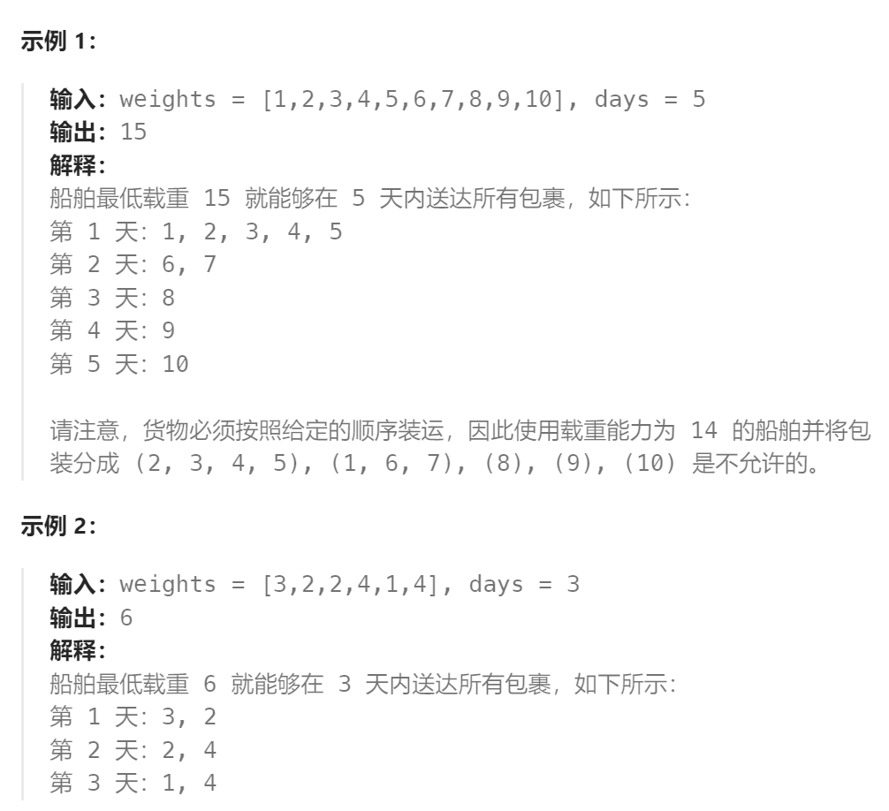
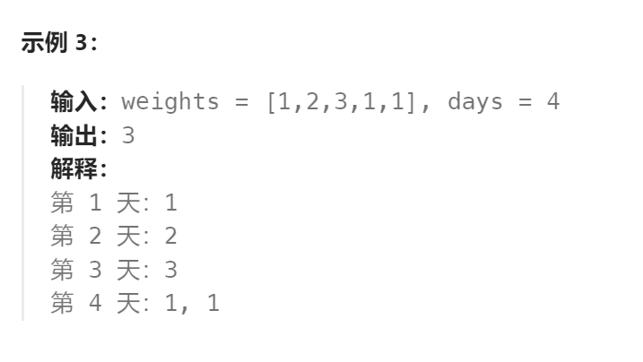

题目：

传送带上的包裹必须在 `days` 天内从一个港口运送到另一个港口。

传送带上的第 `i` 个包裹的重量为 `weights[i]`。每一天，我们都会按给出重量（`weights`）的顺序往传送带上装载包裹。我们装载的重量不会超过船的最大运载重量。

返回能在 `days` 天内将传送带上的所有包裹送达的船的最低运载能力。





题解：

假设当船的运载能力为 x 时，我们可以在 days 天内运送完所有包裹，那么只要运载能力大于 x ，我们同样可以在 days 天内运送完所有包裹：我们只需要使用运载能力为 x 时的运送方法即可。

这样一来，我们就得到了一个非常重要的结论：

**存在一个运载能力的「下限」x_ans，使得当  x >=  x_ans 时，我们可以在 days 天内运送完所有包裹；当 x < x_ans时，我们无法在 days 天内运送完所有包裹。**

同时，x_ans即为我们需要求出的答案。因此，我们就可以使用二分查找的方法找出 x_ans的值。

**二分查找的初始左右边界**应当如何计算呢？

1. 对于**左边界**而言，由于我们**不能「拆分」一个包裹**，因此船的运载能力**不能小于所有包裹中最重的那个的重量**，即左边界为数组 weights 中元素的最大值。

2. 对于**右边界**而言，船的运载能力也**不会大于所有包裹的重量之和**，即右边界为数组 weights 中元素的和。

```go
func shipWithinDays(weights []int, days int) int {
    // 确定二分查找左右边界 (每天的运载能力的左右边界)
    left, right := 0, 0
    mid := 0
    for _, w := range weights {
        if w > left {
            left = w
        }
        right += w
    }
    for left <= right {
        mid = left + (right - left) / 2   // 进行尝试的运载能力
        curWeight := 0   // 今天已经运载的货物重量
        curDays := 1
        for w:=0; w<len(weights); w++ {
            curWeight += weights[w]
            if curWeight > mid {
                w--   // 超重了就需要回退, 把这个货物留到明天进行传输
                curDays++ // 剩下的货物还需要至少额外一天进行传输
                curWeight = 0   // 重新归零，用于明天使用
            }
        }
        // 所需天数 > 指定的天数，说明每天的运载能力不够，需要增加
        if curDays > days {   
            left = mid + 1
        // 所需天数 <= 指定的天数, 可以在days天内完成运输，
        // 但可以继续尝试减小运载能力，查看是否有更低的运载能力可以在days天内完成运输
        } else if curDays <= days {  
            right = mid - 1
        } 
    }

    return right + 1
}
```

