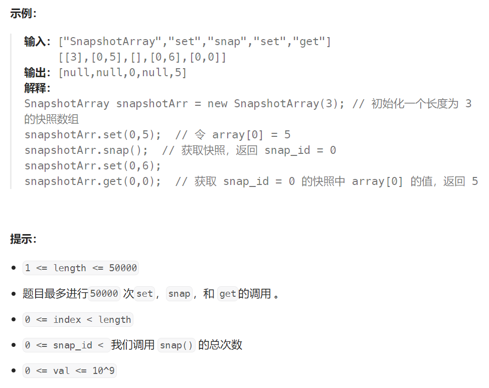

题目：

实现支持下列接口的「快照数组」- SnapshotArray：

- `SnapshotArray(int length)` - 初始化一个与指定长度相等的 类数组 的数据结构。**初始时，每个元素都等于** **0**。
- `void set(index, val)` - 会将指定索引 `index` 处的元素设置为 `val`。
- `int snap()` - 获取该数组的快照，并返回快照的编号 `snap_id`（快照号是调用 `snap()` 的总次数减去 `1`）。
- `int get(index, snap_id)` - 根据指定的 `snap_id` 选择快照，并返回该快照指定索引 `index` 的值。



题解：

```go

type SnapshotArray struct {
    now_version int  // 当前版本
    index_version [][]int   // 每一下标下元素发生变化的版本号(递增顺序)
    index_element [][]int  // 每一下标下元素发生变化的元素值
}


func Constructor(length int) SnapshotArray {
    ssa := &SnapshotArray{
        now_version: 0,
        index_version: make([][]int, length, length),
        index_element: make([][]int, length, length),
    }
    for i := 0 ; i < length; i++ {
        // 在初始化时，每一下标的初始版本号都是0
        ssa.index_version[i] = append(ssa.index_version[i], 0)
        // 在初始化时，每一下标的初始元素值都是0
        ssa.index_element[i] = append(ssa.index_element[i], 0)
    }

    return *ssa
}


func (this *SnapshotArray) Set(index int, val int)  {
    // 要区分在 snap 后调用 Set 和在 snap 前调用 Set 这两种情况
    n := len(this.index_version[index])
    // lastVersion 是该下标处元素发生变化的最后一个版本的版本号
    lastVersion := this.index_version[index][n-1]
    if this.now_version > lastVersion {  // 因调用snap,导致现在进入新的版本
        // 需要记录此下标的本次元素值变化
        this.index_version[index] = append(this.index_version[index], this.now_version)
        this.index_element[index] = append(this.index_element[index], val)
    } else {  // 没有使用snap，依旧是在当前版本内的元素值变化，无需记录
        this.index_element[index][n-1] = val  // 此时 lastVersion == now_version
    }
}


func (this *SnapshotArray) Snap() int {
   this.now_version++
   return this.now_version-1
}


func (this *SnapshotArray) Get(index int, snap_id int) int {
    versions := this.index_version[index]
    elements := this.index_element[index]

    left, right := 0, len(versions) - 1
    mostLeft := 0

    for left <= right {
        mid := left + (right - left) /2
        if versions[mid] == snap_id {   // 恰好找到该版本
            return elements[mid]
        } else if versions[mid] < snap_id {   // 该修改的版本在 snap_id 之前，需要继续向后找
            mostLeft = mid
            left = mid + 1
        } else {    // 该修改的版本在 snap_id 之前
            right = mid - 1
        }
    }

    return elements[mostLeft]   // 找不到snap_id, 最后返回 < snap_id 的最后一个修改版本的值

    // 下为方法二：
    // // 在当前下标的版本集合中找到版本为 snap_id 的索引值
    // ins := sort.SearchInts(versions, snap_id)  // >= snap_id的第一个下标

    // if ins == len(versions) {   
    //     // snap_id 比 versions 中所有版本都大，那么返回最新版本的值即可
    //     return elements[ins-1]
    // } else if versions[ins] != snap_id {  
    //     // snap_id版本时该下标元素并未发生变化,但在versions[ins]时发生了变化
    //     // 那么应当返回版本为 versions[ins-1] 时的元素值,此为snap_id版本时的真实值
    //     return elements[ins-1]
    // } else {
    //     // snap_id版本存在且正好发生了变化
    //     return elements[ins]
    // }
}

```


