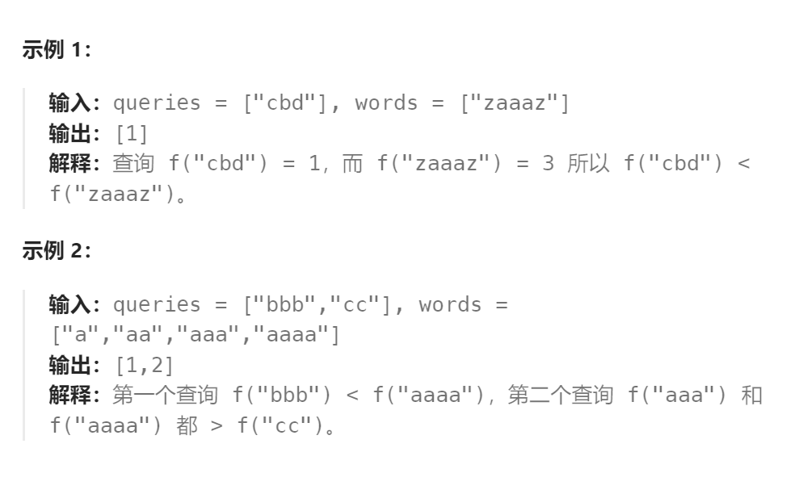

题目：

定义一个函数 `f(s)`，统计 `s` 中**（按字典序比较）最小字母的出现频次** ，其中 `s` 是一个非空字符串。

例如，若 `s = "dcce"`，那么 `f(s) = 2`，因为字典序最小字母是 `"c"`，它出现了 2 次。

现在，给你两个字符串数组待查表 `queries` 和词汇表 `words` 。对于每次查询 `queries[i]` ，需统计 `words` 中满足 `f(queries[i])` < `f(W)` 的 **词的数目** ，`W` 表示词汇表 `words` 中的每个词。

请你返回一个整数数组 `answer` 作为答案，其中每个 `answer[i]` 是第 `i` 次查询的结果。



**提示：**

- `1 <= queries.length <= 2000`
- `1 <= words.length <= 2000`
- `1 <= queries[i].length, words[i].length <= 10`
- `queries[i][j]`、`words[i][j]` 都由小写英文字母组成

题解：

### 解法一：排序+二分

```go
func numSmallerByFrequency(queries []string, words []string) []int {
    querySet := make([]int, len(queries))
    for i:=0; i<len(queries); i++ {
        query := []byte(queries[i])
        sort.Slice(query, func(i,j int) bool {
            return query[i] < query[j]
        })
        for j:=0; j<len(query); j++ {
            if query[j] == query[0] {
                querySet[i]++
            } else {
                break
            }
        }
    }
    wordSet := make([]int, len(words))
    for i:=0; i<len(words); i++ {
        word := []byte(words[i])
        sort.Slice(word, func(i,j int) bool {
            return word[i] < word[j]
        })
        for j:=0; j<len(word); j++ {
            if word[j] == word[0] {
                wordSet[i]++
            } else {
                break
            }
        }
    } 
    sort.Ints(wordSet)

    res := make([]int, len(querySet))
    for i:=0; i<len(querySet); i++ {
        cur := querySet[i]
        left, right := 0,len(wordSet)-1
        mid := 0
        for left <= right {
            mid = left + (right - left) / 2
            if cur < wordSet[mid] {   // 从 mid ~ len(wordSet)-1 的都 > cur
                res[i] = len(wordSet)-1 - mid + 1
                right = mid - 1
            } else {
                left = mid + 1
            }
        }
    }
    return res
}
```

### 解法二：排序+二分（优化：每个字符串只考虑最小字符出现次数）

```go
func numSmallerByFrequency(queries []string, words []string) (ans []int) {
	f := func(s string) int {   // 获取每个字符串最小字符出现的次数
		cnt := [26]int{}
		for _, c := range s {
			cnt[c-'a']++
		}
		for _, x := range cnt {  // 第一个不为零的最小字符的出现次数
			if x > 0 {
				return x
			}
		}
		return 0
	}
	n := len(words)
	nums := make([]int, n)
	for i, w := range words {
		nums[i] = f(w)
	}
	sort.Ints(nums)
	for _, q := range queries {
		x := f(q)
		ans = append(ans, n-sort.SearchInts(nums, x+1))
	}
	return
}
```

### 解法三：后缀和

题目定义了一个函数 f(s) ，用于统计字符串 s 中字典序最小的字母的出现频次。然后给定两个字符串数组 queries 和 words ，要求对于每个 queries[i] ，统计 words 中有多少个字符串 word 满足 f(queries[i])<f(word) 。

在实现函数 f(s) 时，我们首先初始化一个字符变量 ch=‘z’ 表示当前遇到的字典序最小的字母，然后再初始化一个整数 cnt=0 表示该字母的出现次数。接下来依次遍历字符串 s 中的每个字符 c ：

- **如果 c 的字典序小于 ch ，则将 ch 更新为 c ，并将 cnt 置为 1 。**
- **否则如果 c=ch ，则令 cnt 加 111。**

最后，**cnt 即为 s 中字典序最小的字母的出现次数**。

```go
func f(s string) int {  // 计算每个字符串中最小字符的出现次数
    cnt := 0
    ch := 'z'
    for _, c := range s {
        if c < ch {
        	ch = c
        	cnt = 1
        } else if c == ch {
        	cnt++
        }
    }
    return cnt
}

func numSmallerByFrequency(queries []string, words []string) []int {
    count := make([]int, 12)
    for _, s := range words {   // 统计words中每个字符串
        count[f(s)] += 1   // 最小字符出现次数作为key值，字符串数量作为value（实现一个有序map）
    }
    for i := 9; i >= 1; i-- {   // count更新为后缀和数组
        count[i] += count[i + 1]
    }
    res := make([]int, len(queries))
    for i, s := range queries {
        res[i] = count[f(s) + 1]  // f(s)计算s中最小字符出现次数, +1表示获取后缀和中大于f(s)的数量
    }
    return res
}
```

