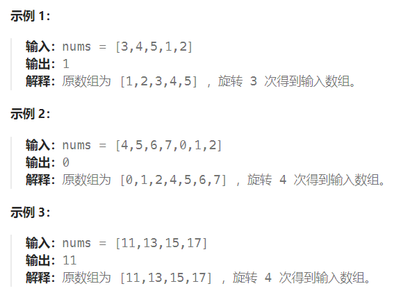

题目：

已知一个长度为 `n` 的数组，预先按照升序排列，经由 `1` 到 `n` 次 **旋转** 后，得到输入数组。例如，原数组 `nums = [0,1,2,4,5,6,7]` 在变化后可能得到：

- 若旋转 `4` 次，则可以得到 `[4,5,6,7,0,1,2]`
- 若旋转 `7` 次，则可以得到 `[0,1,2,4,5,6,7]`

注意，数组 `[a[0], a[1], a[2], ..., a[n-1]]` **旋转一次** 的结果为数组 `[a[n-1], a[0], a[1], a[2], ..., a[n-2]]` 。

给你一个元素值 **互不相同** 的数组 `nums` ，它原来是一个升序排列的数组，并按上述情形进行了多次旋转。请你找出并返回数组中的 **最小元素** 。

你必须设计一个时间复杂度为 `O(log n)` 的算法解决此问题。



题解：

一个**不包含重复元素**的升序数组在经过旋转之后，可以得到下面可视化的折线图：


其中横轴表示数组元素的下标，纵轴表示数组元素的值。图中标出了最小值的位置，是我们需要查找的目标。

在二分查找的每一步中，左边界为 low ，右边界为 high ，区间的中点为 pivot ，最小值就在该区间内。我们将中轴元素 `nums[pivot] `与右边界元素 `nums[high]` 进行比较，可能会有以下的三种情况：

- 第一种情况是 `nums[pivot] < nums[high]` 。如下图所示，这说明 `nums[pivot]` 是最小值右侧的元素，因此我们可以忽略二分查找区间的右半部分（**从 pivot+1 到 high 的所有元素都可以忽略，但 pivot 处的可能是最小元素，因此不能忽略**）。


- 第二种情况是 `nums[pivot] > nums[high]` 。如下图所示，这说明 `nums[pivot]` 是最小值左侧的元素，因此我们可以忽略二分查找区间的左半部分（**从 low 到 pivot 的元素都可以忽略**）。


- 由于**数组不包含重复元素**，并且只要当前的区间长度不为 1 ，pivot 就不会与 high 重合（根据pivot的计算公式，区间长度为偶数时，pivot == low；区间长度为奇数时，pivot恰好就是low与high的中间值）；而如果当前的区间长度为 1 ，这说明 pivot == low == high（否则，正常情况下pivot不可能等于high），此时 `nums[pivot]` 就是最小值

```go
func findMin(nums []int) int {
    low, high := 0, len(nums) - 1   // low 在第一升序区域, high 在第二升序区域。(最小值就位于第二升序区域)
    for low <= high {    // 当 low > high 时结束，因为low和high各自进入了不同的升序区域
        pivot := low + (high - low) / 2    
        if nums[pivot] < nums[high] {
            high = pivot    // high == pivot 而不是 pivot - 1, 因为 pivot 本身可能是最小值
        } else if nums[pivot] > nums[high] {
            low = pivot + 1  // nums[pivot] 不可能是最小值(因为 nums[high] 比他更小)
        } else if nums[pivot] == nums[high] {      // 区间长度为奇数，此时 low == pivot == high 
            return nums[pivot]
        }
    }
    return nums[low]   // 退出循环时，low > high，也即此时 low == 第二升序区域的第一个值，也就是最小值
}
```


方法二：

```go
func findMin(nums []int) int {
    total := len(nums) 
    // 找到旋转点(出现递减的转折点)
    left, right := 0, total - 1
    mid := 0

    for left <= right {
        mid = left + (right - left) / 2
        if mid + 1 < total && nums[mid] > nums[mid+1]  {  // mid 是递减点
            break
        } else if nums[left] > nums[mid] {   // 递减点出现在左区域(包括mid)
            right = mid
        } else if nums[right] < nums[mid] {   // 递减点出现在右区域(包括mid)
            left = mid
        } else {    // 满足 nums[left] <= nums[mid] <= nums[right] 不存在任何递减点，是一个升序序列
            return nums[0]
        }
    }
    return nums[mid + 1]   // mid作为递减点，mid + 1 必然就是最小值所在下标
}
```

