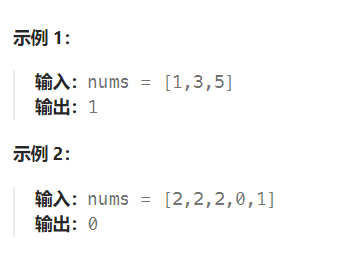

题目：

已知一个长度为 `n` 的数组，预先按照升序排列，经由 `1` 到 `n` 次 **旋转** 后，得到输入数组。例如，原数组 `nums = [0,1,4,4,5,6,7]` 在变化后可能得到：

- 若旋转 `4` 次，则可以得到 `[4,5,6,7,0,1,4]`
- 若旋转 `7` 次，则可以得到 `[0,1,4,4,5,6,7]`

注意，数组 `[a[0], a[1], a[2], ..., a[n-1]]` **旋转一次** 的结果为数组 `[a[n-1], a[0], a[1], a[2], ..., a[n-2]]` 。

给你一个可能存在 **重复** 元素值的数组 `nums` ，它原来是一个升序排列的数组，并按上述情形进行了多次旋转。请你找出并返回数组中的 **最小元素** 。

你必须尽可能减少整个过程的操作步骤。



题解：

一个包含重复元素的升序数组在经过旋转之后，可以得到下面可视化的折线图：


其中横轴表示数组元素的下标，纵轴表示数组元素的值。图中标出了最小值的位置，是我们需要查找的目标。

- 假设数组中的最后一个元素是x 。
- 在最小值右侧的元素，它们的值一定都小于等于 x ；
- 在最小值左侧的元素，它们的值一定都大于等于 x 。

因此，我们可以根据这一条性质，通过二分查找的方法找出最小值。

在二分查找的每一步中，左边界为 low ，右边界为 high ，区间的中点为 pivot ，最小值就在该区间内。我们将**中轴元素 `nums[pivot]`** 与**右边界元素 `nums[high] `**进行比较，可能会有以下的三种情况：

- 第一种情况是 `nums[pivot] < nums[high]`。如下图所示，这说明 `nums[pivot]` 是**最小值右侧的元素**，因此我们**可以忽略**二分查找区间的**右半部分**。
- 
- 第二种情况是 `nums[pivot] > nums[high] `。如下图所示，这说明 `nums[pivot]` 是**最小值左侧的元素**，因此我们**可以忽略**二分查找区间的**左半部分**。


- 第三种情况是 `nums[pivot] == nums[high]` 。如下图所示，由于**重复元素的存在**，我们并**不能确定 `nums[pivot]` 究竟在最小值的左侧还是右侧**，因此我们不能莽撞地忽略某一部分的元素。我们唯一可以知道的是，由于它们的值相同，所以**无论 `nums[high]` 是不是最小值，都有一个它的「替代品」`nums[pivot]`** ，因此我们**可以忽略**二分查找区间的**右端点**。


```go
func findMin(nums []int) int {
    total := len(nums) 
    left, right := 0, total - 1
    mid := 0

    for left <= right {
        mid = left + (right - left) / 2
        if nums[mid] < nums[right] {   // 当前位于最小值右侧，可能就是最小值
            right = mid    // 忽略右半区域
        } else if nums[mid] > nums[right] {   // 当前位于最小值左侧，不可能是最小值
            left = mid + 1	// 忽略左半区域 + 左端点
        } else if nums[mid] == nums[right] { // 不能确定到底在左侧，还是右侧
            right--		// 忽略右端点
        }
    }
    return nums[left]   
}
```

