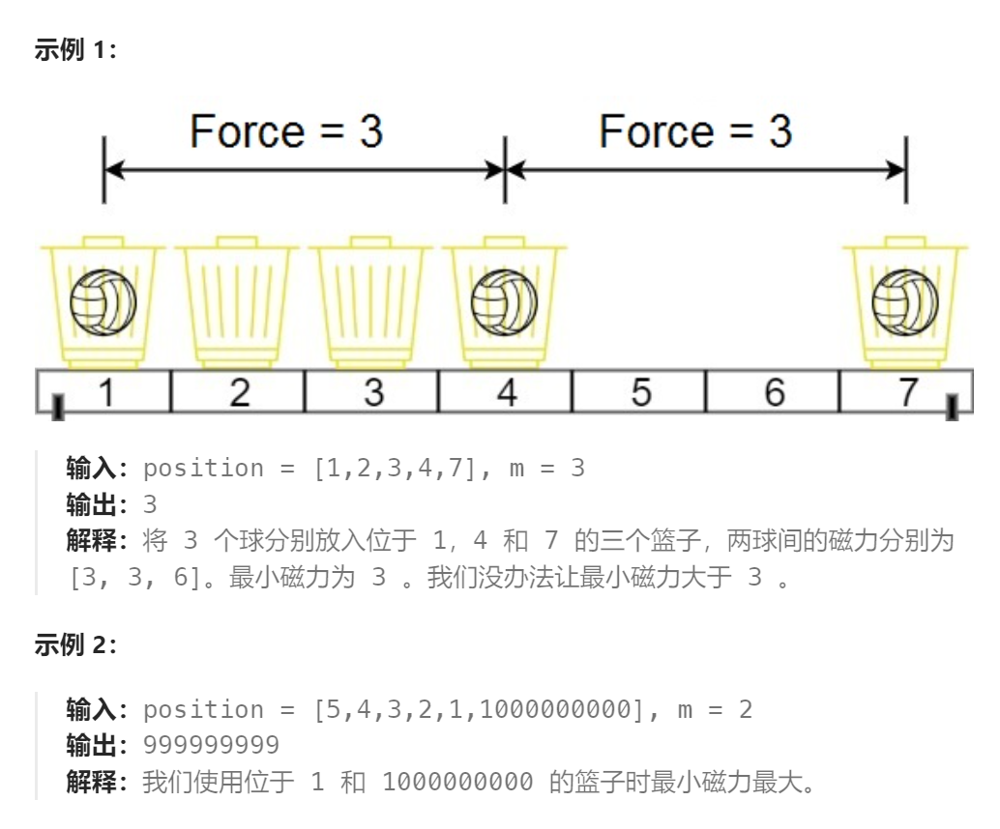

题目：

在代号为 C-137 的地球上，Rick 发现如果他将两个球放在他新发明的篮子里，它们之间会形成特殊形式的磁力。Rick 有 `n` 个空的篮子，第 `i` 个篮子的位置在 `position[i]` ，Morty 想把 `m` 个球放到这些篮子里，使得任意两球间 **最小磁力** 最大。

已知两个球如果分别位于 `x` 和 `y` ，那么它们之间的磁力为 `|x - y|` 。

给你一个整数数组 `position` 和一个整数 `m` ，请你返回最大化的最小磁力。



题解：

对于此题我们需要先思考一个子问题：给定 n 个空篮子，m 个球放置的位置已经确定。那么**「最小磁力」我们该如何计算？**

不难得出「最小磁力」为这 **m 个球中相邻两球距离的最小值**的结论。原因如下：

对于 i<j<k 三个位置的球，最小磁力**一定是 j−i  和 k−j 的较小值**，而**不是跨越了位置 j 的 i 和 k 的差值 k−i 。**

```go
func maxDistance(position []int, m int) int {
    sort.Ints(position)
    // 二分法尝试磁力最小磁力(指定最小磁力,看能否放入m个球)
    // 最小磁力的最小值: 两个紧挨的球之间的磁力 == 1
    // 最小磁力的最大值: 最左和最右两个球之间的磁力 == position[len(position)-1] - position[0]
    min,max := 1, position[len(position)-1] - position[0]   
    mid := 0
    for min <= max {
        mid = min + (max - min) / 2
        if check(position, mid, m) {   // 此磁力下可以放下>=m个球，因此可以调大磁力再尝试
            min = mid + 1
        } else {   // 磁力过大，放不下m个球，需要调小磁力
            max = mid - 1
        }
    }
    return min   // 返回最小磁力的最大值
}
// 判断在最小磁力为 interval 的情况下, 能否放下至少m个球
func check(position []int, interval int, m int) bool {
    pre, cnt := position[0], 1
    for i:=1; i<len(position); i++ {
        if position[i] - pre > interval {   // 相邻两球之间的磁力 > 最小磁力 interval
            cnt++   // 放入了一个新的球
            pre = position[i]  // 新球的位置
        }
    }
    return cnt >= m   // 至少可以放下m个球，任意两个球之间的磁力 > interval
}
```

