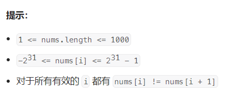
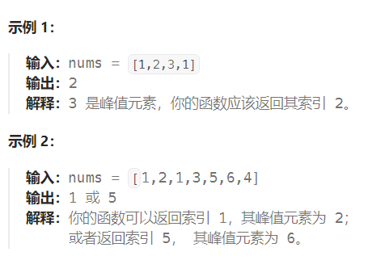

题目：

峰值元素是指其值严格大于左右相邻值的元素。

给你一个整数数组 `nums`，找到峰值元素并返回其索引。数组可能包含多个峰值，在这种情况下，返回 **任何一个峰值** 所在位置即可。

你可以假设 `nums[-1] = nums[n] = -∞` 。

你必须实现时间复杂度为 `O(log n)` 的算法来解决此问题。





题解：

这是一个局部最大值问题，可以使用二分法解决（局部最小值也同样的解法）

- 先看左右两侧是否可以作为峰值元素：
  - 如果 `nums[0] > nums[1]` , 那么 `nums[0]` 就是一个峰值
  - 如果 `nums[n-1] < nums[n]` , 那么 `nums[n]` 就是一个峰值
- 如果左右两侧都不是局部峰值，那么说明左右两侧都是**递增趋势**。峰值出现在中间区域，我们需要跳转到区域中点 mid 继续探测：
  - 如果满足： `nums[mid - 1] < nums[mid] > nums[mid + 1]`，那么mid就是峰值所在位置
  - 如果不满足上述条件，那么mid不是峰值所在位置，需要二分。
    - 如果 `nums[mid - 1] > nums[mid]`，即mid向左侧是一个递增趋势，那么在 **[left, mid - 1] 之间一定存在一个峰值**（因为**两侧都向中间递增**）
    - 如果`nums[mid] < nums[mid + 1]`，即mid向右侧是一个递增趋势，那么在 **[mid+1, right] 之间一定存在一个峰值**（因为**两侧都向中间递增**）

````go
func findPeakElement(nums []int) int {
    if len(nums) == 1 {
        return 0
    }
    left, right := 0,len(nums)-1
    mid := 0

    if left + 1 <= len(nums)-1 && nums[left] > nums[left + 1] {   // 首元素是一个峰值
        return left
    }
    if right - 1 >= 0 && nums[right - 1] < nums[right] {   // 尾元素是一个峰值
        return right
    }
    // 峰值在中间位置，且左右两侧现在都是递增趋势
    for left <= right {
        mid = left + (right - left) / 2
        // 峰值，严格大于左右两侧
        if mid >= 1 && mid+1 <= len(nums) -1 && nums[mid-1] < nums[mid] && nums[mid] > nums[mid+1] {  
            return mid
        } else if mid >= 1 && nums[mid-1] > nums[mid] {   // 峰值位于左半区域
            right = mid-1
        } else if mid + 1 <= len(nums) -1 && nums[mid] < nums[mid+1] {   // 峰值位于右半区域
            left = mid+1
        }
    }
    return -1
}
````

或者：

```go
func findPeakElement(nums []int) int {
    n := len(nums)

    // 辅助函数，输入下标 i，返回 nums[i] 的值
    // 方便处理 nums[-1] 以及 nums[n] 的边界情况
    get := func(i int) int {
        if i == -1 || i == n {
            return math.MinInt64
        }
        return nums[i]
    }

    left, right := 0, n-1
    for {
        mid := (left + right) / 2
        if get(mid-1) < get(mid) && get(mid) > get(mid+1) {
            return mid
        }
        if get(mid) < get(mid+1) {
            left = mid + 1
        } else {
            right = mid - 1
        }
    }
}
```

